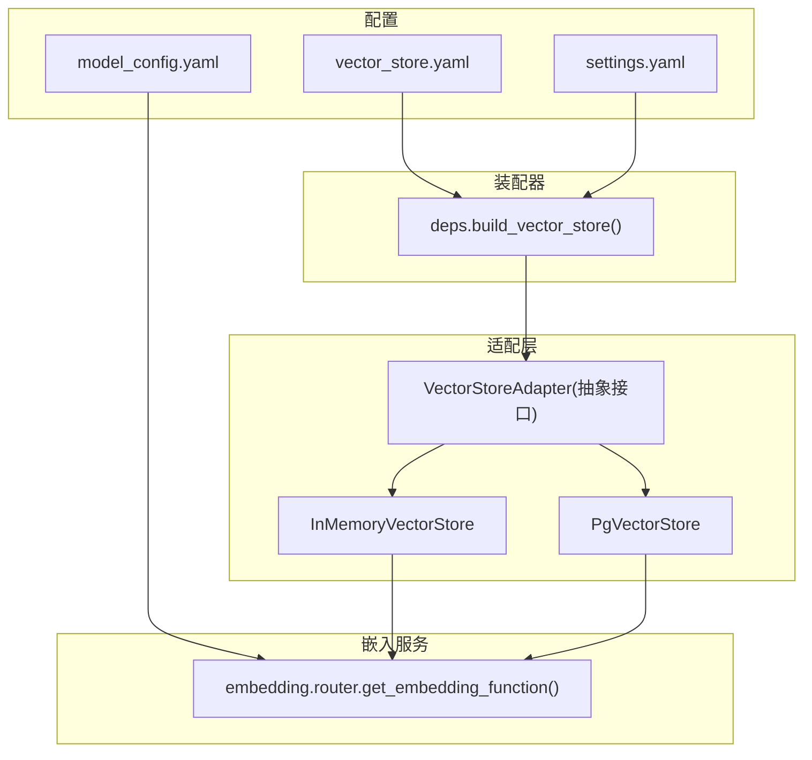
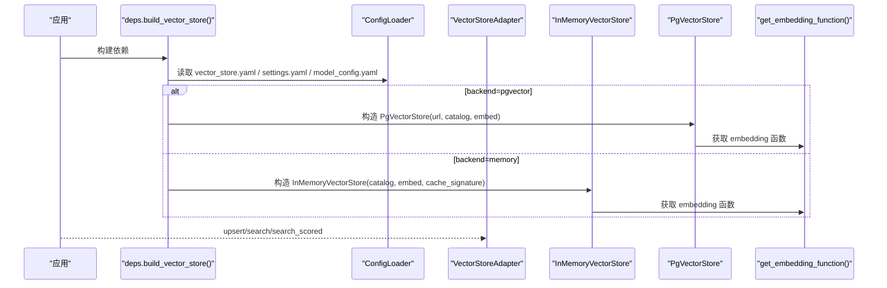
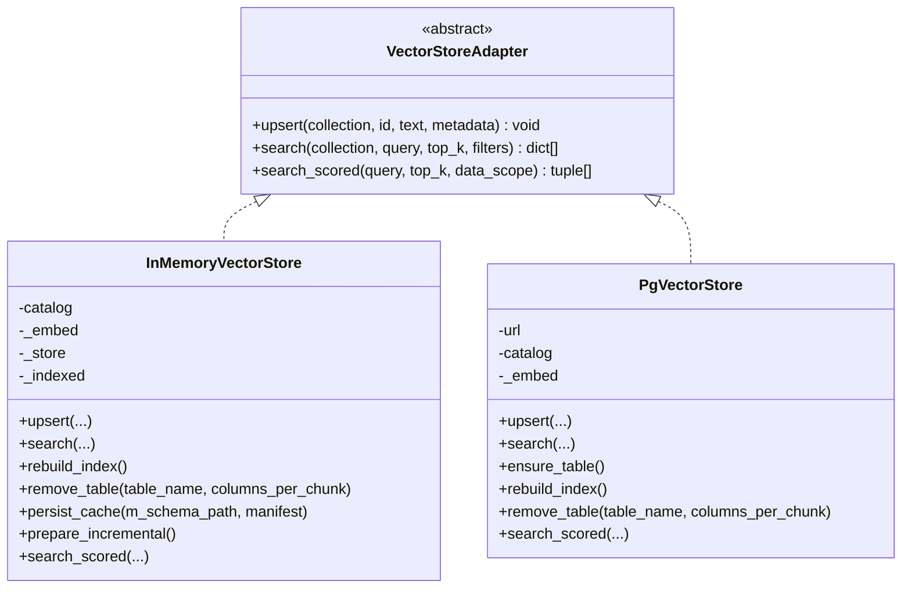
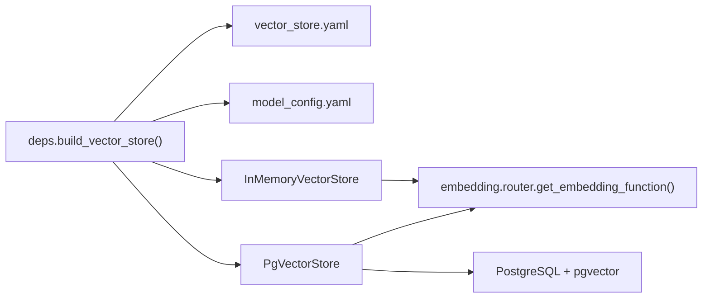

# 向量存储配置

<cite>
**本文引用的文件**   
- [vector_store.yaml](file://nl2sql_agent/config/vector_store.yaml)
- [settings.yaml](file://nl2sql_agent/config/settings.yaml)
- [model_config.yaml](file://nl2sql_agent/config/model_config.yaml)
- [base.py](file://nl2sql_agent/services/vector_store/base.py)
- [memory.py](file://nl2sql_agent/services/vector_store/memory.py)
- [pg.py](file://nl2sql_agent/services/vector_store/pg.py)
- [__init__.py](file://nl2sql_agent/services/vector_store/__init__.py)
- [router.py](file://nl2sql_agent/services/embedding/router.py)
- [deps.py](file://nl2sql_agent/services/deps.py)
- [test_vector_store.py](file://nl2sql_agent/tests/test_vector_store.py)
</cite>

## 目录
1. [简介](#简介)
2. [项目结构](#项目结构)
3. [核心组件](#核心组件)
4. [架构总览](#架构总览)
5. [详细组件分析](#详细组件分析)
6. [依赖关系分析](#依赖关系分析)
7. [性能与容量规划](#性能与容量规划)
8. [故障排查指南](#故障排查指南)
9. [结论](#结论)
10. [附录：配置项速查](#附录配置项速查)

## 简介
本文件面向生产与运维人员，系统化说明 NL2SQL 项目中“向量存储”的配置与使用方式。当前实现提供两种后端：
- 内存向量存储（InMemoryVectorStore）：适合开发、测试与轻量场景；重启后重建索引，支持本地缓存持久化。
- pgvector（PgVectorStore）：基于 PostgreSQL + pgvector 扩展的持久化向量存储，适合生产环境。

文档涵盖：
- 数据库连接参数与环境变量注入
- 相似度算法选择与检索行为
- 索引类型与性能调优建议
- 存储容量规划、数据迁移策略与备份恢复方案
- 连接池、查询优化与监控指标
- 生产部署、高可用设计与故障排查

## 项目结构
向量存储相关代码集中在 services/vector_store 包中，并通过统一的适配器接口对外暴露。配置位于 config 目录下的 vector_store.yaml、settings.yaml 与 model_config.yaml。

图表来源
- [vector_store.yaml:1-6](file://nl2sql_agent/config/vector_store.yaml#L1-L6)
- [settings.yaml:1-30](file://nl2sql_agent/config/settings.yaml#L1-L30)
- [model_config.yaml:1-18](file://nl2sql_agent/config/model_config.yaml#L1-L18)
- [base.py:1-21](file://nl2sql_agent/services/vector_store/base.py#L1-L21)
- [memory.py:1-197](file://nl2sql_agent/services/vector_store/memory.py#L1-L197)
- [pg.py:1-174](file://nl2sql_agent/services/vector_store/pg.py#L1-L174)
- [router.py:1-81](file://nl2sql_agent/services/embedding/router.py#L1-L81)
- [deps.py:87-111](file://nl2sql_agent/services/deps.py#L87-L111)

章节来源
- [vector_store.yaml:1-6](file://nl2sql_agent/config/vector_store.yaml#L1-L6)
- [settings.yaml:1-30](file://nl2sql_agent/config/settings.yaml#L1-L30)
- [model_config.yaml:1-18](file://nl2sql_agent/config/model_config.yaml#L1-L18)
- [base.py:1-21](file://nl2sql_agent/services/vector_store/base.py#L1-L21)
- [deps.py:87-111](file://nl2sql_agent/services/deps.py#L87-L111)

## 核心组件
- VectorStoreAdapter：统一抽象接口，定义 upsert、search、search_scored 等能力。
- InMemoryVectorStore：内存实现，余弦相似度计算，支持按 metadata 过滤、增量/全量重建、本地缓存持久化。
- PgVectorStore：PostgreSQL + pgvector 实现，使用向量距离算子进行检索，自动建表与维度对齐。
- embedding.router：统一 EmbedFn 提供者，支持 local（sentence-transformers）与 fake（测试用）。

章节来源
- [base.py:1-21](file://nl2sql_agent/services/vector_store/base.py#L1-L21)
- [memory.py:1-197](file://nl2sql_agent/services/vector_store/memory.py#L1-L197)
- [pg.py:1-174](file://nl2sql_agent/services/vector_store/pg.py#L1-L174)
- [router.py:1-81](file://nl2sql_agent/services/embedding/router.py#L1-L81)

## 架构总览
下图展示从配置到具体实现的装配流程，以及运行时调用链。

图表来源
- [deps.py:87-111](file://nl2sql_agent/services/deps.py#L87-L111)
- [vector_store.yaml:1-6](file://nl2sql_agent/config/vector_store.yaml#L1-L6)
- [settings.yaml:1-30](file://nl2sql_agent/config/settings.yaml#L1-L30)
- [model_config.yaml:1-18](file://nl2sql_agent/config/model_config.yaml#L1-L18)
- [router.py:1-81](file://nl2sql_agent/services/embedding/router.py#L1-L81)

## 详细组件分析

### 抽象接口与实现类图

图表来源
- [base.py:1-21](file://nl2sql_agent/services/vector_store/base.py#L1-L21)
- [memory.py:1-197](file://nl2sql_agent/services/vector_store/memory.py#L1-L197)
- [pg.py:1-174](file://nl2sql_agent/services/vector_store/pg.py#L1-L174)

章节来源
- [base.py:1-21](file://nl2sql_agent/services/vector_store/base.py#L1-L21)
- [memory.py:1-197](file://nl2sql_agent/services/vector_store/memory.py#L1-L197)
- [pg.py:1-174](file://nl2sql_agent/services/vector_store/pg.py#L1-L174)

### 配置加载与后端切换
- 通过 vector_store.yaml 显式指定 backend 为 memory 或 pgvector。
- 当 backend=pgvector 时，需设置 pgvector.url，支持环境变量展开（如 ${PGVECTOR_URL}）。
- 当 backend=memory 时，根据 model_config.yaml 中的 embedding 配置生成 cache_signature，用于缓存命中判断。

章节来源
- [vector_store.yaml:1-6](file://nl2sql_agent/config/vector_store.yaml#L1-L6)
- [deps.py:87-111](file://nl2sql_agent/services/deps.py#L87-L111)
- [model_config.yaml:1-18](file://nl2sql_agent/config/model_config.yaml#L1-L18)

### 内存向量存储（InMemoryVectorStore）
- 相似度算法：余弦相似度（归一化内积），score ∈ [0,1]。
- 过滤机制：按 metadata 键值精确匹配。
- 索引与缓存：
  - 首次 search_scored/upsert 触发 _ensure_indexed，优先尝试从 m-schema 源构建并写入本地 vector-cache.json。
  - 缓存包含 semantic_hash 与 embedding_signature，重启时若一致则直接复用。
- 重建与清理：
  - rebuild_index：清空并重建索引，适用于模型切换。
  - remove_table：删除表级、字段级、关系级条目，支持增量同步清理。

章节来源
- [memory.py:1-197](file://nl2sql_agent/services/vector_store/memory.py#L1-L197)

### pgvector 向量存储（PgVectorStore）
- 相似度算法：使用 <=> 算子（欧氏距离），检索时通过 1 - (embedding <=> %s::vector)/2 映射为 score ∈ [0,1]。
- 建表与维度：
  - ensure_table：按 embedding.dimension 动态创建 schema_embeddings 表，主键为 (collection, id)。
- 检索与过滤：
  - search：按 collection 与 metadata.business_line 过滤，返回 top_k。
  - search_scored：按 data_scope 限定表集合，返回带分数的 SchemaHit 列表。
- 重建与清理：
  - rebuild_index：清空三集合（表/列/关系）并从 m-schema 源或 catalog 重建。
  - remove_table：删除对应 collection 下以 table_name 前缀的条目。

章节来源
- [pg.py:1-174](file://nl2sql_agent/services/vector_store/pg.py#L1-L174)

### 嵌入函数（Embedding Router）
- provider=local：使用 sentence-transformers，默认模型 paraphrase-multilingual-MiniLM-L12-v2，dimension=384。
- provider=fake：确定性词袋向量，仅测试使用。
- 模型路径：可配置 model_path（相对项目根解析），否则从 HuggingFace 下载。

章节来源
- [router.py:1-81](file://nl2sql_agent/services/embedding/router.py#L1-L81)
- [model_config.yaml:1-18](file://nl2sql_agent/config/model_config.yaml#L1-L18)

## 依赖关系分析
- deps.build_vector_store 负责读取 vector_store.yaml 与 model_config.yaml，决定实例化 InMemoryVectorStore 或 PgVectorStore。
- 两个实现均依赖 embedding.router.get_embedding_function 生成向量。
- PgVectorStore 依赖 psycopg 直连数据库；InMemoryVectorStore 依赖文件系统缓存。

图表来源
- [deps.py:87-111](file://nl2sql_agent/services/deps.py#L87-L111)
- [vector_store.yaml:1-6](file://nl2sql_agent/config/vector_store.yaml#L1-L6)
- [model_config.yaml:1-18](file://nl2sql_agent/config/model_config.yaml#L1-L18)
- [pg.py:1-174](file://nl2sql_agent/services/vector_store/pg.py#L1-L174)

章节来源
- [deps.py:87-111](file://nl2sql_agent/services/deps.py#L87-L111)

## 性能与容量规划

### 相似度算法与索引类型
- 内存实现：余弦相似度，无外部索引；数据规模较小时性能良好。
- pgvector 实现：当前使用欧氏距离算子 <=>，未启用专用索引（IVFFlat/HNSW）。如需提升大规模检索性能，可在 pgvector 侧添加索引（见下文建议）。

注意：当前代码未暴露 IVFFlat/HNSW 等索引参数开关，属于外部数据库层面的优化点。

章节来源
- [memory.py:1-197](file://nl2sql_agent/services/vector_store/memory.py#L1-L197)
- [pg.py:1-174](file://nl2sql_agent/services/vector_store/pg.py#L1-L174)

### 连接与连接池
- PgVectorStore：每次 upsert/search 新建 psycopg 连接，未使用连接池。生产环境建议引入连接池（如 psycopg.Pool 或 SQLAlchemy Pool）以降低握手开销。
- 内存实现：无外部连接。

章节来源
- [pg.py:25-28](file://nl2sql_agent/services/vector_store/pg.py#L25-L28)

### 查询优化
- 过滤条件：metadata.business_line 在 pgvector 实现中作为 WHERE 条件，确保该字段有合适索引以提升过滤效率。
- Top-K：通过 top_k 控制返回数量，避免过大结果集。
- 维度对齐：ensure_table 依据 embedding.dimension 建表，务必保证 dimension 与实际模型输出一致。

章节来源
- [pg.py:46-65](file://nl2sql_agent/services/vector_store/pg.py#L46-L65)
- [pg.py:69-79](file://nl2sql_agent/services/vector_store/pg.py#L69-L79)

### 容量规划
- 单条记录大小估算：text（UTF-8）、metadata（JSON 字符串）、embedding（float32 × dimension）。
- 表大小估算：schema_embeddings 行数 × 单行大小 + 索引开销。
- 内存实现：进程内存占用 ≈ 所有向量与文本之和；重启后重建。

章节来源
- [pg.py:69-79](file://nl2sql_agent/services/vector_store/pg.py#L69-L79)
- [memory.py:30-31](file://nl2sql_agent/services/vector_store/memory.py#L30-L31)

### 数据迁移策略
- 内存实现：通过 vector-cache.json 持久化，语义哈希与 embedding_signature 一致即可复用。
- pgvector 实现：通过 ensure_table/rebuild_index 重建；迁移时可先清空再批量 upsert。

章节来源
- [memory.py:105-138](file://nl2sql_agent/services/vector_store/memory.py#L105-L138)
- [pg.py:81-118](file://nl2sql_agent/services/vector_store/pg.py#L81-L118)

### 备份与恢复
- 内存实现：备份 vector-cache.json；恢复时保持语义哈希与 embedding_signature 不变。
- pgvector 实现：对 PostgreSQL 数据库进行逻辑/物理备份（如 pg_dump/pg_basebackup），恢复后执行 rebuild_index 或按需增量更新。

章节来源
- [memory.py:121-138](file://nl2sql_agent/services/vector_store/memory.py#L121-L138)
- [pg.py:81-118](file://nl2sql_agent/services/vector_store/pg.py#L81-L118)

### 监控指标建议
- 向量库 QPS、P95/P99 延迟、错误率
- 向量检索命中率（top_k 命中业务相关表的比率）
- 索引重建耗时与失败次数
- 缓存命中率（内存实现）
- 数据库连接数、慢查询、锁等待

[本节为通用指导，不直接分析具体文件]

## 故障排查指南

### 常见问题与定位
- 未配置 pgvector.url：当 backend=pgvector 但未提供 url 时会抛出运行时错误。检查 vector_store.yaml 与 .env 中的 PGVECTOR_URL。
- 模型加载失败：provider=local 时若模型不可用，会抛出 RuntimeError。确认 HF_ENDPOINT 镜像或 model_path 指向有效本地目录。
- 维度不一致：ensure_table 使用的 dimension 必须与模型输出一致，否则向量写入/检索异常。
- 缓存失效：内存实现中 semantic_hash 或 embedding_signature 变化会导致缓存不命中，需重建索引。

章节来源
- [deps.py:99-105](file://nl2sql_agent/services/deps.py#L99-L105)
- [router.py:45-53](file://nl2sql_agent/services/embedding/router.py#L45-L53)
- [pg.py:69-79](file://nl2sql_agent/services/vector_store/pg.py#L69-L79)
- [memory.py:113-118](file://nl2sql_agent/services/vector_store/memory.py#L113-L118)

### 调试步骤
- 打印/日志：在 upsert/search 前后记录输入文本、filters、top_k、返回结果与分数分布。
- 最小复现：使用 provider=fake 的 embedding 快速验证检索逻辑与过滤条件。
- 数据库诊断：对 pgvector 查询执行 EXPLAIN ANALYZE，观察扫描方式与是否命中索引。

章节来源
- [test_vector_store.py:12-24](file://nl2sql_agent/tests/test_vector_store.py#L12-L24)
- [router.py:64-81](file://nl2sql_agent/services/embedding/router.py#L64-L81)

## 结论
本项目通过统一的 VectorStoreAdapter 抽象，将内存与 pgvector 两种后端解耦，便于在不同环境下灵活切换。当前实现已满足开发与生产基础需求，但在连接池、索引类型与监控方面仍有优化空间。建议在生产环境中：
- 使用 pgvector 并评估 IVFFlat/HNSW 索引的收益
- 引入连接池与慢查询监控
- 完善容量规划与备份恢复演练
- 建立召回率与延迟的持续观测体系

[本节为总结性内容，不直接分析具体文件]

## 附录：配置项速查
- vector_store.yaml
  - backend：memory | pgvector
  - pgvector.url：PostgreSQL 连接串，支持环境变量展开
- settings.yaml
  - schema_search_top_k：默认 Top-K
  - database_url / pg_database_url：SQL 执行器连接（非向量库）
- model_config.yaml
  - embedding.provider：local | fake
  - embedding.model / model_path：模型名称或本地路径
  - embedding.dimension：向量维度

章节来源
- [vector_store.yaml:1-6](file://nl2sql_agent/config/vector_store.yaml#L1-L6)
- [settings.yaml:1-30](file://nl2sql_agent/config/settings.yaml#L1-L30)
- [model_config.yaml:1-18](file://nl2sql_agent/config/model_config.yaml#L1-L18)