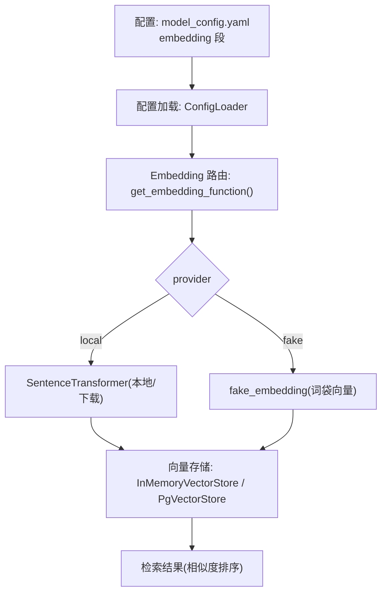
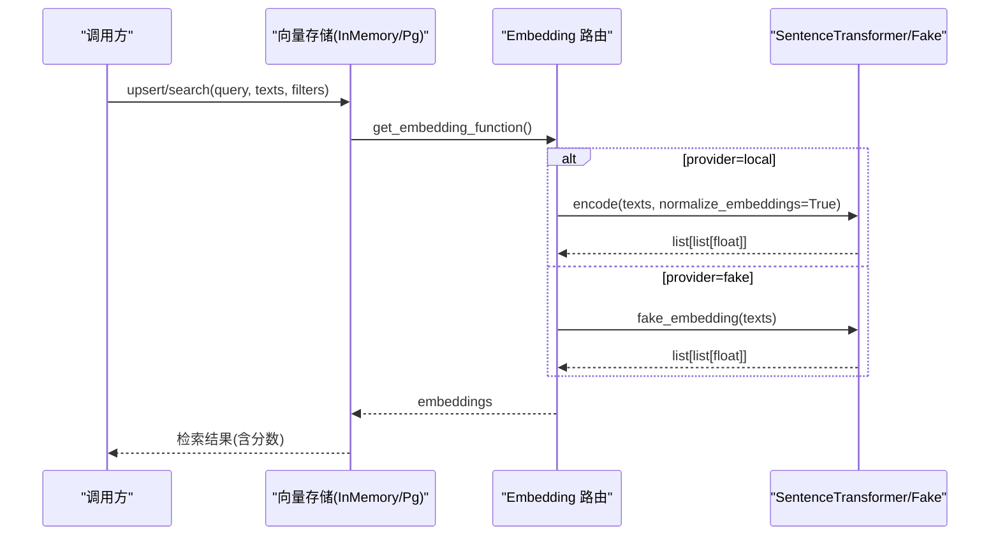
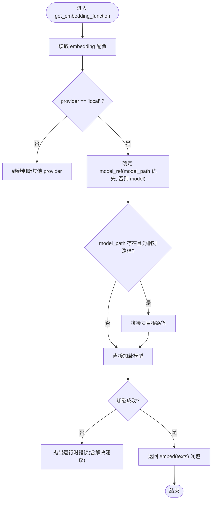
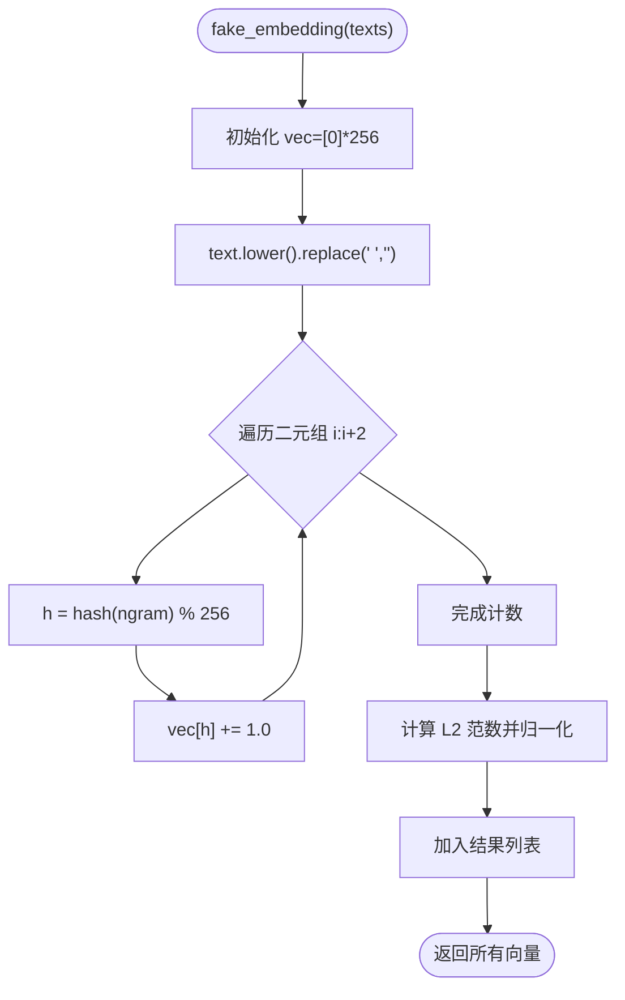
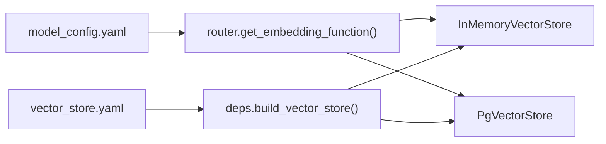

# 嵌入模型配置

<cite>
**本文引用的文件**   
- [model_config.yaml](file://nl2sql_agent/config/model_config.yaml)
- [router.py](file://nl2sql_agent/services/embedding/router.py)
- [config_loader.py](file://nl2sql_agent/services/config_loader.py)
- [vector_store.yaml](file://nl2sql_agent/config/vector_store.yaml)
- [memory.py](file://nl2sql_agent/services/vector_store/memory.py)
- [pg.py](file://nl2sql_agent/services/vector_store/pg.py)
- [deps.py](file://nl2sql_agent/services/deps.py)
- [test_vector_store.py](file://nl2sql_agent/tests/test_vector_store.py)
</cite>

## 目录
1. [简介](#简介)
2. [项目结构](#项目结构)
3. [核心组件](#核心组件)
4. [架构总览](#架构总览)
5. [详细组件分析](#详细组件分析)
6. [依赖关系分析](#依赖关系分析)
7. [性能考量](#性能考量)
8. [故障排查指南](#故障排查指南)
9. [结论](#结论)
10. [附录：配置示例与最佳实践](#附录配置示例与最佳实践)

## 简介
本文档面向“嵌入模型（Embedding）”的配置与使用，覆盖以下要点：
- embedding 配置段的所有参数：provider、model、model_path、dimension
- 不同 provider 的特点与适用场景：local（本地 sentence-transformers）、fake（测试用确定性词袋向量）
- 模型下载机制、缓存策略与离线部署方案
- 向量维度选择指南、性能优化建议与常见问题解决方案
- 具体配置示例与最佳实践

## 项目结构
与嵌入模型相关的代码与配置主要分布在以下位置：
- 配置层：model_config.yaml（embedding 配置）、vector_store.yaml（向量存储后端）
- 适配层：services/embedding/router.py（按 provider 返回 embed 函数）
- 配置加载：services/config_loader.py（YAML 热更新）
- 向量存储：services/vector_store/memory.py、services/vector_store/pg.py（调用 embed）
- 依赖注入：services/deps.py（构建向量存储并注入 embed）

图表来源
- [model_config.yaml:1-12](file://nl2sql_agent/config/model_config.yaml#L1-L12)
- [config_loader.py:14-32](file://nl2sql_agent/services/config_loader.py#L14-L32)
- [router.py:34-61](file://nl2sql_agent/services/embedding/router.py#L34-L61)
- [memory.py:33-67](file://nl2sql_agent/services/vector_store/memory.py#L33-L67)
- [pg.py:46-71](file://nl2sql_agent/services/vector_store/pg.py#L46-L71)

章节来源
- [model_config.yaml:1-12](file://nl2sql_agent/config/model_config.yaml#L1-L12)
- [vector_store.yaml:1-6](file://nl2sql_agent/config/vector_store.yaml#L1-L6)

## 核心组件
- 配置加载器：ConfigLoader 负责读取 YAML 并基于 mtime 实现热更新
- Embedding 路由：get_embedding_function() 根据 provider 返回统一的 embed(texts) -> list[list[float]]
- 本地模式：通过 sentence-transformers 的 SentenceTransformer 加载模型，支持 model_path 优先或按 model 名从网络下载
- Fake 模式：确定性词袋向量，用于快速验证与测试，不依赖外部模型
- 向量存储：InMemoryVectorStore 与 PgVectorStore 均通过 embed 生成查询向量并进行相似度检索

章节来源
- [config_loader.py:14-32](file://nl2sql_agent/services/config_loader.py#L14-L32)
- [router.py:23-61](file://nl2sql_agent/services/embedding/router.py#L23-L61)
- [memory.py:33-67](file://nl2sql_agent/services/vector_store/memory.py#L33-L67)
- [pg.py:46-71](file://nl2sql_agent/services/vector_store/pg.py#L46-L71)

## 架构总览
Embedding 在系统中的角色是“文本到向量的统一接口”，被向量存储模块在入库与检索时调用。

图表来源
- [memory.py:33-67](file://nl2sql_agent/services/vector_store/memory.py#L33-L67)
- [pg.py:46-71](file://nl2sql_agent/services/vector_store/pg.py#L46-L71)
- [router.py:34-61](file://nl2sql_agent/services/embedding/router.py#L34-L61)

## 详细组件分析

### 配置段 embedding 参数说明
- provider：选择嵌入提供者
  - local：使用本地 sentence-transformers 模型，可指定 model_path 或按 model 名下载
  - fake：测试用确定性词袋向量，无需模型，适合快速验证
- model：当未设置 model_path 时，作为模型标识从网络下载（如 paraphrase-multilingual-MiniLM-L12-v2）
- model_path：本地已下载的模型目录（相对项目根解析），优先级高于 model；不设置则按 model 名下载
- dimension：向量维度，需与实际模型输出一致；更换模型时需同步修改

章节来源
- [model_config.yaml:1-12](file://nl2sql_agent/config/model_config.yaml#L1-L12)

### Provider：local（本地 sentence-transformers）
- 行为
  - 若提供 model_path 且为相对路径，将按项目根拼接后加载
  - 否则按 model 名称从网络下载（HuggingFace）
  - 首次加载会延迟导入 sentence_transformers，并通过 lru_cache 缓存模型实例
  - 编码时使用 normalize_embeddings=True，保证向量归一化
- 错误处理
  - 加载失败抛出运行时错误，提示设置 HF_ENDPOINT 镜像或使用 ModelScope 下载后配置 model_path，或切换 provider 为 fake

图表来源
- [router.py:34-61](file://nl2sql_agent/services/embedding/router.py#L34-L61)

章节来源
- [router.py:27-58](file://nl2sql_agent/services/embedding/router.py#L27-L58)

### Provider：fake（测试用确定性词袋向量）
- 行为
  - 对输入文本进行小写与去空格处理
  - 提取二元组并哈希到固定桶（_BUCKETS=256），统计词频
  - 对向量做 L2 归一化，确保稳定性与可比性
- 特点
  - 完全确定性，便于单元测试与回归对比
  - 无语义泛化能力，仅用于功能验证

图表来源
- [router.py:69-80](file://nl2sql_agent/services/embedding/router.py#L69-L80)

章节来源
- [router.py:64-80](file://nl2sql_agent/services/embedding/router.py#L64-L80)

### 配置加载与热更新
- ConfigLoader 基于文件的 mtime_ns 比对实现热更新，避免重启服务即可生效
- embedding 配置变更会被向量存储构建时的 cache_signature 捕获，从而区分不同 embedding 配置的缓存

章节来源
- [config_loader.py:14-32](file://nl2sql_agent/services/config_loader.py#L14-L32)
- [deps.py:106-110](file://nl2sql_agent/services/deps.py#L106-L110)

### 向量存储中的使用
- InMemoryVectorStore
  - upsert/search 中调用 _embed_texts，内部懒加载 get_embedding_function()
  - 使用余弦相似度进行排序
- PgVectorStore
  - search 中使用 embed 生成查询向量，利用 pgvector 的 <=> 算子进行近似最近邻搜索
  - ensure_table 建表时读取模型配置以获取维度

章节来源
- [memory.py:33-67](file://nl2sql_agent/services/vector_store/memory.py#L33-L67)
- [pg.py:46-71](file://nl2sql_agent/services/vector_store/pg.py#L46-L71)

## 依赖关系分析
- 配置依赖
  - model_config.yaml：定义 embedding.provider、model、model_path、dimension
  - vector_store.yaml：选择后端 backend（memory/pgvector）及连接信息
- 运行时依赖
  - sentence-transformers：仅在 provider=local 时延迟导入
  - PyYAML：配置加载
  - pgvector：Postgres 扩展，用于高性能向量检索

图表来源
- [model_config.yaml:1-12](file://nl2sql_agent/config/model_config.yaml#L1-L12)
- [vector_store.yaml:1-6](file://nl2sql_agent/config/vector_store.yaml#L1-L6)
- [deps.py:95-110](file://nl2sql_agent/services/deps.py#L95-L110)
- [router.py:34-61](file://nl2sql_agent/services/embedding/router.py#L34-L61)

章节来源
- [deps.py:95-110](file://nl2sql_agent/services/deps.py#L95-L110)

## 性能考量
- 模型加载与缓存
  - _load_local_model 使用 lru_cache(maxsize=1) 缓存模型实例，避免重复初始化开销
  - 延迟导入 sentence_transformers，减少启动时间
- 向量归一化
  - local 模式默认 normalize_embeddings=True，有利于余弦相似度计算
- 内存 vs 磁盘
  - memory 后端适合开发/小规模数据；pgvector 适合生产大规模检索
- 批量编码
  - model.encode 支持批量输入，减少多次调用开销

[本节为通用指导，不直接分析具体文件]

## 故障排查指南
- 无法加载本地模型
  - 现象：抛出运行时错误，提示模型需可下载或离线缓存
  - 解决：
    - 设置环境变量 HF_ENDPOINT 指向镜像（如 https://hf-mirror.com）
    - 使用 ModelScope 下载模型后配置 model_path
    - 临时切换 provider 为 fake 进行验证
- 维度不一致
  - 现象：向量维度与向量存储期望不一致
  - 解决：确保 dimension 与实际模型输出一致；更换模型后同步修改
- 配置未生效
  - 现象：修改 model_config.yaml 后未生效
  - 解决：确认 ConfigLoader 的 mtime 检测正常；必要时重启进程或调用 reload

章节来源
- [router.py:45-53](file://nl2sql_agent/services/embedding/router.py#L45-L53)
- [config_loader.py:14-32](file://nl2sql_agent/services/config_loader.py#L14-L32)

## 结论
- embedding 配置段提供了灵活的 provider 选择与模型管理方式
- local 模式适用于生产环境，支持本地模型与网络下载；fake 模式适用于测试与快速验证
- 通过 ConfigLoader 的热更新与 lru_cache 的模型缓存，兼顾灵活性与性能
- 向量存储后端可选择内存或 pgvector，满足不同规模需求

[本节为总结，不直接分析具体文件]

## 附录：配置示例与最佳实践

### 配置示例
- 本地模型（推荐生产）
  - provider: local
  - model: paraphrase-multilingual-MiniLM-L12-v2
  - model_path: models/models/sentence-transformers--paraphrase-multilingual-MiniLM-L12-v2/snapshots/master
  - dimension: 384
- 测试模式（快速验证）
  - provider: fake
  - 无需 model 与 model_path

章节来源
- [model_config.yaml:1-12](file://nl2sql_agent/config/model_config.yaml#L1-L12)

### 模型下载与缓存策略
- 首次运行会自动下载模型（HuggingFace）
- 可通过 HF_ENDPOINT 设置镜像加速下载
- 也可使用 ModelScope 下载后配置 model_path，实现离线部署
- 模型实例通过 lru_cache 缓存，避免重复加载

章节来源
- [router.py:38-53](file://nl2sql_agent/services/embedding/router.py#L38-L53)

### 离线部署方案
- 提前下载模型至 model_path 指定的目录
- 确保容器/服务器无外网访问时仍可加载本地模型
- 在 CI/CD 阶段预置模型，缩短启动时间

章节来源
- [router.py:38-53](file://nl2sql_agent/services/embedding/router.py#L38-L53)

### 向量维度选择指南
- 维度应与所选模型的输出维度一致
- 更换模型时需同步修改 dimension
- 中文金融领域模型替换前，应使用真实标注集评估 Recall@K、字段召回率、Join 路径正确率和澄清率

章节来源
- [model_config.yaml:9-11](file://nl2sql_agent/config/model_config.yaml#L9-L11)

### 性能优化建议
- 使用批量编码减少调用开销
- 生产环境优先选择 pgvector 后端
- 合理设置 top_k 与过滤条件，降低检索压力
- 在测试环境中使用 fake provider 提升迭代速度

章节来源
- [memory.py:33-67](file://nl2sql_agent/services/vector_store/memory.py#L33-L67)
- [pg.py:46-71](file://nl2sql_agent/services/vector_store/pg.py#L46-L71)

### 常见问题与解决方案
- 无法连接 HuggingFace
  - 设置 HF_ENDPOINT 镜像
  - 使用 ModelScope 下载模型并配置 model_path
- 向量检索结果不稳定
  - 检查是否启用了 normalize_embeddings
  - 确认 dimension 与模型输出一致
- 配置变更后未生效
  - 确认 ConfigLoader 的 mtime 检测正常
  - 必要时重启进程

章节来源
- [router.py:45-53](file://nl2sql_agent/services/embedding/router.py#L45-L53)
- [config_loader.py:14-32](file://nl2sql_agent/services/config_loader.py#L14-L32)

### 测试与验证
- 使用 fake_embedding 进行单元测试与回归验证
- 通过 InMemoryVectorStore 验证基本检索逻辑
- 切换到 pgvector 后端进行集成测试

章节来源
- [test_vector_store.py:12-34](file://nl2sql_agent/tests/test_vector_store.py#L12-L34)
- [test_vector_store.py:54-68](file://nl2sql_agent/tests/test_vector_store.py#L54-L68)