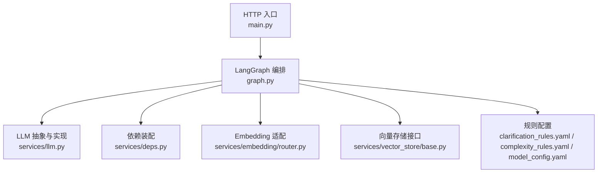
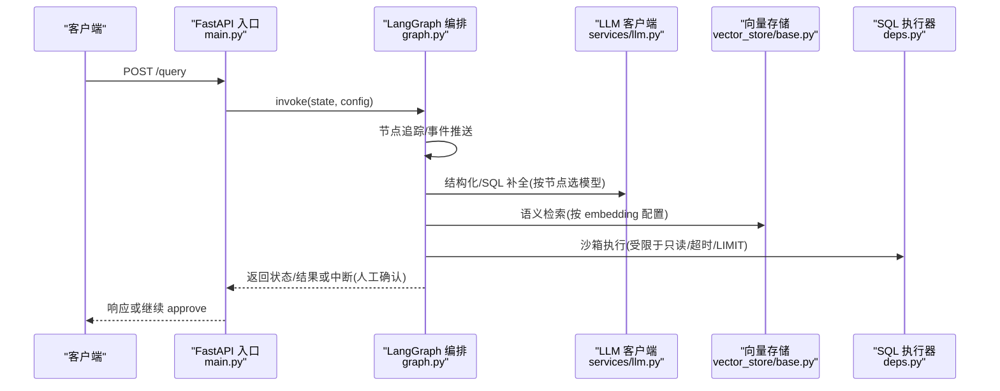
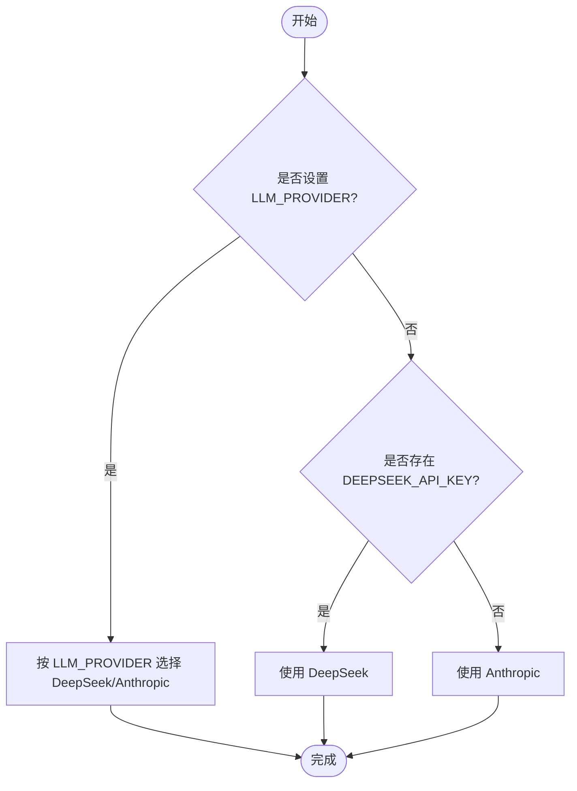
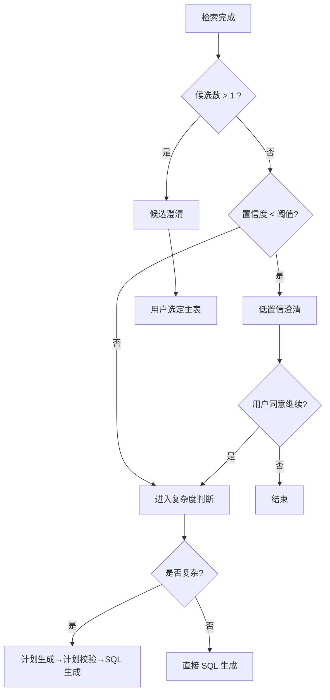
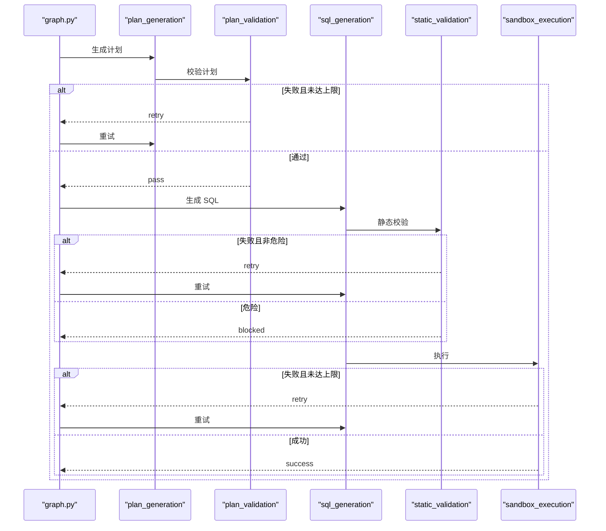
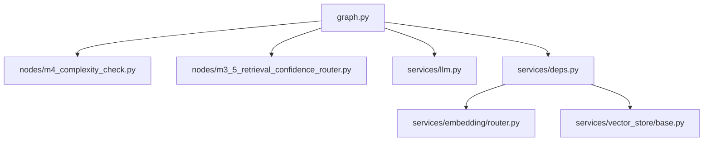

# 模型切换策略

<cite>
**本文引用的文件**   
- [nl2sql_agent/services/llm.py](file://nl2sql_agent/services/llm.py)
- [nl2sql_agent/config/model_config.yaml](file://nl2sql_agent/config/model_config.yaml)
- [nl2sql_agent/services/deps.py](file://nl2sql_agent/services/deps.py)
- [nl2sql_agent/graph.py](file://nl2sql_agent/graph.py)
- [nl2sql_agent/nodes/m4_complexity_check.py](file://nl2sql_agent/nodes/m4_complexity_check.py)
- [nl2sql_agent/nodes/m3_5_retrieval_confidence_router.py](file://nl2sql_agent/nodes/m3_5_retrieval_confidence_router.py)
- [nl2sql_agent/config/clarification_rules.yaml](file://nl2sql_agent/config/clarification_rules.yaml)
- [nl2sql_agent/config/complexity_rules.yaml](file://nl2sql_agent/config/complexity_rules.yaml)
- [nl2sql_agent/main.py](file://nl2sql_agent/main.py)
- [nl2sql_agent/services/embedding/router.py](file://nl2sql_agent/services/embedding/router.py)
- [nl2sql_agent/services/vector_store/base.py](file://nl2sql_agent/services/vector_store/base.py)
</cite>

## 目录
1. [简介](#简介)
2. [项目结构](#项目结构)
3. [核心组件](#核心组件)
4. [架构总览](#架构总览)
5. [详细组件分析](#详细组件分析)
6. [依赖关系分析](#依赖关系分析)
7. [性能考量](#性能考量)
8. [故障排查指南](#故障排查指南)
9. [结论](#结论)
10. [附录](#附录)

## 简介
本文件面向“模型切换策略”的完整文档，围绕 NL2SQL Agent 中的动态模型选择、健康检查与降级、负载均衡与重试、多模型并行与结果融合、优先级管理、版本管理与灰度/A-B 测试支持、阈值与告警机制、以及性能基准与成本优化建议进行系统化说明。系统通过可插拔 LLM 客户端、按节点/任务维度的模型配置、检索置信度路由与复杂度判断、以及图编排中的重试与回退路径，实现了高可用、可观测、可扩展的模型切换能力。

## 项目结构
- 服务层
  - LLM 抽象与 Provider：BaseLLMClient、AnthropicLLMClient、DeepSeekLLMClient，统一 complete / complete_json / complete_structured / complete_sql 接口。
  - 依赖装配：Deps/AppConfig 从 settings.yaml、vector_store.yaml、model_config.yaml 等加载配置，构建 executor、vector store、term mapping、SQL dialect 等。
  - Embedding 适配：按 provider(local/fake) 返回统一 embed(texts) 函数，支持本地模型或测试用确定性向量。
- 编排层
  - LangGraph 图：定义 11 个模块节点与路由，包含计划生成、校验、SQL 生成、静态校验、敏感检查、执行、解释等，内置重试与中断（人工确认）。
- 规则与配置
  - clarification_rules.yaml：时间范围澄清、检索后置信度阈值与候选差距阈值等。
  - complexity_rules.yaml：复杂度判断规则（表数量、复合指标、关键词）。
  - model_config.yaml：embedding 配置与各节点专用模型（如 schema_comment_generation）。
- 入口与 API
  - main.py：FastAPI 入口，/query、/approve、/thread/{id}；根据环境变量启用演示模式（FakeLLM + InMemoryExecutor）。

图表来源
- [nl2sql_agent/main.py:1-152](file://nl2sql_agent/main.py#L1-L152)
- [nl2sql_agent/graph.py:1-313](file://nl2sql_agent/graph.py#L1-L313)
- [nl2sql_agent/services/llm.py:1-328](file://nl2sql_agent/services/llm.py#L1-L328)
- [nl2sql_agent/services/deps.py:1-184](file://nl2sql_agent/services/deps.py#L1-L184)
- [nl2sql_agent/services/embedding/router.py:1-81](file://nl2sql_agent/services/embedding/router.py#L1-L81)
- [nl2sql_agent/services/vector_store/base.py:1-21](file://nl2sql_agent/services/vector_store/base.py#L1-L21)
- [nl2sql_agent/config/clarification_rules.yaml:1-62](file://nl2sql_agent/config/clarification_rules.yaml#L1-L62)
- [nl2sql_agent/config/complexity_rules.yaml:1-17](file://nl2sql_agent/config/complexity_rules.yaml#L1-L17)
- [nl2sql_agent/config/model_config.yaml:1-18](file://nl2sql_agent/config/model_config.yaml#L1-L18)

章节来源
- [nl2sql_agent/main.py:1-152](file://nl2sql_agent/main.py#L1-L152)
- [nl2sql_agent/graph.py:1-313](file://nl2sql_agent/graph.py#L1-L313)
- [nl2sql_agent/services/deps.py:1-184](file://nl2sql_agent/services/deps.py#L1-L184)

## 核心组件
- LLM 客户端抽象与 Provider
  - BaseLLMClient：提供 complete、complete_json、complete_structured、complete_sql、summarize 等统一接口；结构化输出优先走 function calling，失败回退纯文本解析并带错误重试。
  - AnthropicLLMClient：基于 Anthropic Messages API，支持 tool_use。
  - DeepSeekLLMClient：OpenAI 兼容接口，默认 base_url 可覆盖；thinking/reasoning 模式不支持 tool_choice，走纯文本路径。
  - build_llm()：按环境变量选择 provider（LLM_PROVIDER=deepseek → DeepSeek；否则若 DEEPSEEK_API_KEY 存在则用 DeepSeek，否则 Anthropic）。
  - build_sql_llm()：可选 SQL 专用模型，支持独立端点或同主 provider 的模型名。
  - get_model_for_node(node_key)：按 config/model_config.yaml 的 nodes.<node_key> 选模型，未配置回退主模型。
- 依赖装配与配置加载
  - AppConfig：封装 dialect、Top-K、执行限制、超时、行级过滤、各类规则等。
  - Deps：组装 llm、sql_llm、executor、vector_store、term_mapping、catalog、sql 等。
  - build_deps()：从 settings.yaml、vector_store.yaml、model_config.yaml 加载配置，构建各组件；数据库连接缺失时抛出明确错误。
- Embedding 适配
  - get_embedding_function()：provider=local 使用 sentence-transformers（支持 model_path 或 huggingface），provider=fake 使用确定性词袋向量。
- 向量存储接口
  - VectorStoreAdapter：upsert/search 统一接口，InMemory/PgVector 实现由 vector_store.yaml 显式选择。

章节来源
- [nl2sql_agent/services/llm.py:1-328](file://nl2sql_agent/services/llm.py#L1-L328)
- [nl2sql_agent/services/deps.py:1-184](file://nl2sql_agent/services/deps.py#L1-L184)
- [nl2sql_agent/services/embedding/router.py:1-81](file://nl2sql_agent/services/embedding/router.py#L1-L81)
- [nl2sql_agent/services/vector_store/base.py:1-21](file://nl2sql_agent/services/vector_store/base.py#L1-L21)
- [nl2sql_agent/config/model_config.yaml:1-18](file://nl2sql_agent/config/model_config.yaml#L1-L18)

## 架构总览
下图展示请求进入 FastAPI 后，LangGraph 编排如何驱动各节点，并在不同阶段依据规则与状态进行模型切换、重试与降级。

图表来源
- [nl2sql_agent/main.py:1-152](file://nl2sql_agent/main.py#L1-L152)
- [nl2sql_agent/graph.py:1-313](file://nl2sql_agent/graph.py#L1-L313)
- [nl2sql_agent/services/llm.py:1-328](file://nl2sql_agent/services/llm.py#L1-L328)
- [nl2sql_agent/services/vector_store/base.py:1-21](file://nl2sql_agent/services/vector_store/base.py#L1-L21)
- [nl2sql_agent/services/deps.py:1-184](file://nl2sql_agent/services/deps.py#L1-L184)

## 详细组件分析

### 动态模型切换与负载均衡
- 主模型选择
  - build_llm()：按环境变量 LLM_PROVIDER、DEEPSEEK_API_KEY 等决定 provider；未设置时默认 Anthropic。
  - build_sql_llm()：支持独立端点或同 provider 的 SQL 专用模型，未配置则回退主模型。
- 节点级模型选择
  - get_model_for_node(node_key)：读取 model_config.yaml 的 nodes.<node_key>，为特定离线任务（如注释生成）选用更便宜模型；未配置回退主模型。
- 负载均衡与容错
  - 结构化输出：complete_json 优先 function calling，失败回退纯文本解析，带重试计数。
  - 工具调用兼容性：DeepSeek thinking/reasoning 模式不支持 tool_choice，自动回退到纯文本路径。
- 配置与扩展
  - model_config.yaml：embedding 与 nodes 配置集中管理；新增节点只需在 nodes 下添加 model/api_key/base_url。

图表来源
- [nl2sql_agent/services/llm.py:275-283](file://nl2sql_agent/services/llm.py#L275-L283)
- [nl2sql_agent/services/llm.py:285-328](file://nl2sql_agent/services/llm.py#L285-L328)
- [nl2sql_agent/config/model_config.yaml:1-18](file://nl2sql_agent/config/model_config.yaml#L1-L18)

章节来源
- [nl2sql_agent/services/llm.py:1-328](file://nl2sql_agent/services/llm.py#L1-L328)
- [nl2sql_agent/config/model_config.yaml:1-18](file://nl2sql_agent/config/model_config.yaml#L1-L18)

### 基于负载的自动切换与降级
- 检索后置信度路由
  - m3_5_retrieval_confidence_router：根据 retrieval_confidence 阈值与候选差距阈值，决定是否需要候选澄清或低置信澄清。
  - 阈值来自 clarification_rules.yaml 的 retrieval_confidence 段。
- 复杂度判断
  - m4_complexity_check：基于 rules（表数量、复合指标、关键词）判定简单/复杂路径；低置信查询强制走计划路径。
- 降级策略
  - 结构化输出失败：complete_json 多次重试失败抛错；SQL 生成失败经静态校验退回重新生成。
  - 执行失败：sandbox_execution 报错回退至 sql_generation，上限 max_retries。

图表来源
- [nl2sql_agent/nodes/m3_5_retrieval_confidence_router.py:1-127](file://nl2sql_agent/nodes/m3_5_retrieval_confidence_router.py#L1-L127)
- [nl2sql_agent/nodes/m4_complexity_check.py:1-52](file://nl2sql_agent/nodes/m4_complexity_check.py#L1-L52)
- [nl2sql_agent/config/clarification_rules.yaml:1-62](file://nl2sql_agent/config/clarification_rules.yaml#L1-L62)

章节来源
- [nl2sql_agent/nodes/m3_5_retrieval_confidence_router.py:1-127](file://nl2sql_agent/nodes/m3_5_retrieval_confidence_router.py#L1-L127)
- [nl2sql_agent/nodes/m4_complexity_check.py:1-52](file://nl2sql_agent/nodes/m4_complexity_check.py#L1-L52)
- [nl2sql_agent/config/clarification_rules.yaml:1-62](file://nl2sql_agent/config/clarification_rules.yaml#L1-L62)

### 故障转移策略与重试回路
- 计划校验失败：plan_generation → plan_validation → 失败则 retry 回 plan_generation，上限 max_plan_retries。
- 静态校验失败：sql_generation → static_validation → 失败则 retry 回 sql_generation，上限 max_retries；危险操作直接 blocked。
- 执行失败：sandbox_execution → 失败则 retry 回 sql_generation，上限 max_retries。
- 事件与追踪：_retry_route 包装路由，推送 retry 事件（attempt + reason），便于前端与监控。

图表来源
- [nl2sql_agent/graph.py:106-170](file://nl2sql_agent/graph.py#L106-L170)
- [nl2sql_agent/graph.py:237-291](file://nl2sql_agent/graph.py#L237-L291)

章节来源
- [nl2sql_agent/graph.py:106-170](file://nl2sql_agent/graph.py#L106-L170)
- [nl2sql_agent/graph.py:237-291](file://nl2sql_agent/graph.py#L237-L291)

### 多模型并行处理、结果融合与优先级管理
- 多模型并行
  - 当前代码未实现真正的并发多模型调用；但架构上可通过扩展 BaseLLMClient 与路由层实现并行调用与投票/加权融合。
- 结果融合
  - 结构化输出采用 function calling 优先，失败回退纯文本解析；SQLResult 同时返回 used_tables 供后续校验。
- 优先级管理
  - 节点级模型优先级：model_config.yaml 的 nodes.<node_key> 优先于主模型；SQL 专用模型优先于主模型用于 SQL 生成。

章节来源
- [nl2sql_agent/services/llm.py:82-149](file://nl2sql_agent/services/llm.py#L82-L149)
- [nl2sql_agent/config/model_config.yaml:1-18](file://nl2sql_agent/config/model_config.yaml#L1-L18)

### 模型健康检查、性能监控与降级策略
- 健康检查
  - 环境变量与配置校验：build_llm/build_sql_llm 对缺失关键变量抛出 EnvConfigError；build_vector_store 对 pgvector.url 缺失报错。
  - Embedding 加载失败：get_embedding_function 捕获异常并给出清晰提示（镜像地址、离线缓存、fake 模式）。
- 性能监控
  - 节点延迟与步骤追踪：_traced 记录 node_latencies 与 trace_steps；_retry_route 推送 retry 事件。
  - 前端流式事件：event_sink 推送 node_start/node_complete/retry/interrupt/final/error。
- 降级策略
  - 结构化输出失败重试；SQL 生成失败经静态校验重试；执行失败回退 SQL 生成；低置信度查询强制计划路径。

章节来源
- [nl2sql_agent/services/llm.py:275-328](file://nl2sql_agent/services/llm.py#L275-L328)
- [nl2sql_agent/services/embedding/router.py:34-61](file://nl2sql_agent/services/embedding/router.py#L34-L61)
- [nl2sql_agent/graph.py:88-126](file://nl2sql_agent/graph.py#L88-L126)

### 模型版本管理、A/B 测试支持与灰度发布方案
- 版本管理
  - 模型名全部从环境变量读取（ANTHROPIC_MODEL、DEEPSEEK_MODEL、SQL_MODEL 等），避免硬编码；可通过 .env 或部署配置快速切换版本。
- A/B 测试支持
  - 通过环境变量切换 LLM_PROVIDER 或 SQL 专用模型，结合 event_sink 统计不同版本的延迟、重试率、成功率。
- 灰度发布
  - 可按业务线或用户维度在 deps 中注入不同 llm/sql_llm；或在 graph 层扩展路由逻辑，按 state.user_id/data_scope 分流。

章节来源
- [nl2sql_agent/services/llm.py:285-328](file://nl2sql_agent/services/llm.py#L285-L328)
- [nl2sql_agent/services/deps.py:113-184](file://nl2sql_agent/services/deps.py#L113-L184)

### 切换规则配置、阈值设置与告警机制
- 切换规则
  - clarification_rules.yaml：retrieval_confidence.confidence_threshold、candidate_gap_threshold 等控制澄清与路由。
  - complexity_rules.yaml：multi_table_threshold、composite_metric_trigger、multi_step_keywords 控制复杂度判断。
- 阈值设置
  - settings.yaml：schema_search_top_k、execution.limit、execution.timeout_seconds、execution.explain_row_threshold。
- 告警机制
  - 通过 _retry_route 推送 retry 事件（attempt + reason），可在上层聚合告警（如连续重试超限、blocked 风险）。

章节来源
- [nl2sql_agent/config/clarification_rules.yaml:1-62](file://nl2sql_agent/config/clarification_rules.yaml#L1-L62)
- [nl2sql_agent/config/complexity_rules.yaml:1-17](file://nl2sql_agent/config/complexity_rules.yaml#L1-L17)
- [nl2sql_agent/config/settings.yaml:1-30](file://nl2sql_agent/config/settings.yaml#L1-L30)
- [nl2sql_agent/graph.py:106-126](file://nl2sql_agent/graph.py#L106-L126)

### 性能基准测试、成本监控与优化建议
- 基准测试
  - 使用 testing.py 的 FakeLLM 与 InMemoryExecutor 在无外部依赖环境下跑通链路；可构造 bad_then_good 场景验证重试与回归。
- 成本监控
  - 通过 event_sink 统计不同模型的调用次数、重试次数、平均延迟；结合 SQL 专用模型降低 SQL 生成成本。
- 优化建议
  - 合理设置 Top-K、超时与 LIMIT，减少无效执行；embedding 使用本地缓存或镜像加速；复杂查询优先计划路径提升准确率。

章节来源
- [nl2sql_agent/testing.py:124-145](file://nl2sql_agent/testing.py#L124-L145)
- [nl2sql_agent/graph.py:88-126](file://nl2sql_agent/graph.py#L88-L126)
- [nl2sql_agent/config/settings.yaml:1-30](file://nl2sql_agent/config/settings.yaml#L1-L30)

## 依赖关系分析
- 组件耦合
  - graph.py 依赖 nodes/* 与 services/*；deps.py 负责装配 llm、sql_llm、executor、vector_store、term_mapping、catalog、sql。
  - llm.py 提供 BaseLLMClient 及具体实现；embedding/router.py 提供统一 embed 函数；vector_store/base.py 定义统一接口。
- 外部依赖
  - OpenAI/Anthropic SDK、sentence-transformers、数据库驱动（MySQL/Postgres）。
- 潜在循环依赖
  - 当前无循环依赖；graph.py 仅导入 nodes 与 services，不反向依赖。

图表来源
- [nl2sql_agent/graph.py:1-313](file://nl2sql_agent/graph.py#L1-L313)
- [nl2sql_agent/nodes/m4_complexity_check.py:1-52](file://nl2sql_agent/nodes/m4_complexity_check.py#L1-L52)
- [nl2sql_agent/nodes/m3_5_retrieval_confidence_router.py:1-127](file://nl2sql_agent/nodes/m3_5_retrieval_confidence_router.py#L1-L127)
- [nl2sql_agent/services/llm.py:1-328](file://nl2sql_agent/services/llm.py#L1-L328)
- [nl2sql_agent/services/deps.py:1-184](file://nl2sql_agent/services/deps.py#L1-L184)
- [nl2sql_agent/services/embedding/router.py:1-81](file://nl2sql_agent/services/embedding/router.py#L1-L81)
- [nl2sql_agent/services/vector_store/base.py:1-21](file://nl2sql_agent/services/vector_store/base.py#L1-L21)

章节来源
- [nl2sql_agent/graph.py:1-313](file://nl2sql_agent/graph.py#L1-L313)
- [nl2sql_agent/services/deps.py:1-184](file://nl2sql_agent/services/deps.py#L1-L184)

## 性能考量
- 执行限制
  - settings.yaml 的 execution.limit、timeout_seconds、explain_row_threshold 防止大查询与长耗时。
- 向量检索
  - schema_search_top_k 控制召回规模；embedding 本地缓存与镜像加速下载。
- 重试与回退
  - 合理设置 max_retries/max_plan_retries，避免无限重试；失败尽早回退以减少资源消耗。
- 监控与观测
  - 节点延迟、trace_steps、retry 事件可用于性能分析与瓶颈定位。

[本节为通用指导，不直接分析具体文件]

## 故障排查指南
- 常见错误
  - 环境变量缺失：build_llm/build_sql_llm 抛出 EnvConfigError；检查 ANTHROPIC_API_KEY/MODEL、DEEPSEEK_API_KEY/MODEL、SQL_* 等。
  - 数据库连接缺失：build_deps 抛出 RuntimeError；检查 DATABASE_URL/settings.yaml 的 database_url。
  - Embedding 加载失败：get_embedding_function 捕获异常并提示镜像或离线缓存；可使用 provider=fake 测试。
- 调试手段
  - 使用 testing.py 的 FakeLLM 与 InMemoryExecutor 快速验证链路；观察 trace_steps 与 node_latencies。
  - 通过 /thread/{id} 查看中间状态与 next 节点。

章节来源
- [nl2sql_agent/services/llm.py:275-328](file://nl2sql_agent/services/llm.py#L275-L328)
- [nl2sql_agent/services/deps.py:113-184](file://nl2sql_agent/services/deps.py#L113-L184)
- [nl2sql_agent/services/embedding/router.py:34-61](file://nl2sql_agent/services/embedding/router.py#L34-L61)
- [nl2sql_agent/main.py:142-146](file://nl2sql_agent/main.py#L142-L146)

## 结论
本系统通过可插拔 LLM 客户端、节点级模型配置、检索置信度路由与复杂度判断、以及图编排中的重试与回退路径，构建了稳健的模型切换策略。配合环境变量驱动的版本管理、事件驱动的监控与告警、以及严格的执行限制，能够在保证准确率与稳定性的同时，灵活应对负载波动与故障场景。未来可在多模型并行、结果融合与灰度分流方面进一步扩展，以满足更高要求的生产环境。

[本节为总结性内容，不直接分析具体文件]

## 附录
- 关键配置项速查
  - model_config.yaml：embedding.provider/model/model_path/dimension；nodes.<key>.model/api_key/base_url。
  - clarification_rules.yaml：retrieval_confidence.confidence_threshold/candidate_gap_threshold 等。
  - complexity_rules.yaml：multi_table_threshold/composite_metric_trigger/multi_step_keywords。
  - settings.yaml：dialect/schema_search_top_k/database_url/execution.*。

[本节为补充信息，不直接分析具体文件]