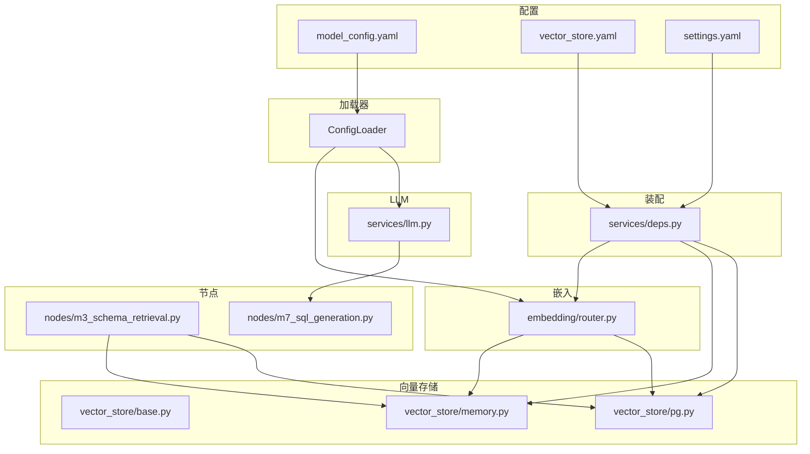
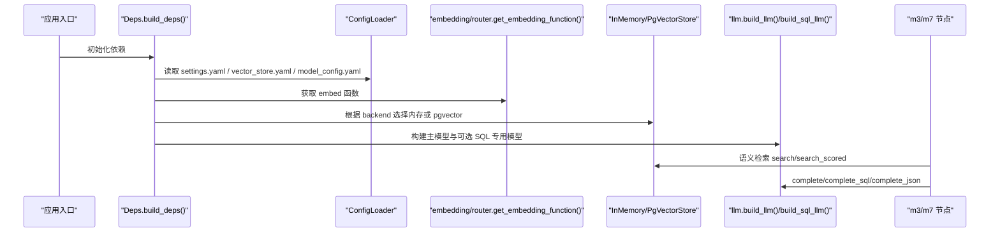
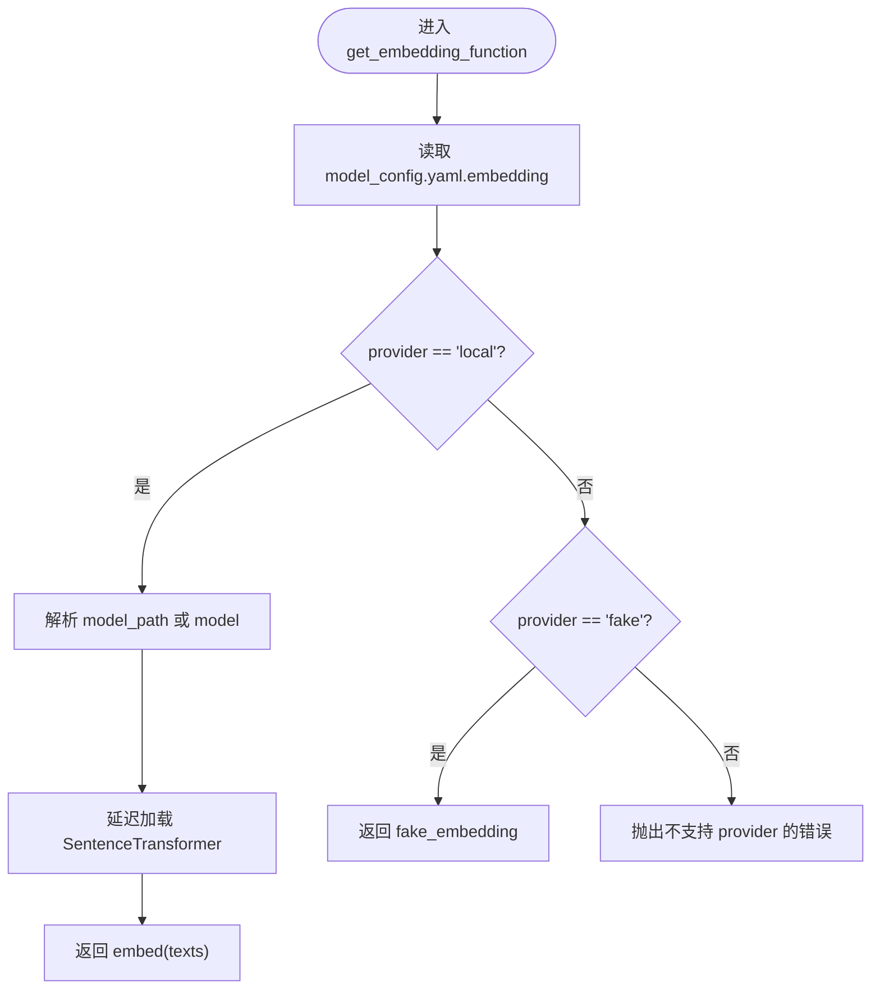
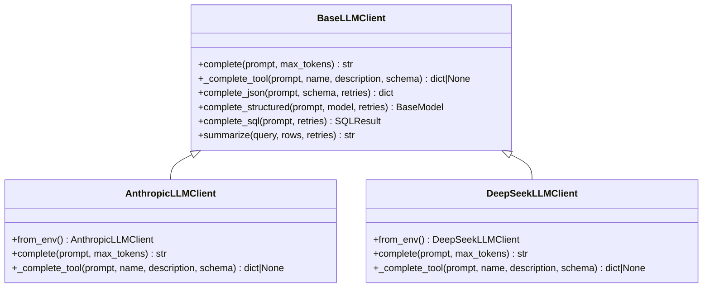
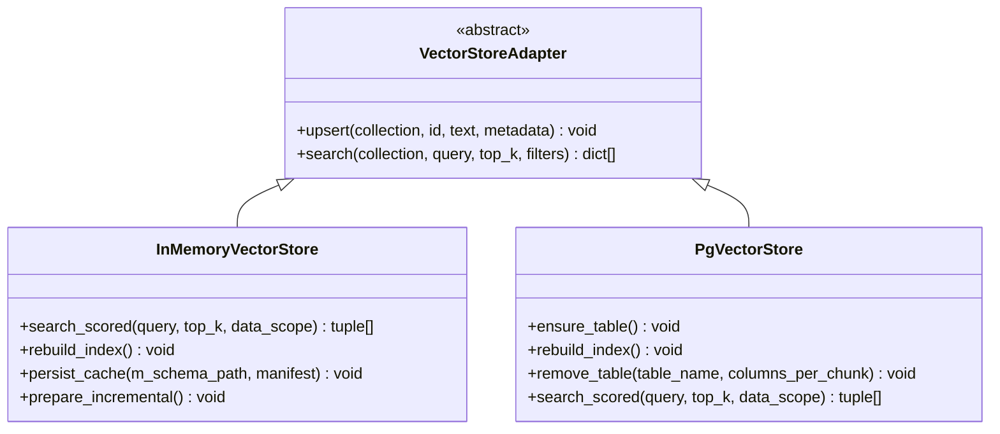
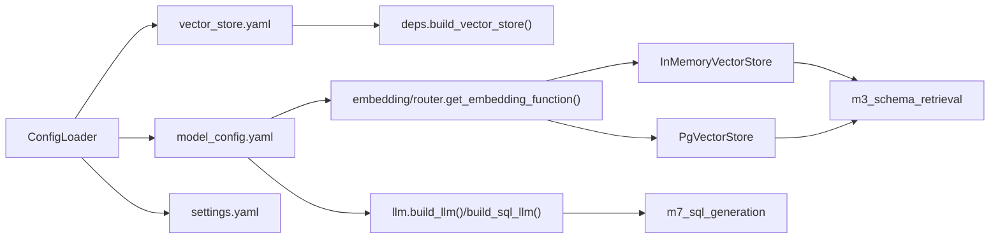

# 模型配置

<cite>
**本文引用的文件**   
- [model_config.yaml](file://nl2sql_agent/config/model_config.yaml)
- [vector_store.yaml](file://nl2sql_agent/config/vector_store.yaml)
- [settings.yaml](file://nl2sql_agent/config/settings.yaml)
- [llm.py](file://nl2sql_agent/services/llm.py)
- [router.py](file://nl2sql_agent/services/embedding/router.py)
- [base.py](file://nl2sql_agent/services/vector_store/base.py)
- [memory.py](file://nl2sql_agent/services/vector_store/memory.py)
- [pg.py](file://nl2sql_agent/services/vector_store/pg.py)
- [deps.py](file://nl2sql_agent/services/deps.py)
- [config_loader.py](file://nl2sql_agent/services/config_loader.py)
- [m3_schema_retrieval.py](file://nl2sql_agent/nodes/m3_schema_retrieval.py)
- [m7_sql_generation.py](file://nl2sql_agent/nodes/m7_sql_generation.py)
</cite>

## 目录
1. [简介](#简介)
2. [项目结构](#项目结构)
3. [核心组件](#核心组件)
4. [架构总览](#架构总览)
5. [详细组件分析](#详细组件分析)
6. [依赖关系分析](#依赖关系分析)
7. [性能与成本优化](#性能与成本优化)
8. [故障排查指南](#故障排查指南)
9. [结论](#结论)
10. [附录](#附录)

## 简介
本文件面向“模型配置系统”，围绕 nl2sql_agent/config/model_config.yaml 及关联代码，系统性说明：
- 嵌入模型（本地 sentence-transformers、测试 fake）的配置结构与加载流程
- LLM 模型（Anthropic Claude、DeepSeek OpenAI 兼容等）的切换策略、环境变量与节点级模型覆盖
- 向量存储（内存与 pgvector）的参数、索引与缓存策略
- 请求限流、密钥管理、监控指标与可观测性建议
- 多模型并行处理、动态模型切换与版本管理的实现要点与扩展建议

## 项目结构
与模型配置相关的核心文件分布如下：
- 配置层：model_config.yaml、vector_store.yaml、settings.yaml
- 加载器：ConfigLoader（YAML 热更新）
- 嵌入层：embedding/router.py（provider: local/fake）
- LLM 层：services/llm.py（BaseLLMClient、AnthropicLLMClient、DeepSeekLLMClient、build_llm/build_sql_llm/get_model_for_node）
- 向量存储：vector_store/base.py、memory.py、pg.py
- 装配与依赖：services/deps.py（构建向量存储、选择后端、注入 embedding）
- 使用点：m3_schema_retrieval.py（检索）、m7_sql_generation.py（SQL 生成）

**图表来源** 
- [model_config.yaml:1-16](file://nl2sql_agent/config/model_config.yaml#L1-L16)
- [vector_store.yaml:1-6](file://nl2sql_agent/config/vector_store.yaml#L1-L6)
- [settings.yaml:1-30](file://nl2sql_agent/config/settings.yaml#L1-L30)
- [config_loader.py:1-36](file://nl2sql_agent/services/config_loader.py#L1-L36)
- [router.py:1-81](file://nl2sql_agent/services/embedding/router.py#L1-L81)
- [llm.py:1-328](file://nl2sql_agent/services/llm.py#L1-L328)
- [base.py:1-21](file://nl2sql_agent/services/vector_store/base.py#L1-L21)
- [memory.py:1-192](file://nl2sql_agent/services/vector_store/memory.py#L1-L192)
- [pg.py:1-174](file://nl2sql_agent/services/vector_store/pg.py#L1-L174)
- [deps.py:1-181](file://nl2sql_agent/services/deps.py#L1-L181)
- [m3_schema_retrieval.py:1-331](file://nl2sql_agent/nodes/m3_schema_retrieval.py#L1-L331)
- [m7_sql_generation.py:1-113](file://nl2sql_agent/nodes/m7_sql_generation.py#L1-L113)

**章节来源**
- [model_config.yaml:1-16](file://nl2sql_agent/config/model_config.yaml#L1-L16)
- [vector_store.yaml:1-6](file://nl2sql_agent/config/vector_store.yaml#L1-L6)
- [settings.yaml:1-30](file://nl2sql_agent/config/settings.yaml#L1-L30)
- [config_loader.py:1-36](file://nl2sql_agent/services/config_loader.py#L1-L36)

## 核心组件
- 嵌入模型配置（embedding）
  - provider: local（sentence-transformers）或 fake（确定性词袋向量）
  - model/model_path/dimension：模型名、本地路径、输出维度
  - 通过 embedding/router.py 的 get_embedding_function() 返回统一 embed(texts) -> list[list[float]]
- LLM 模型配置（主模型与 SQL 专用模型）
  - 主模型 build_llm(): 按 LLM_PROVIDER 或 API_KEY 自动选择 DeepSeek/Anthropic
  - SQL 专用模型 build_sql_llm(): 支持独立端点或同 provider 的不同模型名
  - 节点级模型覆盖 get_model_for_node(node_key): 读取 model_config.yaml.nodes.<node_key>.model
- 向量存储后端（vector store）
  - vector_store.yaml.backend: memory 或 pgvector
  - pgvector.url: 数据库连接字符串（支持环境变量展开）
  - InMemoryVectorStore/PgVectorStore 均实现 VectorStoreAdapter 接口

**章节来源**
- [router.py:1-81](file://nl2sql_agent/services/embedding/router.py#L1-L81)
- [llm.py:1-328](file://nl2sql_agent/services/llm.py#L1-L328)
- [base.py:1-21](file://nl2sql_agent/services/vector_store/base.py#L1-L21)
- [memory.py:1-192](file://nl2sql_agent/services/vector_store/memory.py#L1-L192)
- [pg.py:1-174](file://nl2sql_agent/services/vector_store/pg.py#L1-L174)
- [deps.py:87-108](file://nl2sql_agent/services/deps.py#L87-L108)

## 架构总览
下图展示从配置到运行时组件的装配与调用关系。

**图表来源** 
- [deps.py:110-181](file://nl2sql_agent/services/deps.py#L110-L181)
- [router.py:23-61](file://nl2sql_agent/services/embedding/router.py#L23-L61)
- [llm.py:280-328](file://nl2sql_agent/services/llm.py#L280-L328)
- [m3_schema_retrieval.py:230-331](file://nl2sql_agent/nodes/m3_schema_retrieval.py#L230-L331)
- [m7_sql_generation.py:94-113](file://nl2sql_agent/nodes/m7_sql_generation.py#L94-L113)

## 详细组件分析

### 嵌入模型配置与加载
- 配置项（model_config.yaml.embedding）
  - provider: local | fake
  - model: 模型名（如 paraphrase-multilingual-MiniLM-L12-v2）
  - model_path: 本地已下载模型目录（相对项目根解析）
  - dimension: 向量维度（用于 pgvector 建表）
- 加载流程
  - embedding/router.py::get_embedding_function() 读取配置并返回 embed(texts)
  - provider=local 时延迟导入 SentenceTransformer；若 model_path 存在则优先使用本地路径
  - provider=fake 时使用确定性词袋向量（仅测试）
- 错误处理
  - 本地模型加载失败抛出 RuntimeError，提示设置 HF_ENDPOINT 或使用 model_path/fake

**图表来源** 
- [router.py:23-61](file://nl2sql_agent/services/embedding/router.py#L23-L61)

**章节来源**
- [model_config.yaml:1-16](file://nl2sql_agent/config/model_config.yaml#L1-L16)
- [router.py:1-81](file://nl2sql_agent/services/embedding/router.py#L1-L81)

### LLM 模型配置与切换策略
- 主模型选择（build_llm）
  - 优先级：显式 LLM_PROVIDER=deepseek → DeepSeek；否则若 DEEPSEEK_API_KEY 存在 → DeepSeek；否则 Anthropic
  - 模型名一律从环境变量读取（ANTHROPIC_MODEL / DEEPSEEK_MODEL），禁止硬编码
- SQL 专用模型（build_sql_llm）
  - 方式一：完全独立的 OpenAI 兼容端点（SQL_MODEL + SQL_BASE_URL + SQL_API_KEY）
  - 方式二：同主 provider 的模型名（DEEPSEEK_SQL_MODEL / ANTHROPIC_SQL_MODEL）
- 节点级模型覆盖（get_model_for_node）
  - 读取 model_config.yaml.nodes.<node_key>.model
  - 未配置该节点则回退主模型；当前实现为 DeepSeekLLMClient（可配 api_key/base_url）
- 结构化输出与重试
  - BaseLLMClient.complete_json/_complete_tool：优先 function calling，失败回退纯文本解析并校验必填字段
  - complete_sql：返回 SQLResult(sql, used_tables)，供模块 8 交叉比对

**图表来源** 
- [llm.py:70-243](file://nl2sql_agent/services/llm.py#L70-L243)

**章节来源**
- [llm.py:1-328](file://nl2sql_agent/services/llm.py#L1-L328)

### 向量存储模型配置与参数
- 后端选择（vector_store.yaml）
  - backend: memory | pgvector
  - pgvector.url: 数据库连接串（支持 ${PGVECTOR_URL} 展开）
- 内存向量存储（InMemoryVectorStore）
  - 真 embedding + 余弦相似度；提供 search_scored 供模块 3/3.5
  - 缓存签名 cache_signature 由 embedding 配置序列化得到，重启后仅在语义哈希与签名一致时复用
  - rebuild_index：embedding 模型切换后必须重建
- pgvector 存储（PgVectorStore）
  - ensure_table：按 embedding.dimension 创建 vector(dim) 列
  - search：基于 <=> 余弦距离排序，score = 1 - (embedding <=> query)/2
  - rebuild_index：可从 M-Schema manifest 恢复或全量重建

**图表来源** 
- [base.py:1-21](file://nl2sql_agent/services/vector_store/base.py#L1-L21)
- [memory.py:1-192](file://nl2sql_agent/services/vector_store/memory.py#L1-L192)
- [pg.py:1-174](file://nl2sql_agent/services/vector_store/pg.py#L1-L174)

**章节来源**
- [vector_store.yaml:1-6](file://nl2sql_agent/config/vector_store.yaml#L1-L6)
- [memory.py:1-192](file://nl2sql_agent/services/vector_store/memory.py#L1-L192)
- [pg.py:1-174](file://nl2sql_agent/services/vector_store/pg.py#L1-L174)

### 节点特定模型配置
- model_config.yaml.nodes.schema_comment_generation.model: deepseek-chat（示例）
- get_model_for_node(node_key) 会读取对应节点的 model，未配置则回退主模型
- 当前实现为 DeepSeekLLMClient（可覆盖 api_key/base_url），便于离线任务使用更便宜模型

**章节来源**
- [model_config.yaml:11-16](file://nl2sql_agent/config/model_config.yaml#L11-L16)
- [llm.py:245-273](file://nl2sql_agent/services/llm.py#L245-L273)

### 模型切换与负载均衡
- 切换策略
  - 主模型：LLM_PROVIDER 或 DEEPSEEK_API_KEY 决定 provider
  - SQL 专用模型：独立端点或同 provider 不同模型名
  - 节点级：按 nodes.<node_key>.model 覆盖
- 负载均衡（现状与建议）
  - 当前代码未内置多实例轮询/权重分配
  - 建议在客户端封装层增加：健康检查、超时重试、权重路由、熔断降级（例如对同一 provider 的多 base_url 列表进行轮询）

[本节为概念性建议，不直接分析具体文件]

### 故障转移机制
- 结构化输出失败重试：complete_json 支持多次重试（function calling 失败回退纯文本解析）
- SQL 生成失败反馈：m7_sql_generation 将执行错误与校验错误拼接为反馈，驱动下一次生成
- 向量检索兜底：无术语命中时走向量检索；置信度低触发候选澄清

**章节来源**
- [llm.py:82-128](file://nl2sql_agent/services/llm.py#L82-L128)
- [m7_sql_generation.py:17-29](file://nl2sql_agent/nodes/m7_sql_generation.py#L17-L29)
- [m3_schema_retrieval.py:230-331](file://nl2sql_agent/nodes/m3_schema_retrieval.py#L230-L331)

### 模型 API 密钥管理与请求限流
- 密钥管理
  - .env 文件加载：load_dotenv(PROJECT_ROOT/.env)
  - 环境变量：ANTHROPIC_API_KEY/ANTHROPIC_MODEL、DEEPSEEK_API_KEY/DEEPSEEK_MODEL/DEEPSEEK_BASE_URL、SQL_* 系列
- 请求限流
  - 当前代码未实现速率限制；可在上层 HTTP 网关或服务包装器中实现令牌桶/漏桶
  - 建议结合 provider 侧配额与错误码（如 429）进行指数退避重试

**章节来源**
- [deps.py:32-38](file://nl2sql_agent/services/deps.py#L32-L38)
- [llm.py:169-228](file://nl2sql_agent/services/llm.py#L169-L228)

### 缓存策略
- 配置热更新：ConfigLoader 基于 mtime 缓存，修改 YAML 后下次读取即重载
- 向量缓存（内存）：InMemoryVectorStore.persist_cache 原子写入 vector-cache.json，重启后依据 semantic_hash 与 embedding_signature 决定是否复用
- 嵌入模型缓存：SentenceTransformer 首次加载后常驻内存（进程内）

**章节来源**
- [config_loader.py:1-36](file://nl2sql_agent/services/config_loader.py#L1-L36)
- [memory.py:100-132](file://nl2sql_agent/services/vector_store/memory.py#L100-L132)

### 多模型并行处理、动态模型切换与版本管理
- 多模型并行
  - 当前检索阶段对 collection 分别查询（表级/字段级/关系级），但非跨 provider 并行
  - 建议：在路由层对多个 provider/endpoint 并发发起请求，合并结果并按分数排序
- 动态模型切换
  - 运行时通过环境变量切换 provider/model；如需热切换，可在 deps 层暴露 reload_llm()
- 版本管理
  - embedding 维度与签名参与缓存键；模型升级需重建索引（rebuild_index）
  - 建议：为每个 provider/model 维护版本标签，并在日志与指标中记录

[本节为概念性建议，不直接分析具体文件]

## 依赖关系分析
- 配置加载依赖 ConfigLoader，所有 YAML 文件通过其 load(rel_path) 读取
- 向量存储后端由 vector_store.yaml.backend 显式选择，默认 memory
- embedding 函数由 embedding/router.py 提供，被向量存储与检索节点共用
- LLM 客户端由 llm.py 构建，SQL 生成节点优先使用 sql_llm，否则回退 llm

**图表来源** 
- [deps.py:87-108](file://nl2sql_agent/services/deps.py#L87-L108)
- [router.py:23-61](file://nl2sql_agent/services/embedding/router.py#L23-L61)
- [llm.py:280-328](file://nl2sql_agent/services/llm.py#L280-L328)
- [memory.py:1-192](file://nl2sql_agent/services/vector_store/memory.py#L1-L192)
- [pg.py:1-174](file://nl2sql_agent/services/vector_store/pg.py#L1-L174)
- [m3_schema_retrieval.py:1-331](file://nl2sql_agent/nodes/m3_schema_retrieval.py#L1-L331)
- [m7_sql_generation.py:1-113](file://nl2sql_agent/nodes/m7_sql_generation.py#L1-L113)

**章节来源**
- [deps.py:1-181](file://nl2sql_agent/services/deps.py#L1-L181)
- [config_loader.py:1-36](file://nl2sql_agent/services/config_loader.py#L1-L36)

## 性能与成本优化
- 嵌入模型
  - 优先使用本地模型与 model_path，避免网络下载与重复加载
  - 合理设置 dimension，减少 pgvector 存储与计算开销
- LLM 模型
  - 使用更便宜的节点级模型处理离线任务（如 schema_comment_generation）
  - SQL 专用模型可指向低成本端点（OpenAI 兼容），降低生成成本
- 向量存储
  - 内存模式适合开发/小规模；生产建议使用 pgvector 并利用索引加速
  - 增量同步前调用 prepare_incremental，仅重算变更表
- 监控指标（建议）
  - 各 provider 的 QPS、P95/P99 延迟、错误率、重试次数
  - 向量检索召回率、top-k 命中率、缓存命中率
  - SQL 生成成功率、used_tables 一致性比率

[本节为通用指导，不直接分析具体文件]

## 故障排查指南
- 本地 embedding 模型加载失败
  - 现象：RuntimeError 提示无法加载本地模型
  - 处理：设置 HF_ENDPOINT 镜像或配置 model_path；测试可用 provider=fake
- 向量存储后端未配置
  - 现象：backend=pgvector 但未提供 url
  - 处理：在 vector_store.yaml 中设置 pgvector.url 或通过环境变量 PGVECTOR_URL
- LLM 环境变量缺失
  - 现象：EnvConfigError 提示缺少 API_KEY 或 MODEL
  - 处理：补充 .env 或系统环境变量
- SQL 生成失败
  - 现象：执行错误或校验错误导致重新生成
  - 处理：查看 validation_errors/execution_error，修正 prompt 或数据范围

**章节来源**
- [router.py:45-53](file://nl2sql_agent/services/embedding/router.py#L45-L53)
- [deps.py:98-107](file://nl2sql_agent/services/deps.py#L98-L107)
- [llm.py:169-228](file://nl2sql_agent/services/llm.py#L169-L228)
- [m7_sql_generation.py:17-29](file://nl2sql_agent/nodes/m7_sql_generation.py#L17-L29)

## 结论
本配置系统以 YAML 为中心，结合环境变量与 ConfigLoader 热更新，实现了：
- 灵活的嵌入模型与 LLM 提供商切换
- 节点级模型覆盖与 SQL 专用模型
- 内存与 pgvector 两种向量存储后端
- 结构化输出与失败重试的鲁棒性设计
在生产环境中，建议补充负载均衡、限流、监控与版本管理，以获得更高的稳定性与可观测性。

## 附录
- 关键环境变量清单（建议）
  - LLM_PROVIDER、ANTHROPIC_API_KEY、ANTHROPIC_MODEL、ANTHROPIC_SQL_MODEL
  - DEEPSEEK_API_KEY、DEEPSEEK_MODEL、DEEPSEEK_BASE_URL、DEEPSEEK_SQL_MODEL
  - SQL_MODEL、SQL_BASE_URL、SQL_API_KEY
  - PGVECTOR_URL、DATABASE_URL
- 常用操作
  - 切换 embedding：修改 model_config.yaml.embedding 并重建向量索引
  - 切换 LLM：调整环境变量或 model_config.yaml.nodes.*.model
  - 切换向量后端：修改 vector_store.yaml.backend 并配置相应 URL

[本节为参考信息，不直接分析具体文件]