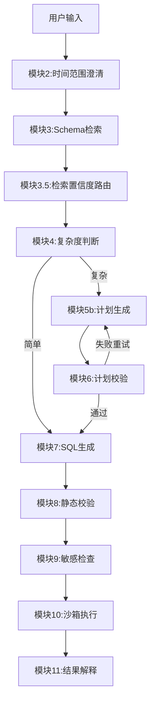
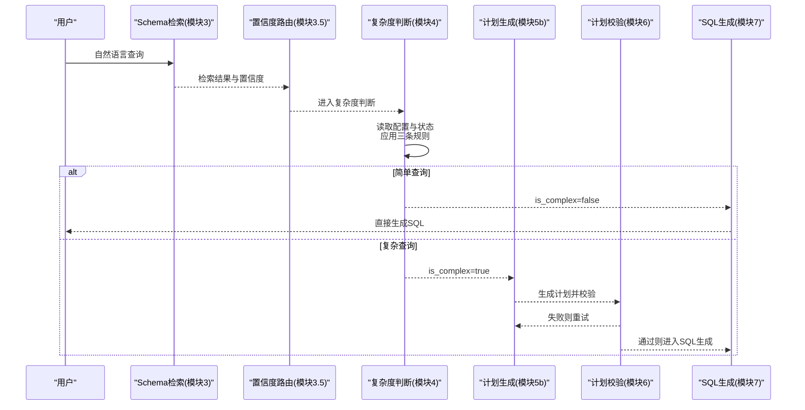
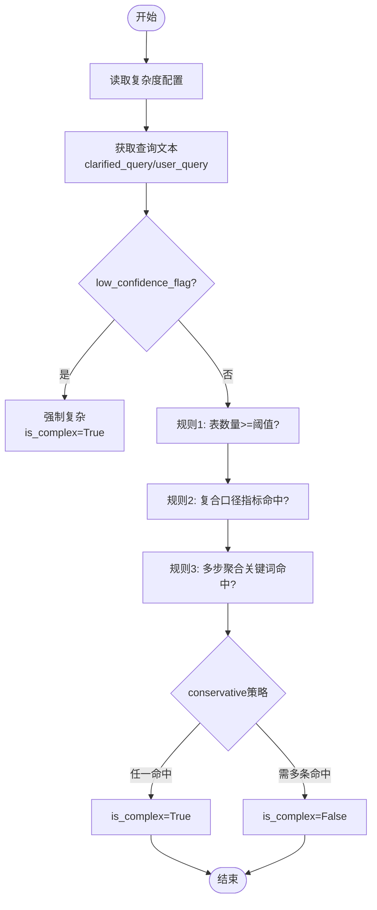
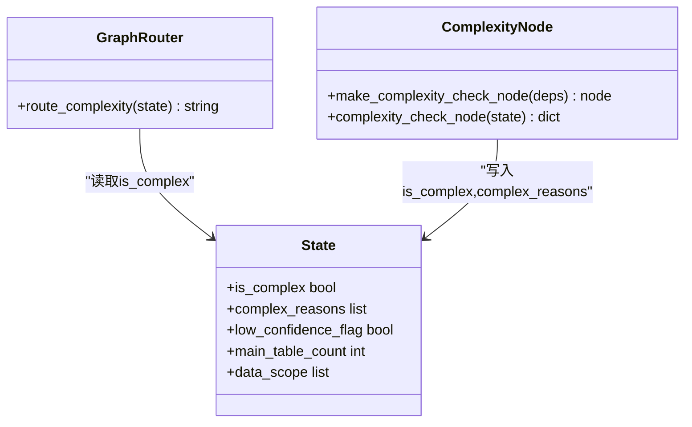
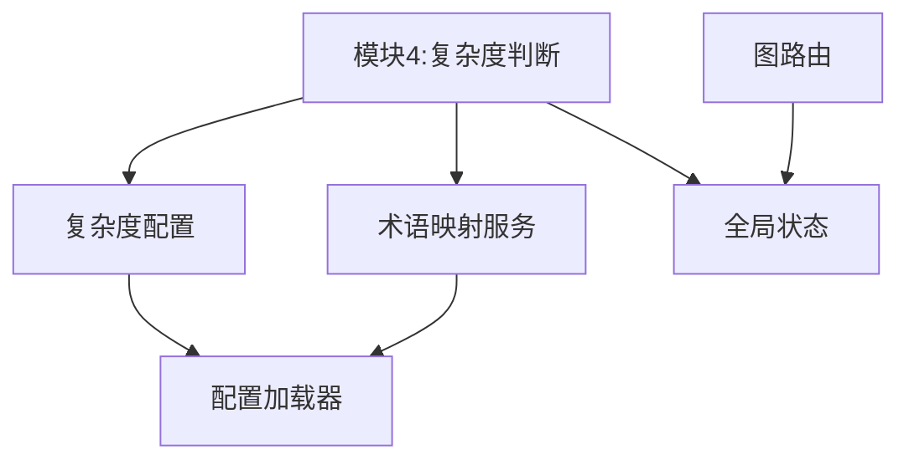

# 复杂度判断规则

<cite>
**本文引用的文件**   
- [complexity_rules.yaml](file://nl2sql_agent/config/complexity_rules.yaml)
- [m4_complexity_check.py](file://nl2sql_agent/nodes/m4_complexity_check.py)
- [state.py](file://nl2sql_agent/state.py)
- [graph.py](file://nl2sql_agent/graph.py)
- [term_mapping.py](file://nl2sql_agent/services/term_mapping.py)
- [config_loader.py](file://nl2sql_agent/services/config_loader.py)
- [clarification_rules.yaml](file://nl2sql_agent/config/clarification_rules.yaml)
- [_global.yaml](file://nl2sql_agent/config/term_mapping/_global.yaml)
- [settings.yaml](file://nl2sql_agent/config/settings.yaml)
</cite>

## 目录
1. [简介](#简介)
2. [项目结构](#项目结构)
3. [核心组件](#核心组件)
4. [架构总览](#架构总览)
5. [详细组件分析](#详细组件分析)
6. [依赖关系分析](#依赖关系分析)
7. [性能考量](#性能考量)
8. [故障排查指南](#故障排查指南)
9. [结论](#结论)
10. [附录](#附录)

## 简介
本文件系统化阐述 NL2SQL 的“查询复杂度判断规则”体系，聚焦于模块 4（复杂度判断）如何通过确定性规则对自然语言查询进行复杂度评估，并据此选择后续处理路径：简单查询直接生成 SQL，复杂查询进入计划生成与校验流程。文档覆盖指标定义、评分与分类机制、阈值与权重配置、扩展方法、最佳实践与调优建议，以及常见查询模式的复杂度分析示例。

## 项目结构
- 复杂度规则配置文件位于 nl2sql_agent/config/complexity_rules.yaml，集中管理保守策略、表数量阈值、复合口径指标开关与多步聚合关键词列表。
- 复杂度判断节点实现位于 nl2sql_agent/nodes/m4_complexity_check.py，读取配置并结合状态字段与术语映射服务完成判定。
- 全局状态模型在 nl2sql_agent/state.py，包含 is_complex、complex_reasons 等关键字段。
- 图编排与路由在 nl2sql_agent/graph.py，根据 is_complex 决定走简单路径还是计划路径。
- 术语映射服务在 nl2sql_agent/services/term_mapping.py，提供术语抽取与解析能力，支持 composite_metric 标记。
- 配置加载器在 nl2sql_agent/services/config_loader.py，支持 YAML 热更新。
- 澄清规则与检索置信度相关参数在 nl2sql_agent/config/clarification_rules.yaml，影响低置信度标志位，间接驱动复杂度判断。
- 术语映射样例在 nl2sql_agent/config/term_mapping/_global.yaml，展示 composite_metric 的使用方式。
- 运行参数在 nl2sql_agent/config/settings.yaml，涉及执行限制与 EXPLAIN 阈值等，虽不直接参与复杂度判断，但与整体性能与安全策略相关。

图表来源
- [graph.py:174-294](file://nl2sql_agent/graph.py#L174-L294)

章节来源
- [graph.py:174-294](file://nl2sql_agent/graph.py#L174-L294)
- [m4_complexity_check.py:1-53](file://nl2sql_agent/nodes/m4_complexity_check.py#L1-L53)
- [complexity_rules.yaml:1-17](file://nl2sql_agent/config/complexity_rules.yaml#L1-L17)

## 核心组件
- 复杂度规则配置（complexity_rules.yaml）
  - conservative：是否采用“任一命中即复杂”的保守策略。
  - multi_table_threshold：触发复杂的表数量阈值。
  - composite_metric_trigger：是否启用复合口径指标触发。
  - multi_step_keywords：多步聚合语义关键词列表。
  - keyword_trigger：是否启用关键词匹配。
- 复杂度判断节点（m4_complexity_check.py）
  - 读取 deps.config.complexity_rules。
  - 使用 state.clarified_query 或 state.user_query 作为输入文本。
  - 使用 state.data_scope 限定术语映射命名空间。
  - 基于三条规则收集 reasons，按 conservative 策略计算 is_complex。
- 全局状态（state.py）
  - is_complex：是否为复杂查询。
  - complex_reasons：判定原因列表。
  - main_table_count：术语精确命中的主表数（不含向量补充关联表）。
  - low_confidence_flag：低置信度标志，强制走计划路径。
- 术语映射服务（term_mapping.py）
  - extract_terms：从查询中抽取术语（含别名），返回主术语名。
  - resolve：按 data_scope 解析术语，返回 FOUND/AMBIGUOUS/NOT_FOUND。
  - TermEntry.composite_metric：复合口径指标标记。
- 图路由（graph.py）
  - route_complexity：根据 state.is_complex 返回 "complex" 或 "simple"，决定后续节点。

章节来源
- [complexity_rules.yaml:1-17](file://nl2sql_agent/config/complexity_rules.yaml#L1-L17)
- [m4_complexity_check.py:17-52](file://nl2sql_agent/nodes/m4_complexity_check.py#L17-L52)
- [state.py:83-146](file://nl2sql_agent/state.py#L83-L146)
- [term_mapping.py:39-98](file://nl2sql_agent/services/term_mapping.py#L39-L98)
- [graph.py:134-136](file://nl2sql_agent/graph.py#L134-L136)

## 架构总览
复杂度判断处于 Schema 检索与置信度路由之后、SQL 生成之前。其职责是纯确定性规则评估，不调用 LLM，避免引入不确定性。评估结果直接影响后续路径：
- 简单路径：跳过计划生成，直接进入 SQL 生成。
- 复杂路径：进入计划生成与校验，确保复杂查询具备可验证的执行计划。

图表来源
- [graph.py:230-248](file://nl2sql_agent/graph.py#L230-L248)
- [m4_complexity_check.py:17-52](file://nl2sql_agent/nodes/m4_complexity_check.py#L17-L52)

章节来源
- [graph.py:230-248](file://nl2sql_agent/graph.py#L230-L248)
- [m4_complexity_check.py:17-52](file://nl2sql_agent/nodes/m4_complexity_check.py#L17-L52)

## 详细组件分析

### 复杂度评估算法与分类标准
- 输入
  - 查询文本：优先使用 clarified_query，否则回退到 user_query。
  - 数据域：data_scope，用于限定术语映射命名空间。
  - 状态字段：main_table_count（术语精确命中主表数）、retrieved_schema（检索到的表集合）。
- 规则集
  - 表数量规则：当 main_table_count >= multi_table_threshold 时，视为复杂。
  - 复合口径指标规则：若术语映射中存在 composite_metric=true 的条目被命中，则视为复杂。
  - 多步聚合关键词规则：若查询文本包含 multi_step_keywords 中的任意词，则视为复杂。
- 分类策略
  - conservative=true：任意一条规则命中即判为复杂。
  - conservative=false：需要至少两条规则命中才判为复杂。
- 输出
  - is_complex：布尔值，决定是否进入计划路径。
  - complex_reasons：字符串列表，记录命中的规则及原因。

图表来源
- [m4_complexity_check.py:17-52](file://nl2sql_agent/nodes/m4_complexity_check.py#L17-L52)
- [complexity_rules.yaml:1-17](file://nl2sql_agent/config/complexity_rules.yaml#L1-L17)

章节来源
- [m4_complexity_check.py:17-52](file://nl2sql_agent/nodes/m4_complexity_check.py#L17-L52)
- [complexity_rules.yaml:1-17](file://nl2sql_agent/config/complexity_rules.yaml#L1-L17)

### 简单查询与复杂查询的判断条件
- 简单查询
  - 未命中任何复杂度规则（在 conservative=true 下）。
  - 典型场景：单表查询、无复合口径指标、无多步聚合关键词。
- 复杂查询
  - 命中以下任一条件（保守策略）：
    - 涉及表数量达到或超过阈值（main_table_count >= multi_table_threshold）。
    - 命中术语映射中标记为复合口径指标的术语（composite_metric=true）。
    - 查询文本包含多步聚合语义关键词（如同比、环比、累计、占比、排名等）。
  - 低置信度查询：无论其他规则如何，强制走计划路径（is_complex=True）。

章节来源
- [m4_complexity_check.py:17-52](file://nl2sql_agent/nodes/m4_complexity_check.py#L17-L52)
- [state.py:100-106](file://nl2sql_agent/state.py#L100-L106)
- [term_mapping.py:23-31](file://nl2sql_agent/services/term_mapping.py#L23-L31)

### 不同复杂度级别的处理策略选择机制
- 路由函数
  - route_complexity(state) 根据 state.is_complex 返回 "complex" 或 "simple"。
- 路径分支
  - simple：直接跳转到 SQL 生成（模块7）。
  - complex：进入计划生成（模块5b）→ 计划校验（模块6）→ 通过则进入 SQL 生成（模块7）。
- 重试机制
  - 计划校验失败会在模块5b内部重试，上限由 max_plan_retries 控制。
  - SQL 生成与静态校验失败会回退到 SQL 生成，上限由 max_retries 控制。

图表来源
- [graph.py:134-136](file://nl2sql_agent/graph.py#L134-L136)
- [m4_complexity_check.py:17-52](file://nl2sql_agent/nodes/m4_complexity_check.py#L17-L52)
- [state.py:104-106](file://nl2sql_agent/state.py#L104-L106)

章节来源
- [graph.py:230-248](file://nl2sql_agent/graph.py#L230-L248)
- [m4_complexity_check.py:17-52](file://nl2sql_agent/nodes/m4_complexity_check.py#L17-L52)

### 复杂度规则的权重配置、阈值调整与自定义扩展
- 权重与阈值
  - conservative：布尔开关，控制“任一命中即复杂”或“需多条命中”。
  - multi_table_threshold：整数阈值，默认 2。
  - composite_metric_trigger：布尔开关，默认 true。
  - keyword_trigger：布尔开关，默认 true。
  - multi_step_keywords：字符串列表，可按业务需求增删。
- 动态加载与热更新
  - 通过 ConfigLoader 加载 YAML，支持 mtime 变化自动重载。
  - 术语映射服务也支持热更新，无需重启服务。
- 自定义扩展
  - 新增规则：在 complexity_rules.yaml 中添加新字段，并在 m4_complexity_check.py 中增加对应判断逻辑。
  - 调整阈值：修改 multi_table_threshold 或 conservative 策略。
  - 扩展关键词：在 multi_step_keywords 中添加新的多步聚合语义词。

章节来源
- [complexity_rules.yaml:1-17](file://nl2sql_agent/config/complexity_rules.yaml#L1-L17)
- [config_loader.py:14-36](file://nl2sql_agent/services/config_loader.py#L14-L36)
- [term_mapping.py:47-81](file://nl2sql_agent/services/term_mapping.py#L47-L81)

### 术语映射与复合口径指标
- 术语抽取
  - extract_terms 支持最长优先匹配与别名映射，返回主术语名。
- 术语解析
  - resolve 按 data_scope 解析，支持 FOUND/AMBIGUOUS/NOT_FOUND 三种状态。
- 复合口径指标
  - TermEntry.composite_metric 标记复合口径指标，命中后触发复杂度提升。
  - _global.yaml 示例展示了复合口径指标的定义与别名。

章节来源
- [term_mapping.py:100-128](file://nl2sql_agent/services/term_mapping.py#L100-L128)
- [term_mapping.py:83-98](file://nl2sql_agent/services/term_mapping.py#L83-L98)
- [_global.yaml:10-15](file://nl2sql_agent/config/term_mapping/_global.yaml#L10-L15)

### 低置信度查询的强制复杂路径
- 低置信度标志位
  - state.low_confidence_flag 由模块 3.5 设置，表示检索置信度较低。
- 强制复杂路径
  - 复杂度判断节点检测到 low_confidence_flag 时，直接返回 is_complex=True，跳过规则判断。
- 设计动机
  - 低置信度查询更需要人工审视理解过程，走计划路径可提高准确性与可解释性。

章节来源
- [state.py:100](file://nl2sql_agent/state.py#L100)
- [m4_complexity_check.py:19-21](file://nl2sql_agent/nodes/m4_complexity_check.py#L19-L21)
- [clarification_rules.yaml:27-31](file://nl2sql_agent/config/clarification_rules.yaml#L27-L31)

## 依赖关系分析
- 模块间依赖
  - 复杂度判断节点依赖 deps.config.complexity_rules、deps.term_mapping、state。
  - 图路由依赖 state.is_complex 决定分支。
- 外部依赖
  - ConfigLoader 负责 YAML 配置加载与热更新。
  - TermMappingService 负责术语抽取与解析。
- 潜在循环依赖
  - 当前实现无循环依赖，复杂度判断为纯确定性节点，不反向依赖上游。

图表来源
- [m4_complexity_check.py:17-52](file://nl2sql_agent/nodes/m4_complexity_check.py#L17-L52)
- [graph.py:134-136](file://nl2sql_agent/graph.py#L134-L136)
- [config_loader.py:14-36](file://nl2sql_agent/services/config_loader.py#L14-L36)
- [term_mapping.py:39-98](file://nl2sql_agent/services/term_mapping.py#L39-L98)

章节来源
- [m4_complexity_check.py:17-52](file://nl2sql_agent/nodes/m4_complexity_check.py#L17-L52)
- [graph.py:134-136](file://nl2sql_agent/graph.py#L134-L136)

## 性能考量
- 复杂度判断为确定性规则，计算开销极低，主要成本在于术语映射与配置加载。
- 术语映射服务支持热更新，避免频繁 IO；ConfigLoader 缓存已加载配置，减少重复读取。
- 低置信度查询强制走计划路径可能增加整体延迟，但提高准确性与可解释性。
- 可通过调整 conservative 与 multi_table_threshold 平衡误判率与性能。

章节来源
- [config_loader.py:14-36](file://nl2sql_agent/services/config_loader.py#L14-L36)
- [term_mapping.py:47-81](file://nl2sql_agent/services/term_mapping.py#L47-L81)

## 故障排查指南
- 常见问题
  - 误判为复杂查询：检查 multi_table_threshold 是否过低，或 conservative 是否过于严格。
  - 复合口径指标未生效：确认术语映射中 composite_metric 是否正确设置。
  - 关键词未命中：检查 multi_step_keywords 是否包含目标词汇。
  - 低置信度查询未走计划路径：确认 low_confidence_flag 是否正确设置。
- 调试建议
  - 查看 complex_reasons 了解具体命中规则。
  - 检查 term_mapping 的 extract_terms 与 resolve 返回值。
  - 调整配置后无需重启，等待 mtime 变化自动重载。

章节来源
- [m4_complexity_check.py:17-52](file://nl2sql_agent/nodes/m4_complexity_check.py#L17-L52)
- [term_mapping.py:100-128](file://nl2sql_agent/services/term_mapping.py#L100-L128)

## 结论
复杂度判断规则通过简洁而稳健的确定性规则，有效区分简单与复杂查询，保障系统在不同查询模式下的准确性与性能。通过灵活的配置与可扩展的规则体系，系统能够适应多样化的业务需求与查询特征。建议在生产环境中结合业务特性调整阈值与关键词，并持续监控复杂度分布以优化策略。

## 附录
- 最佳实践
  - 保守策略适用于生产环境，宁可多走一次计划也不漏判复杂查询。
  - 定期更新 multi_step_keywords 以覆盖新的业务语义。
  - 利用术语映射统一口径，避免歧义。
- 性能调优建议
  - 合理设置 multi_table_threshold，避免过多简单查询进入计划路径。
  - 启用术语映射热更新，减少服务重启频率。
  - 监控 low_confidence_flag 比例，必要时调整检索置信度阈值。
- 常见查询模式复杂度分析示例
  - 单表查询（如“查询贷款余额”）：通常简单，除非命中复合口径指标或多步关键词。
  - 多表 JOIN（如“客户与借据关联查询”）：可能因表数量阈值触发复杂。
  - 聚合统计（如“逾期率”）：复合口径指标命中，直接复杂。
  - 时间序列分析（如“近三个月环比增长”）：多步关键词命中，复杂。