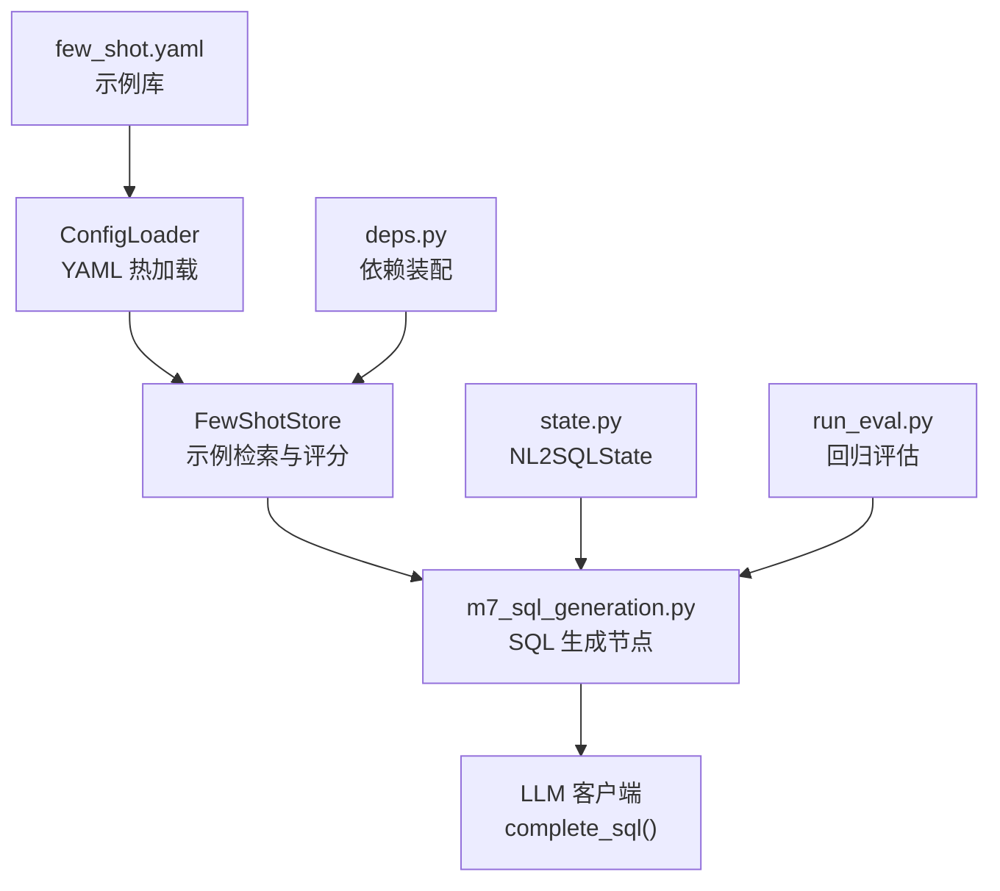
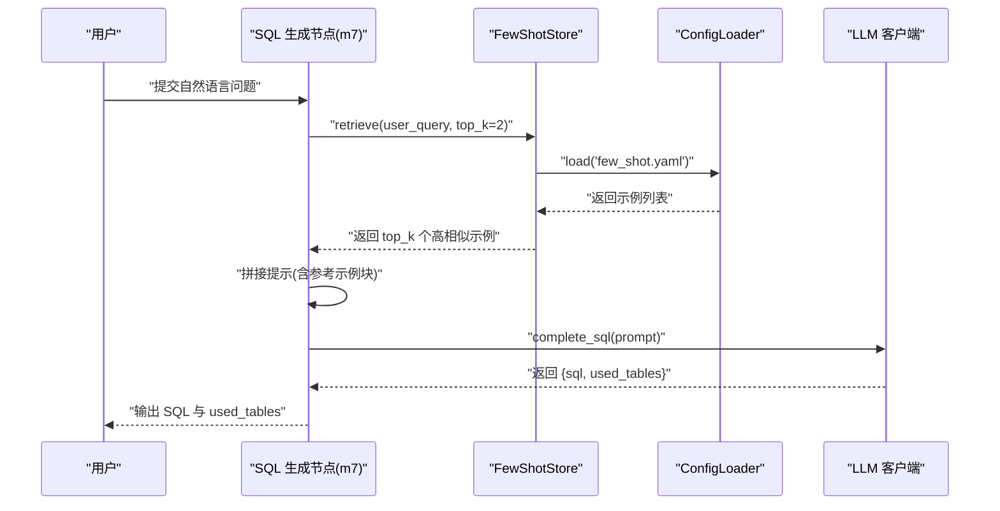
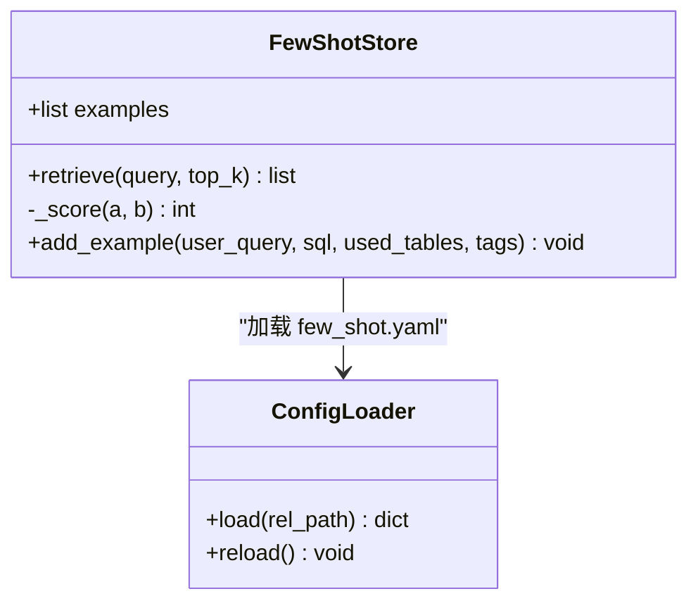
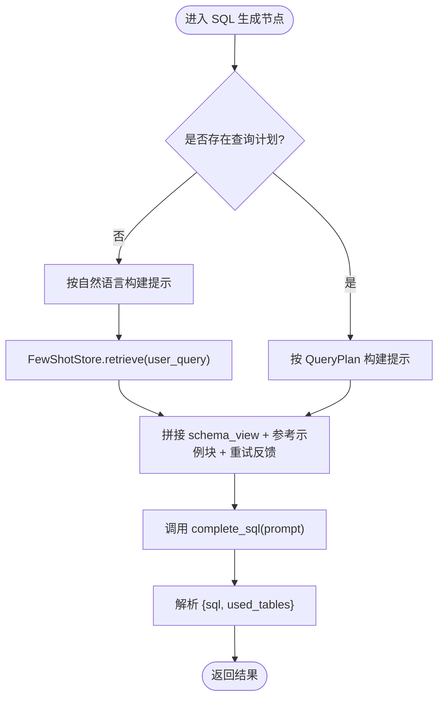
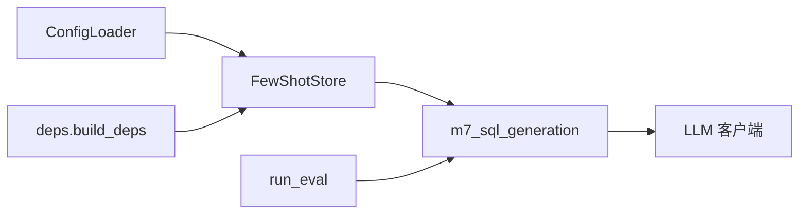

# 少样本学习配置

<cite>
**本文引用的文件**   
- [few_shot.yaml](file://nl2sql_agent/config/few_shot.yaml)
- [few_shot_store.py](file://nl2sql_agent/services/few_shot_store.py)
- [config_loader.py](file://nl2sql_agent/services/config_loader.py)
- [m7_sql_generation.py](file://nl2sql_agent/nodes/m7_sql_generation.py)
- [deps.py](file://nl2sql_agent/services/deps.py)
- [state.py](file://nl2sql_agent/state.py)
- [run_eval.py](file://nl2sql_agent/eval/run_eval.py)
</cite>

## 目录
1. [简介](#简介)
2. [项目结构](#项目结构)
3. [核心组件](#核心组件)
4. [架构总览](#架构总览)
5. [详细组件分析](#详细组件分析)
6. [依赖关系分析](#依赖关系分析)
7. [性能考量](#性能考量)
8. [故障排查指南](#故障排查指南)
9. [结论](#结论)
10. [附录](#附录)

## 简介
本文件面向“少样本学习”在 NL2SQL 中的配置与实现，重点围绕 few_shot.yaml 的示例管理机制、提示模板定制与动态加载策略展开。文档将说明：
- 示例查询的组织结构与分类方法（tags、used_tables）
- 质量评估标准与自动筛选算法（相似度评分、阈值过滤）
- 提示模板变量替换机制、上下文构建逻辑与输出格式控制
- 示例与查询的匹配算法、相似度计算与动态选择策略
- 示例编写规范、模板设计最佳实践与性能优化建议
- 示例版本管理、A/B 测试框架与效果评估指标说明

## 项目结构
与少样本学习相关的代码与配置主要分布在以下位置：
- 配置层：nl2sql_agent/config/few_shot.yaml
- 服务层：nl2sql_agent/services/few_shot_store.py（示例库读取与检索）、nl2sql_agent/services/config_loader.py（YAML 热更新加载器）
- 节点层：nl2sql_agent/nodes/m7_sql_generation.py（SQL 生成节点，组装提示并注入少样本示例）
- 依赖装配：nl2sql_agent/services/deps.py（构建 FewShotStore 实例并注入到 Deps）
- 状态模型：nl2sql_agent/state.py（NL2SQLState，承载用户问题与中间结果）
- 评估入口：nl2sql_agent/eval/run_eval.py（回归评估，验证端到端流程）

**图表来源** 
- [few_shot.yaml:1-32](file://nl2sql_agent/config/few_shot.yaml#L1-L32)
- [config_loader.py:14-32](file://nl2sql_agent/services/config_loader.py#L14-L32)
- [few_shot_store.py:13-34](file://nl2sql_agent/services/few_shot_store.py#L13-L34)
- [m7_sql_generation.py:62-91](file://nl2sql_agent/nodes/m7_sql_generation.py#L62-L91)
- [deps.py:172-183](file://nl2sql_agent/services/deps.py#L172-L183)
- [state.py:83-146](file://nl2sql_agent/state.py#L83-L146)
- [run_eval.py:18-47](file://nl2sql_agent/eval/run_eval.py#L18-L47)

**章节来源**
- [few_shot.yaml:1-32](file://nl2sql_agent/config/few_shot.yaml#L1-L32)
- [config_loader.py:14-32](file://nl2sql_agent/services/config_loader.py#L14-L32)
- [few_shot_store.py:13-34](file://nl2sql_agent/services/few_shot_store.py#L13-L34)
- [m7_sql_generation.py:62-91](file://nl2sql_agent/nodes/m7_sql_generation.py#L62-L91)
- [deps.py:172-183](file://nl2sql_agent/services/deps.py#L172-L183)
- [state.py:83-146](file://nl2sql_agent/state.py#L83-L146)
- [run_eval.py:18-47](file://nl2sql_agent/eval/run_eval.py#L18-L47)

## 核心组件
- FewShotStore：负责从 YAML 加载示例集合，提供基于简单字符集交集的相似度评分与 top-k 检索，预留 add_example 接口用于反馈闭环。
- ConfigLoader：提供本地缓存 + mtime 热更新的 YAML 加载能力，确保配置文件修改后无需重启即可生效。
- m7_sql_generation：在“无计划路径”下，根据用户问题检索相关示例，拼接成参考示例块，注入到 SQL 生成提示中；同时强制输出 JSON 结构（包含 sql 与 used_tables）。
- deps：统一装配 FewShotStore 实例，并将其注入到运行时的依赖容器 Deps 中，供各节点使用。
- state：定义 NL2SQLState，承载用户问题、澄清后的查询、检索到的 Schema、生成的 SQL 等关键状态字段。

**章节来源**
- [few_shot_store.py:13-34](file://nl2sql_agent/services/few_shot_store.py#L13-L34)
- [config_loader.py:14-32](file://nl2sql_agent/services/config_loader.py#L14-L32)
- [m7_sql_generation.py:62-91](file://nl2sql_agent/nodes/m7_sql_generation.py#L62-L91)
- [deps.py:172-183](file://nl2sql_agent/services/deps.py#L172-L183)
- [state.py:83-146](file://nl2sql_agent/state.py#L83-L146)

## 架构总览
下图展示了少样本学习在 SQL 生成阶段的调用链路与数据流：

**图表来源** 
- [m7_sql_generation.py:62-91](file://nl2sql_agent/nodes/m7_sql_generation.py#L62-L91)
- [few_shot_store.py:19-27](file://nl2sql_agent/services/few_shot_store.py#L19-L27)
- [config_loader.py:19-32](file://nl2sql_agent/services/config_loader.py#L19-L32)

## 详细组件分析

### 示例库与检索（FewShotStore）
- 数据结构：examples 为字典列表，每个元素包含 user_query、sql、used_tables、tags。
- 检索策略：对每条示例与输入 query 进行字符集交集打分，按分数降序取 top_k，并过滤掉分数为 0 的结果。
- 扩展点：add_example 预留接口，便于后续接入反馈闭环（人工确认通过的案例回流）。

**图表来源** 
- [few_shot_store.py:13-34](file://nl2sql_agent/services/few_shot_store.py#L13-L34)
- [config_loader.py:14-32](file://nl2sql_agent/services/config_loader.py#L14-L32)

**章节来源**
- [few_shot_store.py:13-34](file://nl2sql_agent/services/few_shot_store.py#L13-L34)
- [config_loader.py:14-32](file://nl2sql_agent/services/config_loader.py#L14-L32)

### 提示模板与上下文构建（m7_sql_generation）
- 分支逻辑：当存在查询计划时，按 QueryPlan 构建 prompt；否则走“自然语言 + 少样本示例”的简单路径。
- 上下文构建：注入 data_scope 权限说明、可用表结构（retrieved_schema）、重试反馈（上一次失败原因），以及参考示例块（来自 FewShotStore.retrieve）。
- 输出格式控制：强制要求模型输出 JSON，包含 sql 与 used_tables，便于下游校验与执行。

**图表来源** 
- [m7_sql_generation.py:31-91](file://nl2sql_agent/nodes/m7_sql_generation.py#L31-L91)

**章节来源**
- [m7_sql_generation.py:31-91](file://nl2sql_agent/nodes/m7_sql_generation.py#L31-L91)

### 配置加载与热更新（ConfigLoader）
- 缓存策略：以 rel_path 为键，缓存 (mtime, data) 元组。
- 热更新：每次 load 时比较文件的 mtime_ns，若变化则重新读取 YAML 并更新缓存。
- 错误处理：文件不存在时抛出 FileNotFoundError，便于上层快速定位配置问题。

**章节来源**
- [config_loader.py:14-32](file://nl2sql_agent/services/config_loader.py#L14-L32)

### 依赖装配（deps）
- 构建顺序：先加载 settings.yaml，再依次初始化 term_mapping、catalog、sql、llm/sql_llm、vector_store、executor。
- FewShotStore 注入：通过 FewShotStore(loader) 创建实例，并放入 Deps.few_shot，供 m7 节点使用。

**章节来源**
- [deps.py:113-183](file://nl2sql_agent/services/deps.py#L113-L183)

### 状态模型（state）
- NL2SQLState 字段：user_query、clarified_query、retrieved_schema、query_plan、generated_sql、used_tables、validation_errors、execution_error 等。
- 作用：贯穿整个图执行链路，承载各节点的输入与输出，保证上下文一致性。

**章节来源**
- [state.py:83-146](file://nl2sql_agent/state.py#L83-L146)

## 依赖关系分析
- FewShotStore 依赖 ConfigLoader 读取 few_shot.yaml。
- m7_sql_generation 依赖 FewShotStore 获取参考示例，并依赖 LLM 客户端完成 SQL 生成。
- deps 负责装配 FewShotStore 并注入 Deps，使节点可访问。
- run_eval 通过 build_test_deps 构建测试环境，驱动完整图执行，验证端到端行为。

**图表来源** 
- [config_loader.py:14-32](file://nl2sql_agent/services/config_loader.py#L14-L32)
- [few_shot_store.py:13-34](file://nl2sql_agent/services/few_shot_store.py#L13-L34)
- [m7_sql_generation.py:62-91](file://nl2sql_agent/nodes/m7_sql_generation.py#L62-L91)
- [deps.py:172-183](file://nl2sql_agent/services/deps.py#L172-L183)
- [run_eval.py:18-47](file://nl2sql_agent/eval/run_eval.py#L18-L47)

**章节来源**
- [config_loader.py:14-32](file://nl2sql_agent/services/config_loader.py#L14-L32)
- [few_shot_store.py:13-34](file://nl2sql_agent/services/few_shot_store.py#L13-L34)
- [m7_sql_generation.py:62-91](file://nl2sql_agent/nodes/m7_sql_generation.py#L62-L91)
- [deps.py:172-183](file://nl2sql_agent/services/deps.py#L172-L183)
- [run_eval.py:18-47](file://nl2sql_agent/eval/run_eval.py#L18-L47)

## 性能考量
- 相似度计算复杂度：当前 _score 使用字符集交集，时间复杂度近似 O(n+m)，n、m 分别为 query 与示例 user_query 的长度。对于短文本通常足够高效。
- 检索开销：top_k 默认较小（如 2），排序与过滤开销低。
- 配置热更新：ConfigLoader 基于 mtime 比对，避免频繁 IO，仅在文件变更时重载。
- 建议：
  - 若示例规模增长，可引入向量嵌入与近似最近邻检索（如 FAISS）替代字符集交集。
  - 增加缓存层（内存或 Redis）存储热门 query 的 top_k 结果，降低重复检索成本。
  - 对 tags 与 used_tables 建立索引，支持按业务线或标签快速筛选。

[本节为通用指导，不直接分析具体文件]

## 故障排查指南
- 配置文件缺失：ConfigLoader.load 会抛出 FileNotFoundError，检查 few_shot.yaml 路径与权限。
- 示例为空：FewShotStore.examples 为空时，retrieve 返回空列表，检查 YAML 中 examples 数组是否有效。
- 相似度为 0：_score 返回 0 表示字符集无交集，需调整示例 user_query 与真实 query 的用词一致性。
- 提示未包含示例：m7_sql_generation 中 few_shot_block 为空时不会注入参考示例，确认 retrieve 返回值非空。
- 输出格式错误：LLM 未按要求输出 JSON，需在提示中强化约束或增加重试逻辑。

**章节来源**
- [config_loader.py:19-32](file://nl2sql_agent/services/config_loader.py#L19-L32)
- [few_shot_store.py:19-27](file://nl2sql_agent/services/few_shot_store.py#L19-L27)
- [m7_sql_generation.py:62-91](file://nl2sql_agent/nodes/m7_sql_generation.py#L62-L91)

## 结论
本项目通过 FewShotStore 与 ConfigLoader 实现了轻量级的少样本学习配置与动态加载，结合 m7_sql_generation 的提示构建逻辑，能够在“简单路径”下有效提升 SQL 生成的准确性与稳定性。未来可扩展更复杂的相似度算法、版本管理与 A/B 测试框架，以支撑更大规模的示例库与更精细的效果评估。

[本节为总结性内容，不直接分析具体文件]

## 附录

### 示例编写规范
- user_query：尽量贴近真实用户表达，覆盖常见句式与关键词。
- sql：严格遵循 MySQL 语法，仅引用 schema 内真实表与字段。
- used_tables：明确列出 SQL 实际使用的表名，便于下游校验。
- tags：使用业务线（如 XXD）、操作类型（count、sum、where）与场景（overdue、amount）等标签，便于后续按标签筛选与评估。

**章节来源**
- [few_shot.yaml:1-32](file://nl2sql_agent/config/few_shot.yaml#L1-L32)

### 模板设计最佳实践
- 明确权限说明：禁止将 data_scope 转换为 WHERE 条件，行级权限由安全节点注入。
- 限制输出范围：只允许 SELECT，禁止写操作；只使用提供的表与字段。
- 结构化输出：强制 JSON 格式，包含 sql 与 used_tables，便于自动化校验。
- 重试反馈：注入上一次失败原因，引导模型修正而非规避错误。

**章节来源**
- [m7_sql_generation.py:31-91](file://nl2sql_agent/nodes/m7_sql_generation.py#L31-L91)

### 效果评估指标说明
- 回归评估：run_eval 读取 regression_set.yaml，驱动完整图执行，断言路径、计划、执行结果、敏感判定等。
- 指标维度：table_recall_at_k、column_recall、join_path_accuracy、sql_execution_accuracy、clarification_rate、human_modification_rate、avg_profile_seconds_per_table、avg_llm_cost_per_table。

**章节来源**
- [run_eval.py:18-47](file://nl2sql_agent/eval/run_eval.py#L18-L47)

### 示例版本管理与 A/B 测试框架（建议）
- 版本管理：在 few_shot.yaml 中增加 version 字段，配合 ConfigLoader 的版本缓存，支持灰度发布与回滚。
- A/B 测试：通过环境变量或配置开关切换不同版本的示例库，对比不同版本的 SQL 生成准确率与延迟。
- 效果评估：结合 run_eval 与 schema_metrics，统计各版本的召回率、执行正确率与人工修改率，形成量化报告。

[本节为概念性建议，不直接分析具体文件]