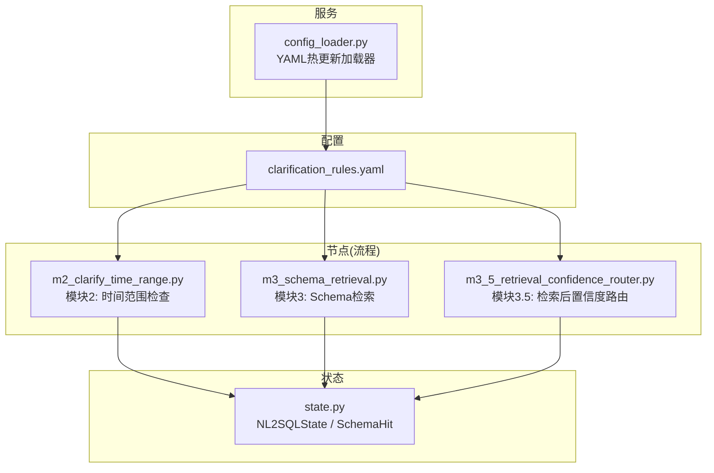
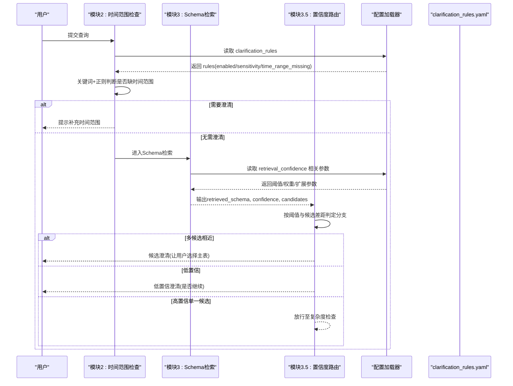
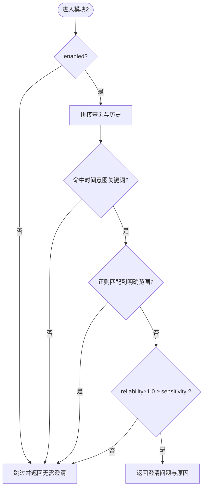
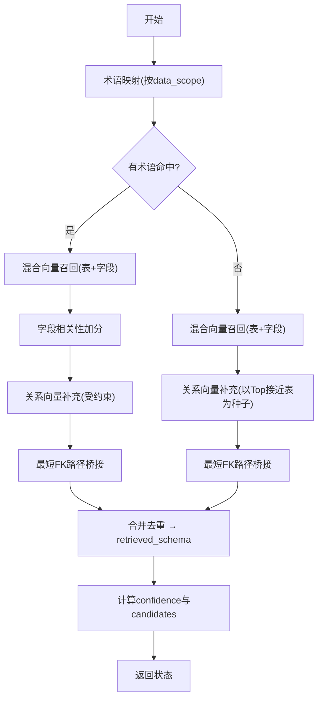
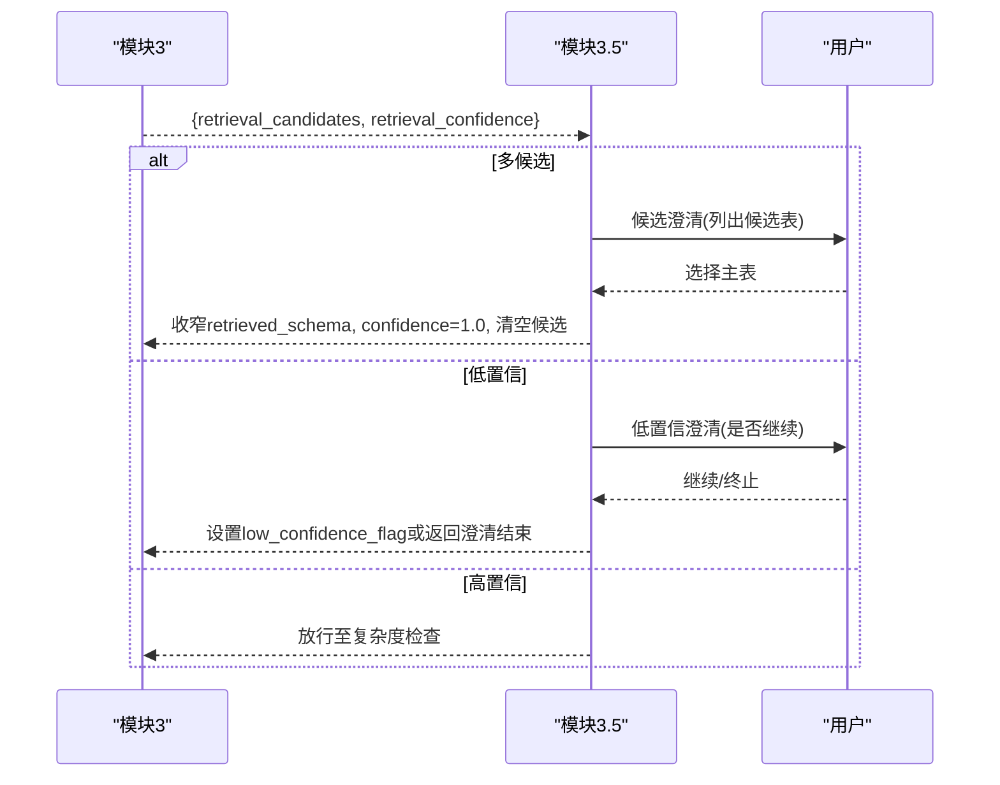
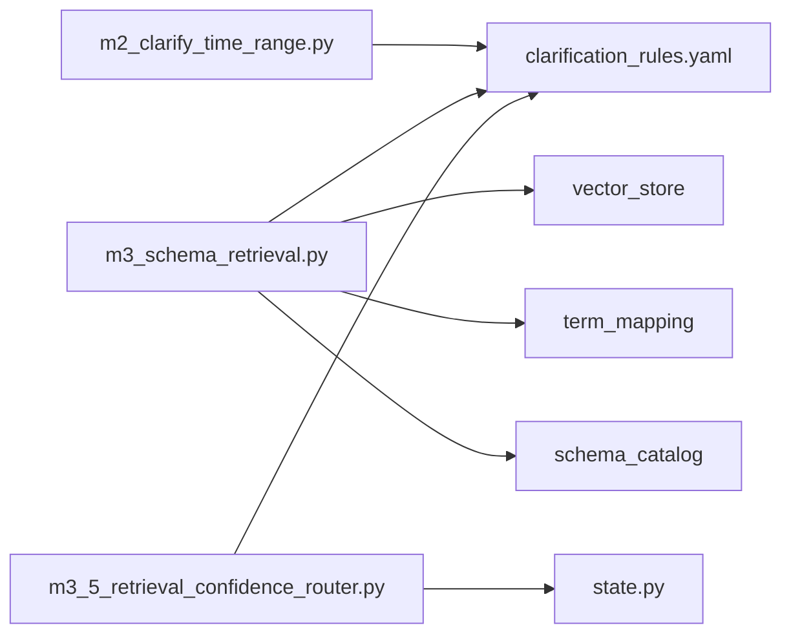

# 意图澄清规则

<cite>
**本文引用的文件**   
- [clarification_rules.yaml](file://nl2sql_agent/config/clarification_rules.yaml)
- [m2_clarify_time_range.py](file://nl2sql_agent/nodes/m2_clarify_time_range.py)
- [m3_5_retrieval_confidence_router.py](file://nl2sql_agent/nodes/m3_5_retrieval_confidence_router.py)
- [m3_schema_retrieval.py](file://nl2sql_agent/nodes/m3_schema_retrieval.py)
- [state.py](file://nl2sql_agent/state.py)
- [config_loader.py](file://nl2sql_agent/services/config_loader.py)
- [test_retrieval_confidence.py](file://nl2sql_agent/tests/test_retrieval_confidence.py)
</cite>

## 目录
1. [简介](#简介)
2. [项目结构](#项目结构)
3. [核心组件](#核心组件)
4. [架构总览](#架构总览)
5. [详细组件分析](#详细组件分析)
6. [依赖关系分析](#依赖关系分析)
7. [性能考量](#性能考量)
8. [故障排查指南](#故障排查指南)
9. [结论](#结论)
10. [附录：配置调优与示例](#附录配置调优与示例)

## 简介
本文件面向“意图澄清规则系统”，围绕 clarification_rules.yaml 的配置结构与运行时行为进行系统化说明。重点覆盖：
- enabled 开关与 sensitivity 阈值的整体控制
- time_range_missing 模块的时间范围识别机制（时间意图关键词、范围模式匹配、用户交互消息）
- retrieval_confidence 检索置信度判定模块（置信度阈值、候选差距阈值、补充表数量等）
- 字段相关性权重计算、向量融合策略与关系扩展机制
- 规则调优指南、常见场景配置示例与性能优化建议

## 项目结构
与意图澄清相关的代码集中在 nodes 层与 config 层，状态定义在 state.py，配置加载通过 services/config_loader.py 实现。

图表来源
- [clarification_rules.yaml:1-62](file://nl2sql_agent/config/clarification_rules.yaml#L1-L62)
- [m2_clarify_time_range.py:1-62](file://nl2sql_agent/nodes/m2_clarify_time_range.py#L1-L62)
- [m3_schema_retrieval.py:1-331](file://nl2sql_agent/nodes/m3_schema_retrieval.py#L1-L331)
- [m3_5_retrieval_confidence_router.py:1-127](file://nl2sql_agent/nodes/m3_5_retrieval_confidence_router.py#L1-L127)
- [state.py:1-146](file://nl2sql_agent/state.py#L1-L146)
- [config_loader.py:1-36](file://nl2sql_agent/services/config_loader.py#L1-L36)

章节来源
- [clarification_rules.yaml:1-62](file://nl2sql_agent/config/clarification_rules.yaml#L1-L62)
- [m2_clarify_time_range.py:1-62](file://nl2sql_agent/nodes/m2_clarify_time_range.py#L1-L62)
- [m3_schema_retrieval.py:1-331](file://nl2sql_agent/nodes/m3_schema_retrieval.py#L1-L331)
- [m3_5_retrieval_confidence_router.py:1-127](file://nl2sql_agent/nodes/m3_5_retrieval_confidence_router.py#L1-L127)
- [state.py:1-146](file://nl2sql_agent/state.py#L1-L146)
- [config_loader.py:1-36](file://nl2sql_agent/services/config_loader.py#L1-L36)

## 核心组件
- 配置入口：clarification_rules.yaml
  - 顶层开关 enabled 与全局敏感度 sensitivity
  - time_range_missing：时间范围缺失检测
  - retrieval_confidence：检索后置信度判定与补充策略
- 节点实现：
  - m2_clarify_time_range.py：基于关键词与正则的模式匹配，决定是否追问时间范围
  - m3_schema_retrieval.py：术语映射 + 表/字段向量混合召回 + 关系扩展 + 字段相关性加权
  - m3_5_retrieval_confidence_router.py：根据检索结果分布决定候选澄清或低置信澄清
- 状态模型：state.py 中的 NL2SQLState 与 SchemaHit，承载检索结果、置信度、候选集与澄清标记
- 配置加载：config_loader.py 提供基于 mtime 的热更新缓存

章节来源
- [clarification_rules.yaml:1-62](file://nl2sql_agent/config/clarification_rules.yaml#L1-L62)
- [m2_clarify_time_range.py:1-62](file://nl2sql_agent/nodes/m2_clarify_time_range.py#L1-L62)
- [m3_schema_retrieval.py:1-331](file://nl2sql_agent/nodes/m3_schema_retrieval.py#L1-L331)
- [m3_5_retrieval_confidence_router.py:1-127](file://nl2sql_agent/nodes/m3_5_retrieval_confidence_router.py#L1-L127)
- [state.py:1-146](file://nl2sql_agent/state.py#L1-L146)
- [config_loader.py:1-36](file://nl2sql_agent/services/config_loader.py#L1-L36)

## 架构总览
下图展示从用户输入到澄清决策的关键路径，以及各模块如何读取 clarification_rules.yaml 的相应配置项。

图表来源
- [m2_clarify_time_range.py:1-62](file://nl2sql_agent/nodes/m2_clarify_time_range.py#L1-L62)
- [m3_schema_retrieval.py:1-331](file://nl2sql_agent/nodes/m3_schema_retrieval.py#L1-L331)
- [m3_5_retrieval_confidence_router.py:1-127](file://nl2sql_agent/nodes/m3_5_retrieval_confidence_router.py#L1-L127)
- [config_loader.py:1-36](file://nl2sql_agent/services/config_loader.py#L1-L36)
- [clarification_rules.yaml:1-62](file://nl2sql_agent/config/clarification_rules.yaml#L1-L62)

## 详细组件分析

### 配置结构：clarification_rules.yaml
- 顶层开关与敏感度
  - enabled: 全局启用/禁用澄清规则
  - sensitivity: 触发阈值（0~1），越低越容易触发；用于平衡误报与漏报
- time_range_missing
  - enabled: 模块2开关
  - reliability: 该模块可靠性系数（与sensitivity共同决定最终触发）
  - time_intent_keywords: 命中即认为“问题表现出时间意图”
  - range_present_patterns: 正则集合，命中即认为“已有明确时间范围”，不再追问
  - message: 用户交互提示语
- retrieval_confidence
  - confidence_threshold: 低于该值触发低置信澄清
  - candidate_gap_threshold: Top-2 置信度差小于该值视为相近候选，触发候选澄清
  - candidate_gap_ratio: 相对差距优先使用，避免低分区间被绝对阈值放大
  - supplement_top_n: 术语命中后，向量补充关联表的数量
  - supplement_threshold / supplement_relative_threshold: 补充表最低置信度及自适应下限
  - field_relevance_weight: 字段相关性加成权重
  - table_vector_weight / column_vector_weight: 表级/字段级向量融合权重
  - relation_expand_top_n / relation_threshold: 关系向量扩展数量与阈值
  - max_join_path_hops: 最短FK路径扩展最大跳数
  - field_query_markers / field_query_table_weight / field_query_column_weight: 字段型查询的权重切换
  - query_expansions: 显式领域查询扩展词典

章节来源
- [clarification_rules.yaml:1-62](file://nl2sql_agent/config/clarification_rules.yaml#L1-L62)

### 模块2：时间范围缺失检测（m2_clarify_time_range.py）
- 工作机制
  - 若 enabled=false，直接跳过
  - 拼接当前查询与历史对话内容，避免历史已给出范围时重复追问
  - 遍历 time_intent_keywords，若命中则进入下一步
  - 用 range_present_patterns 的正则匹配，若命中则不追问
  - 否则返回 message 作为澄清问题
  - 结合 sensitivity 与 reliability 做最终判定：仅当 reliability × 1.0 >= sensitivity 时才触发
- 输出
  - need_clarification=true 时附带 clarification_questions 与 clarification_reason=missing_time_range

图表来源
- [m2_clarify_time_range.py:1-62](file://nl2sql_agent/nodes/m2_clarify_time_range.py#L1-L62)
- [clarification_rules.yaml:10-26](file://nl2sql_agent/config/clarification_rules.yaml#L10-L26)

章节来源
- [m2_clarify_time_range.py:1-62](file://nl2sql_agent/nodes/m2_clarify_time_range.py#L1-L62)
- [clarification_rules.yaml:10-26](file://nl2sql_agent/config/clarification_rules.yaml#L10-L26)

### 模块3：Schema检索（m3_schema_retrieval.py）
- 检索流程
  - 术语映射：按 data_scope 命名空间解析术语，失败再查全局；记录 matched_terms
  - 混合向量检索：并行召回表级与字段级向量，并按配置权重融合评分
  - 关系向量补充：对主候选直接相连的关系表进行受约束补充
  - 最短FK路径桥接：在语义候选之间寻找必要桥接表
  - 字段相关性加分：去掉已命中术语后的剩余词与字段名/注释重叠次数，给关联表加分
- 关键配置读取
  - _supplement_config: supplement_top_n, supplement_threshold, field_relevance_weight
  - _hybrid_config: table/column 向量权重、relation_expand_top_n、relation_threshold
  - _expand_query: 使用 query_expansions 扩展查询
  - 候选接近判定: candidate_gap_ratio 优先，否则回退 candidate_gap_threshold
- 置信度与候选
  - 术语精确命中 → confidence=1.0；多主表且非必需多表命中 → 放入 candidates
  - 无术语命中 → confidence=向量Top-1分数；candidates为与Top-1接近的若干表
- 输出
  - retrieved_schema: 合并去重后的表集合（含补充与桥接）
  - retrieval_confidence: 置信度
  - retrieval_candidates: 候选列表（供模块3.5判定）
  - main_table_count: 术语命中的主表数量（不含补充）

图表来源
- [m3_schema_retrieval.py:1-331](file://nl2sql_agent/nodes/m3_schema_retrieval.py#L1-L331)
- [clarification_rules.yaml:27-62](file://nl2sql_agent/config/clarification_rules.yaml#L27-L62)

章节来源
- [m3_schema_retrieval.py:1-331](file://nl2sql_agent/nodes/m3_schema_retrieval.py#L1-L331)
- [clarification_rules.yaml:27-62](file://nl2sql_agent/config/clarification_rules.yaml#L27-L62)

### 模块3.5：检索后置信度路由（m3_5_retrieval_confidence_router.py）
- 路由逻辑
  - 若存在多个候选 → clarify_candidates
  - 若 retrieval_confidence < confidence_threshold → clarify_low_confidence
  - 否则 → 放行至复杂度检查
- 候选澄清
  - 将候选表与业务术语展示给用户，支持字符串或数字索引选择
  - 选定后：retrieved_schema 收窄为主选表（保留向量补充的关联表），confidence=1.0，清空候选，标记 retrieval_resolved=true
- 低置信澄清
  - 询问是否继续；继续则设置 low_confidence_flag=True，后续强制计划路径与人工确认；否则返回澄清结束

图表来源
- [m3_5_retrieval_confidence_router.py:1-127](file://nl2sql_agent/nodes/m3_5_retrieval_confidence_router.py#L1-L127)
- [state.py:83-103](file://nl2sql_agent/state.py#L83-L103)

章节来源
- [m3_5_retrieval_confidence_router.py:1-127](file://nl2sql_agent/nodes/m3_5_retrieval_confidence_router.py#L1-L127)
- [state.py:83-103](file://nl2sql_agent/state.py#L83-L103)

### 数据模型与状态流转（state.py）
- SchemaHit：单张表的命中信息（表名、列定义、业务术语）
- NL2SQLState：贯穿全流程的状态载体，包含澄清标志、检索结果、置信度、候选、复杂度、计划、执行、敏感性与人工确认等字段
- 关键字段
  - need_clarification / clarification_questions / clarification_reason
  - retrieved_schema / retrieval_confidence / retrieval_candidates / main_table_count / low_confidence_flag / retrieval_resolved

章节来源
- [state.py:1-146](file://nl2sql_agent/state.py#L1-L146)

### 配置加载（config_loader.py）
- 基于 mtime 的本地缓存，修改 YAML 后下次读取自动重载
- 所有规则文件统一通过此加载器读取，避免硬编码

章节来源
- [config_loader.py:1-36](file://nl2sql_agent/services/config_loader.py#L1-L36)

## 依赖关系分析
- 模块间耦合
  - m2 仅依赖 clarification_rules.yaml 的 time_range_missing 与全局 sensitivity
  - m3 依赖 clarification_rules.yaml 的 retrieval_confidence 各项参数，并依赖 vector_store、term_mapping、catalog
  - m3.5 依赖 m3 的输出与 clarification_rules.yaml 的 thresholds
- 外部依赖
  - vector_store.search/search_scored：表级与字段级向量召回
  - term_mapping.extract_terms/resolve：术语解析
  - catalog.hits_for_term/hits_covering_term_fields：术语到表的映射
  - schema_ingest.text_builder.load_mschema_vector_source：关系图与FK路径

图表来源
- [m2_clarify_time_range.py:1-62](file://nl2sql_agent/nodes/m2_clarify_time_range.py#L1-L62)
- [m3_schema_retrieval.py:1-331](file://nl2sql_agent/nodes/m3_schema_retrieval.py#L1-L331)
- [m3_5_retrieval_confidence_router.py:1-127](file://nl2sql_agent/nodes/m3_5_retrieval_confidence_router.py#L1-L127)
- [clarification_rules.yaml:1-62](file://nl2sql_agent/config/clarification_rules.yaml#L1-L62)
- [state.py:1-146](file://nl2sql_agent/state.py#L1-L146)

章节来源
- [m2_clarify_time_range.py:1-62](file://nl2sql_agent/nodes/m2_clarify_time_range.py#L1-L62)
- [m3_schema_retrieval.py:1-331](file://nl2sql_agent/nodes/m3_schema_retrieval.py#L1-L331)
- [m3_5_retrieval_confidence_router.py:1-127](file://nl2sql_agent/nodes/m3_5_retrieval_confidence_router.py#L1-L127)
- [clarification_rules.yaml:1-62](file://nl2sql_agent/config/clarification_rules.yaml#L1-L62)
- [state.py:1-146](file://nl2sql_agent/state.py#L1-L146)

## 性能考量
- 向量召回
  - 表级与字段级并行召回，减少等待时间
  - 按 data_scope 过滤，降低无关文档召回量
  - 字段级 top_k 放大（top_k*3）提升召回率，随后按表聚合取最高分
- 融合与补充
  - 表/字段向量权重可动态切换（field_query_markers），避免字段型查询被表级权重稀释
  - 关系向量与FK路径桥接限制 top_n 与 threshold，防止扩散
  - 字段相关性加分采用 bigram 重叠计数，开销可控
- 配置热更新
  - 基于 mtime 的缓存，避免频繁IO，同时支持在线调整阈值

[本节为通用指导，不直接分析具体文件]

## 故障排查指南
- 常见问题定位
  - 未触发时间范围澄清：检查 time_range_missing.enabled、sensitivity 与 reliability 组合；确认 time_intent_keywords 与 range_present_patterns 是否正确
  - 候选澄清反复出现：确认 retrieval_resolved 是否置位；检查 candidate_gap_threshold/candidate_gap_ratio 是否过宽
  - 低置信澄清过多：适当提高 confidence_threshold 或改善术语映射/向量索引质量
  - 补充表过多或过少：调整 supplement_top_n、supplement_threshold、supplement_relative_threshold 与 field_relevance_weight
- 验证方法
  - 使用测试用例验证不同分支行为（如多候选、低置信、高置信、缺时间范围）

章节来源
- [test_retrieval_confidence.py:1-159](file://nl2sql_agent/tests/test_retrieval_confidence.py#L1-L159)

## 结论
意图澄清规则系统通过清晰的配置驱动与模块化设计，实现了“时间范围缺失拦截”和“检索后置信度路由”两大能力。配合字段相关性加权、向量融合与关系扩展，能够在保证准确率的同时，有效降低误报与漏报。通过合理的阈值调优与性能优化，可在复杂查询场景中稳定运行。

[本节为总结性内容，不直接分析具体文件]

## 附录：配置调优与示例

### 调优要点
- sensitivity 与 reliability
  - 降低 sensitivity 或提高 reliability 更容易触发时间范围澄清
- 时间范围模式
  - 在 range_present_patterns 中补充常见表达（如“近X个月”“Q1”“至今”等）以减少误报
- 检索置信度
  - confidence_threshold：过低导致频繁低置信澄清；过高可能放过不确定结果
  - candidate_gap_threshold / candidate_gap_ratio：控制候选相近程度，避免随意选择
  - supplement_top_n / supplement_threshold / supplement_relative_threshold：平衡补充表数量与质量
  - field_relevance_weight：提高可增强语义相关表的优先级
  - table_vector_weight / column_vector_weight：根据查询类型切换权重
  - relation_expand_top_n / relation_threshold / max_join_path_hops：控制关系扩展范围
  - field_query_markers / field_query_table_weight / field_query_column_weight：字段型查询更关注字段级向量
  - query_expansions：集中管理领域同义词，提升召回一致性

### 常见场景配置示例
- 场景A：新指标不在术语库但字段能匹配
  - 期望：模块2不拦截，进入模块3→3.5；低置信时提示继续而非拒答
  - 参考验收：见测试用例“新指标不被模块2拦截”
- 场景B：多相近候选表
  - 期望：触发候选澄清，用户选定后回到模块3，confidence拉高，不再重复触发
  - 参考验收：见测试用例“多相近候选→候选澄清”“选定候选后回到模块3”
- 场景C：高置信单一候选
  - 期望：直接放行至复杂度检查，不触发任何澄清
  - 参考验收：见测试用例“高置信单一候选直接放行”
- 场景D：缺时间范围
  - 期望：仍在模块2拦截，不进入模块3
  - 参考验收：见测试用例“缺时间范围仍在模块2拦截”

章节来源
- [test_retrieval_confidence.py:1-159](file://nl2sql_agent/tests/test_retrieval_confidence.py#L1-L159)
- [clarification_rules.yaml:1-62](file://nl2sql_agent/config/clarification_rules.yaml#L1-L62)