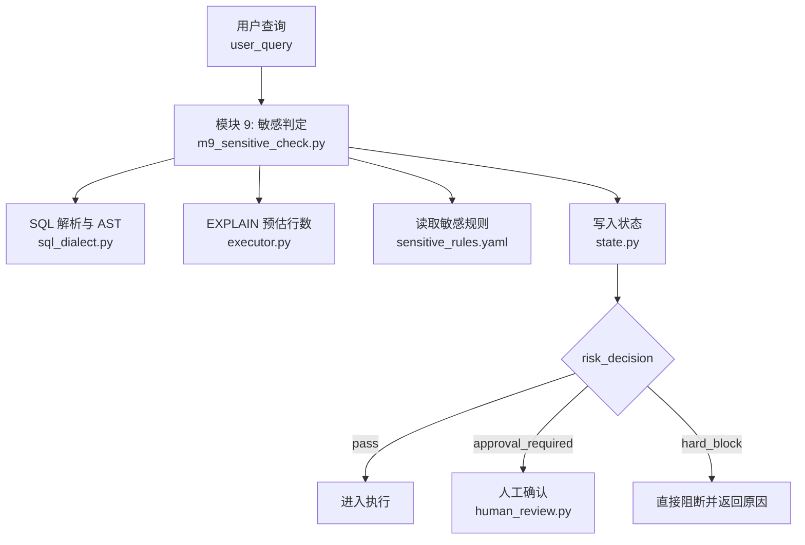
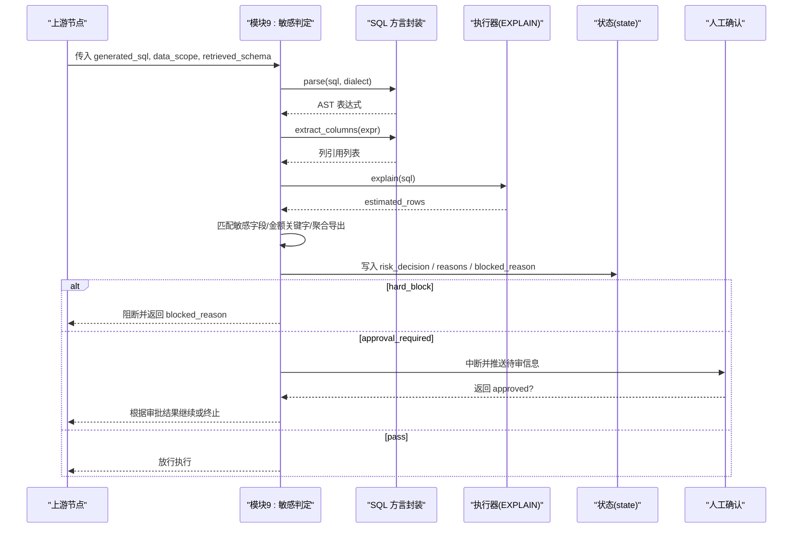
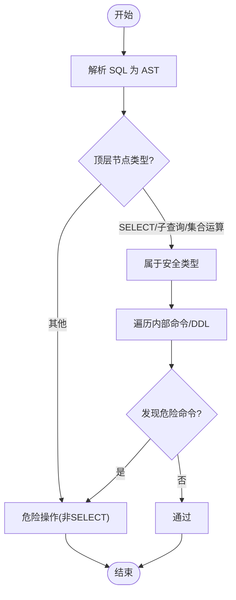
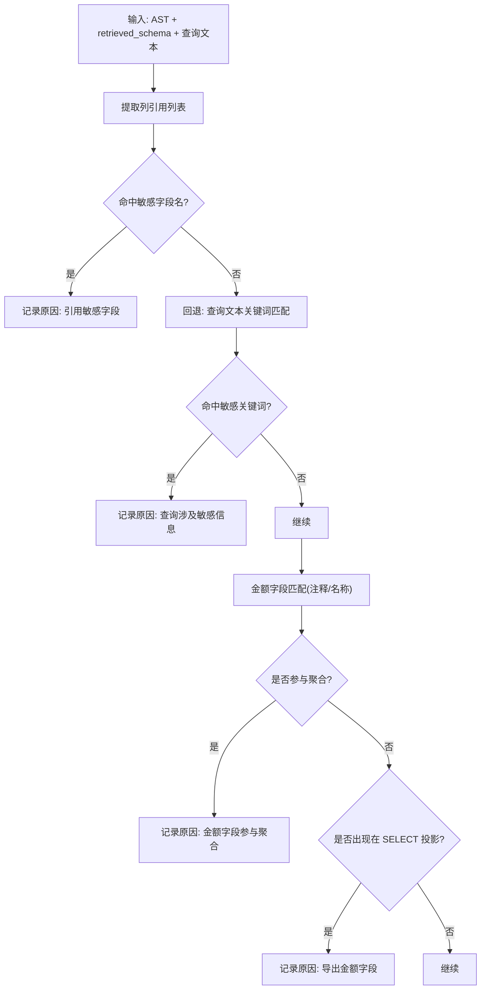
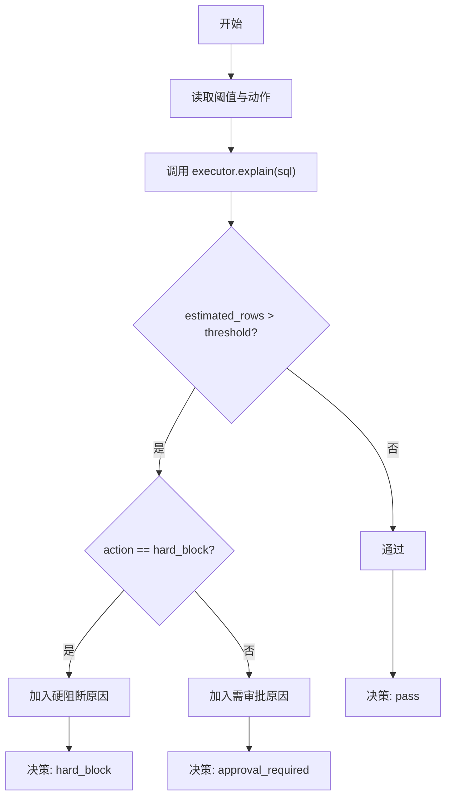
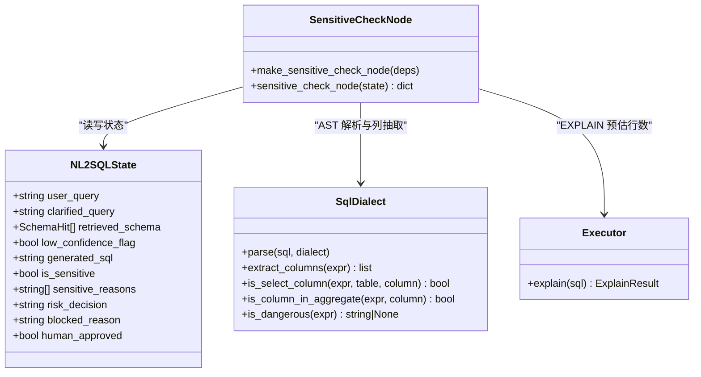
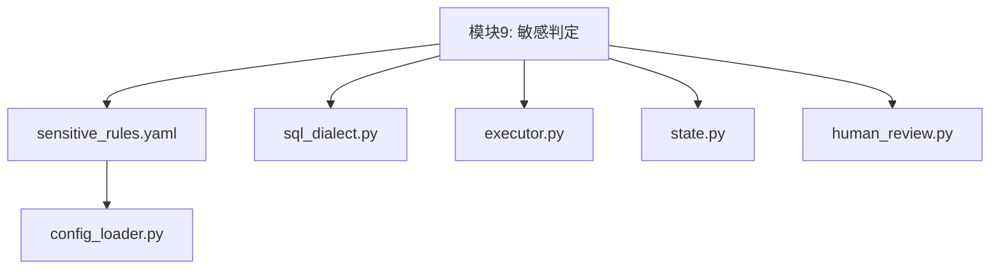

# 敏感操作规则

<cite>
**本文引用的文件**   
- [sensitive_rules.yaml](file://nl2sql_agent/config/sensitive_rules.yaml)
- [m9_sensitive_check.py](file://nl2sql_agent/nodes/m9_sensitive_check.py)
- [sql_dialect.py](file://nl2sql_agent/services/sql_dialect.py)
- [settings.yaml](file://nl2sql_agent/config/settings.yaml)
- [executor.py](file://nl2sql_agent/services/executor.py)
- [state.py](file://nl2sql_agent/state.py)
- [human_review.py](file://nl2sql_agent/nodes/human_review.py)
- [config_loader.py](file://nl2sql_agent/services/config_loader.py)
- [NL2SQL.md](file://NL2SQL.md)
</cite>

## 目录
1. [简介](#简介)
2. [项目结构](#项目结构)
3. [核心组件](#核心组件)
4. [架构总览](#架构总览)
5. [详细组件分析](#详细组件分析)
6. [依赖关系分析](#依赖关系分析)
7. [性能考量](#性能考量)
8. [故障排查指南](#故障排查指南)
9. [结论](#结论)
10. [附录](#附录)

## 简介
本文件面向风控与平台工程人员，系统化说明“敏感操作检测规则”的设计与实现。重点覆盖：
- 危险 SQL 操作的识别机制（基于 AST 的结构化判定）
- 风险等级分类体系与处置策略（通过、需审批、硬阻断）
- 敏感字段、扫描行数阈值、金额字段汇总/导出的触发逻辑
- 规则优先级、白名单机制与自定义扩展方法
- 安全策略配置最佳实践与安全审计日志分析方法

## 项目结构
敏感判定位于模块 9，由配置驱动、AST 解析与执行器 EXPLAIN 协同完成。关键文件职责如下：
- 配置层：sensitive_rules.yaml 定义敏感字段、扫描阈值、金额关键字及开关；settings.yaml 提供全局执行参数（如只读、超时、默认阈值）。
- 节点层：m9_sensitive_check.py 实现敏感判定流程，输出三态决策。
- 服务层：sql_dialect.py 提供 AST 解析、列抽取、聚合/导出判断、危险操作检测；executor.py 提供 EXPLAIN 预估行数能力。
- 状态层：state.py 承载 risk_decision、is_sensitive、sensitive_reasons、blocked_reason 等字段。
- 人工确认：human_review.py 负责中断与恢复，将审批结果写回状态。
- 配置加载：config_loader.py 提供热更新能力。

**图表来源** 
- [m9_sensitive_check.py:1-106](file://nl2sql_agent/nodes/m9_sensitive_check.py#L1-L106)
- [sql_dialect.py:1-111](file://nl2sql_agent/services/sql_dialect.py#L1-L111)
- [executor.py:1-200](file://nl2sql_agent/services/executor.py#L1-L200)
- [sensitive_rules.yaml:1-24](file://nl2sql_agent/config/sensitive_rules.yaml#L1-L24)
- [state.py:83-146](file://nl2sql_agent/state.py#L83-L146)
- [human_review.py:1-32](file://nl2sql_agent/nodes/human_review.py#L1-L32)

**章节来源**
- [NL2SQL.md:57-64](file://NL2SQL.md#L57-L64)

## 核心组件
- 敏感规则配置（sensitive_rules.yaml）
  - sensitive_fields：敏感字段列表，包含 name 与 keywords，命中任一即触发。
  - explain_scan：扫描阈值与 action（hard_block 或 approval_required）。
  - amount_field_keywords：金额类字段关键词集合。
  - aggregation_trigger/export_trigger：是否开启金额字段聚合/导出触发。
- 敏感判定节点（m9_sensitive_check.py）
  - 解析 SQL 为 AST，提取列引用，匹配敏感字段。
  - 调用 executor.explain 获取预估行数，按阈值与 action 决定策略。
  - 检查金额字段是否参与聚合或出现在 SELECT 投影中。
  - 低置信度查询强制进入人工确认。
  - 输出 risk_decision、is_sensitive、sensitive_reasons、blocked_reason。
- SQL 方言封装（sql_dialect.py）
  - is_dangerous：非 SELECT 类顶层节点视为危险（DROP/DELETE/UPDATE/TRUNCATE/INSERT/ALTER 等）。
  - extract_columns/is_select_column/is_column_in_aggregate：用于敏感判定与导出/聚合检测。
  - enforce_limit/has_aggregate_or_limit：未聚合查询强制 LIMIT。
- 执行器（executor.py）
  - MySQLExecutor/PostgresExecutor：提供 EXPLAIN 预估行数与只读执行保障。
  - InMemoryExecutor：测试用，可模拟 EXPLAIN 失败与执行错误。
- 状态模型（state.py）
  - risk_decision: pass/approval_required/hard_block
  - is_sensitive、sensitive_reasons、blocked_reason 等字段贯穿链路。
- 人工确认（human_review.py）
  - 使用 interrupt 暂停流程，恢复后写入 human_approved 与 final_answer。
- 配置加载（config_loader.py）
  - 基于 mtime 的热更新，无需重启即可生效。

**章节来源**
- [sensitive_rules.yaml:1-24](file://nl2sql_agent/config/sensitive_rules.yaml#L1-L24)
- [m9_sensitive_check.py:1-106](file://nl2sql_agent/nodes/m9_sensitive_check.py#L1-L106)
- [sql_dialect.py:1-111](file://nl2sql_agent/services/sql_dialect.py#L1-L111)
- [executor.py:1-200](file://nl2sql_agent/services/executor.py#L1-L200)
- [state.py:83-146](file://nl2sql_agent/state.py#L83-L146)
- [human_review.py:1-32](file://nl2sql_agent/nodes/human_review.py#L1-L32)
- [config_loader.py:1-36](file://nl2sql_agent/services/config_loader.py#L1-L36)

## 架构总览
敏感判定在生成 SQL 之后、执行之前进行，采用“配置驱动 + AST 结构化判定 + EXPLAIN 预估”的三层防护：
- 第一层：AST 层面识别危险操作（非 SELECT），直接阻断。
- 第二层：敏感字段与金额关键字匹配，结合聚合/导出语义触发审批。
- 第三层：EXPLAIN 预估行数超过阈值，按 action 决定阻断或审批。

**图表来源** 
- [m9_sensitive_check.py:1-106](file://nl2sql_agent/nodes/m9_sensitive_check.py#L1-L106)
- [sql_dialect.py:1-111](file://nl2sql_agent/services/sql_dialect.py#L1-L111)
- [executor.py:1-200](file://nl2sql_agent/services/executor.py#L1-L200)
- [state.py:83-146](file://nl2sql_agent/state.py#L83-L146)
- [human_review.py:1-32](file://nl2sql_agent/nodes/human_review.py#L1-L32)

## 详细组件分析

### 危险 SQL 操作识别（AST 结构化判定）
- 判定依据：顶层节点类型是否为 SELECT/Subquery/Union/Except/Intersect。若为非 SELECT 类（如 DROP/DELETE/UPDATE/TRUNCATE/INSERT/ALTER），则视为危险。
- 内部命令检测：即使顶层为 SELECT，若内部存在 Command/DDL 节点且非安全类型，同样拦截。
- 优势：避免正则误判，确保语法层面的确定性。

**图表来源** 
- [sql_dialect.py:22-38](file://nl2sql_agent/services/sql_dialect.py#L22-L38)

**章节来源**
- [sql_dialect.py:22-38](file://nl2sql_agent/services/sql_dialect.py#L22-L38)

### 敏感字段与金额关键字匹配
- 敏感字段：从 sensitive_fields 中取 name 集合，对 AST 中的列引用进行匹配；若 AST 无法检出，则回退到查询文本关键词匹配。
- 金额字段：从 retrieved_schema 的列注释/名称中匹配 amount_field_keywords，再判断是否参与聚合或出现在 SELECT 投影。
- 开关控制：aggregation_trigger/export_trigger.enabled 控制是否启用对应规则。

**图表来源** 
- [m9_sensitive_check.py:32-82](file://nl2sql_agent/nodes/m9_sensitive_check.py#L32-L82)
- [sql_dialect.py:51-77](file://nl2sql_agent/services/sql_dialect.py#L51-L77)
- [sensitive_rules.yaml:4-17](file://nl2sql_agent/config/sensitive_rules.yaml#L4-L17)

**章节来源**
- [m9_sensitive_check.py:32-82](file://nl2sql_agent/nodes/m9_sensitive_check.py#L32-L82)
- [sql_dialect.py:51-77](file://nl2sql_agent/services/sql_dialect.py#L51-L77)
- [sensitive_rules.yaml:4-17](file://nl2sql_agent/config/sensitive_rules.yaml#L4-L17)

### 扫描行数阈值与阻断策略
- 阈值来源：优先读取 explain_scan.threshold，否则回退 settings.execution.explain_row_threshold。
- 动作策略：action=hard_block 直接阻断；action=approval_required 进入人工审批。
- 异常处理：EXPLAIN 失败视为基础设施问题，静默跳过，由后续执行模块兜底。

**图表来源** 
- [m9_sensitive_check.py:52-67](file://nl2sql_agent/nodes/m9_sensitive_check.py#L52-L67)
- [settings.yaml:18-22](file://nl2sql_agent/config/settings.yaml#L18-L22)
- [executor.py:137-146](file://nl2sql_agent/services/executor.py#L137-L146)

**章节来源**
- [m9_sensitive_check.py:52-67](file://nl2sql_agent/nodes/m9_sensitive_check.py#L52-L67)
- [settings.yaml:18-22](file://nl2sql_agent/config/settings.yaml#L18-L22)
- [executor.py:137-146](file://nl2sql_agent/services/executor.py#L137-L146)

### 风险等级划分与处理策略
- 低风险（pass）：无敏感命中、扫描行数未超限、未涉及金额聚合/导出。
- 中风险（approval_required）：命中敏感字段/金额关键字/低置信度查询等，需人工审批。
- 高风险（hard_block）：危险 SQL（非 SELECT）、扫描行数严重超限且 action=hard_block。
- 决策优先级：hard_block 优先于 approval_required；去重保序保留最先命中的原因。

**图表来源** 
- [state.py:83-146](file://nl2sql_agent/state.py#L83-L146)
- [m9_sensitive_check.py:19-106](file://nl2sql_agent/nodes/m9_sensitive_check.py#L19-L106)
- [sql_dialect.py:1-111](file://nl2sql_agent/services/sql_dialect.py#L1-L111)
- [executor.py:1-200](file://nl2sql_agent/services/executor.py#L1-L200)

**章节来源**
- [state.py:83-146](file://nl2sql_agent/state.py#L83-L146)
- [m9_sensitive_check.py:19-106](file://nl2sql_agent/nodes/m9_sensitive_check.py#L19-L106)

### 白名单机制与自定义规则扩展
- 白名单建议：通过 settings.row_level_filters 注入可信过滤条件（如平台编码），限制数据范围；敏感字段白名单可通过不在 sensitive_fields 中声明来实现。
- 自定义扩展：
  - 新增敏感字段：在 sensitive_rules.yaml 的 sensitive_fields 追加条目（name + keywords）。
  - 调整阈值与动作：修改 explain_scan.threshold/action。
  - 金额关键字：在 amount_field_keywords 中增删关键词。
  - 开关控制：通过 aggregation_trigger/export_trigger.enabled 灵活启用/禁用。
- 热更新：config_loader.py 基于 mtime 自动重载，无需重启服务。

**章节来源**
- [sensitive_rules.yaml:1-24](file://nl2sql_agent/config/sensitive_rules.yaml#L1-L24)
- [settings.yaml:24-30](file://nl2sql_agent/config/settings.yaml#L24-L30)
- [config_loader.py:1-36](file://nl2sql_agent/services/config_loader.py#L1-L36)

### 安全策略配置最佳实践
- 只读与超时：settings.execution.read_only=true、timeout_seconds 合理设置，防止长时间运行。
- 行级权限：启用 row_level_filter 时，确保鉴权层正确注入 row_level_filters。
- 阈值调优：根据业务规模设定 explain_row_threshold，避免误报或漏报。
- 金额字段保护：开启 aggregation_trigger/export_trigger，减少敏感数据泄露风险。
- 人工审批：approval_required 场景应配合审批流与审计日志，确保可追溯。

**章节来源**
- [settings.yaml:18-30](file://nl2sql_agent/config/settings.yaml#L18-L30)
- [sensitive_rules.yaml:19-24](file://nl2sql_agent/config/sensitive_rules.yaml#L19-L24)

### 常见敏感操作识别示例
- 身份证/姓名字段：sensitive_fields.name 命中即触发。
- 金额字段导出：amount_field_keywords 匹配列名/注释，且 is_select_column 为真。
- 金额字段聚合：amount_field_keywords 匹配列名/注释，且 is_column_in_aggregate 为真。
- 大扫描量：estimated_rows 超过 explain_scan.threshold，按 action 决定阻断或审批。
- 低置信度查询：low_confidence_flag 为真，强制进入人工确认。

**章节来源**
- [m9_sensitive_check.py:32-86](file://nl2sql_agent/nodes/m9_sensitive_check.py#L32-L86)
- [sql_dialect.py:51-77](file://nl2sql_agent/services/sql_dialect.py#L51-L77)

### 安全审计日志分析方法
- 关注 state.risk_decision 与 state.sensitive_reasons：定位触发原因与决策结果。
- 关注 state.blocked_reason：硬阻断的具体原因。
- 关注 human_review 的审批结果：approved 与否与最终回答。
- 结合 executor.explain 的 estimated_rows：评估扫描量阈值是否合理。
- 结合 sql_dialect.is_dangerous：排查危险 SQL 是否被正确识别。

**章节来源**
- [state.py:123-128](file://nl2sql_agent/state.py#L123-L128)
- [m9_sensitive_check.py:88-103](file://nl2sql_agent/nodes/m9_sensitive_check.py#L88-L103)
- [executor.py:137-146](file://nl2sql_agent/services/executor.py#L137-L146)
- [sql_dialect.py:22-38](file://nl2sql_agent/services/sql_dialect.py#L22-L38)

## 依赖关系分析
- 模块 9 依赖：
  - 配置：sensitive_rules.yaml（敏感字段、阈值、金额关键字、开关）
  - 服务：sql_dialect.py（AST 解析、列抽取、危险检测）、executor.py（EXPLAIN）
  - 状态：state.py（risk_decision、reasons、blocked_reason）
  - 人工确认：human_review.py（中断与恢复）
  - 配置加载：config_loader.py（热更新）

**图表来源** 
- [m9_sensitive_check.py:1-106](file://nl2sql_agent/nodes/m9_sensitive_check.py#L1-L106)
- [sensitive_rules.yaml:1-24](file://nl2sql_agent/config/sensitive_rules.yaml#L1-L24)
- [sql_dialect.py:1-111](file://nl2sql_agent/services/sql_dialect.py#L1-L111)
- [executor.py:1-200](file://nl2sql_agent/services/executor.py#L1-L200)
- [state.py:83-146](file://nl2sql_agent/state.py#L83-L146)
- [human_review.py:1-32](file://nl2sql_agent/nodes/human_review.py#L1-L32)
- [config_loader.py:1-36](file://nl2sql_agent/services/config_loader.py#L1-L36)

**章节来源**
- [m9_sensitive_check.py:1-106](file://nl2sql_agent/nodes/m9_sensitive_check.py#L1-L106)

## 性能考量
- EXPLAIN 开销：每次敏感判定都会调用 executor.explain，建议在高频场景下缓存结果或降低频率。
- AST 解析成本：sqlglot 解析为 O(n)，通常可接受；避免超大 SQL 导致解析耗时。
- 配置热更新：config_loader 基于 mtime 比对，毫秒级生效，但频繁修改可能带来额外 IO。
- 只读事务与超时：MySQL/Postgres 执行器通过只读事务与超时控制，避免长尾查询影响整体吞吐。

[本节为通用指导，不直接分析具体文件]

## 故障排查指南
- EXPLAIN 失败：executor.explain 抛错时，敏感判定会静默跳过，需检查数据库连接与权限。
- 误报/漏报：检查 sensitive_fields.keywords、amount_field_keywords 是否覆盖实际字段名/注释；调整 explain_scan.threshold。
- 审批卡住：确认 human_review 的 interrupt 返回值是否正确写入 human_approved。
- 危险 SQL 未被拦截：检查 sql_dialect.is_dangerous 的顶层节点类型与内部命令检测逻辑。

**章节来源**
- [executor.py:187-191](file://nl2sql_agent/services/executor.py#L187-L191)
- [m9_sensitive_check.py:52-67](file://nl2sql_agent/nodes/m9_sensitive_check.py#L52-L67)
- [human_review.py:15-31](file://nl2sql_agent/nodes/human_review.py#L15-L31)
- [sql_dialect.py:22-38](file://nl2sql_agent/services/sql_dialect.py#L22-L38)

## 结论
敏感操作检测规则通过“配置驱动 + AST 结构化判定 + EXPLAIN 预估”形成闭环防护，既能精准识别危险 SQL 与敏感数据访问，又能灵活调整阈值与策略。建议在生产环境中：
- 严格配置只读与超时，启用行级权限过滤。
- 定期审查敏感字段与金额关键字，确保覆盖业务变化。
- 结合审计日志持续优化阈值与策略，平衡安全性与可用性。

[本节为总结性内容，不直接分析具体文件]

## 附录
- 术语映射与 Schema 检索：参考 NL2SQL.md 中对 Schema 检索与复杂度判断的描述，有助于理解敏感判定前置上下文。
- 执行器实现细节：MySQL/Postgres/InMemory 三种执行器分别适用于生产、测试与离线场景。

**章节来源**
- [NL2SQL.md:36-40](file://NL2SQL.md#L36-L40)
- [executor.py:53-81](file://nl2sql_agent/services/executor.py#L53-L81)
- [executor.py:83-159](file://nl2sql_agent/services/executor.py#L83-L159)
- [executor.py:161-200](file://nl2sql_agent/services/executor.py#L161-L200)