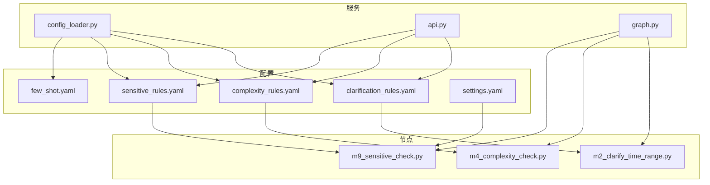
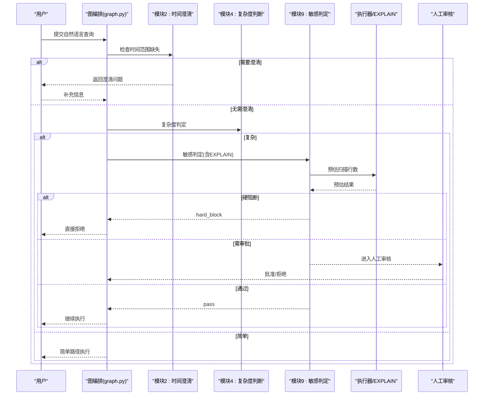
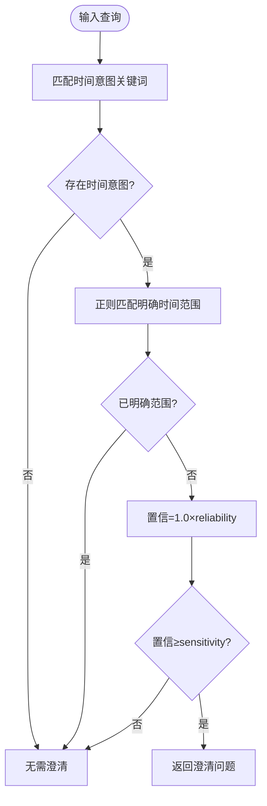
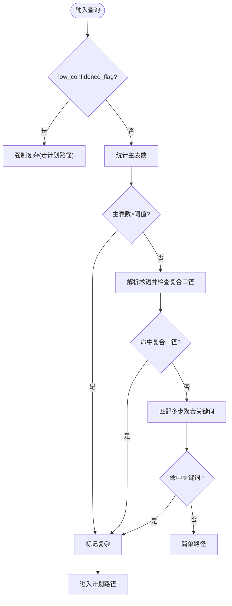
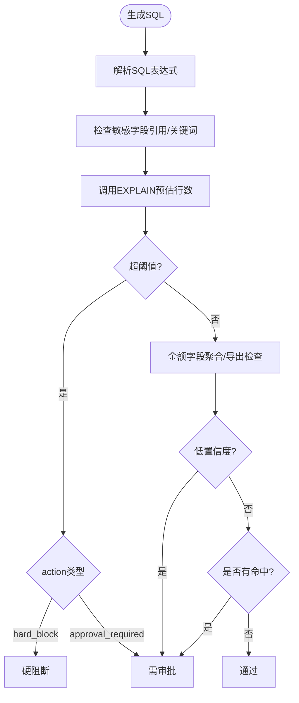
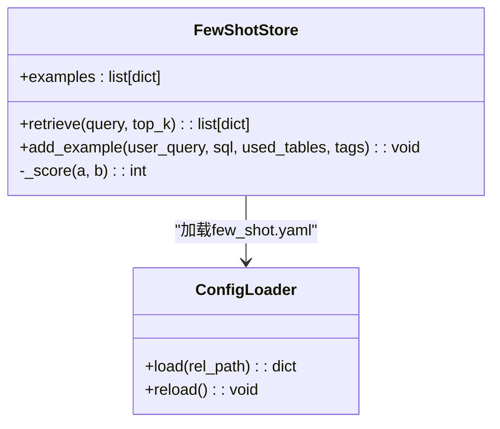
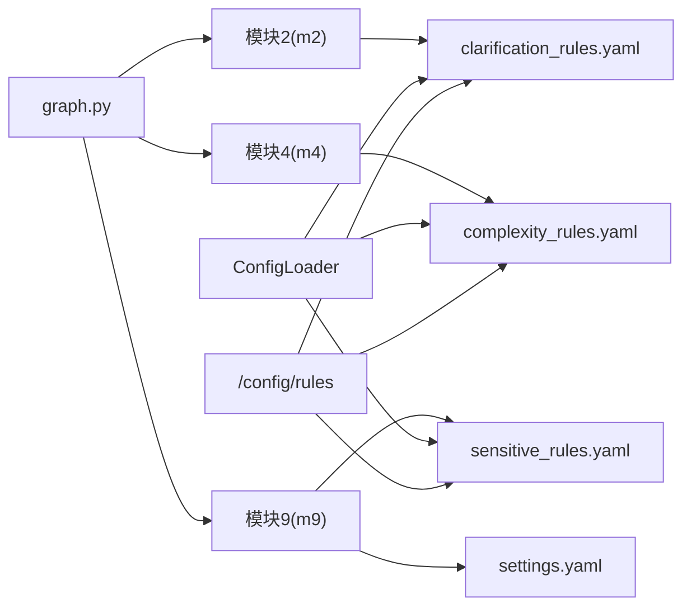

# 规则配置

<cite>
**本文引用的文件**   
- [clarification_rules.yaml](file://nl2sql_agent/config/clarification_rules.yaml)
- [complexity_rules.yaml](file://nl2sql_agent/config/complexity_rules.yaml)
- [sensitive_rules.yaml](file://nl2sql_agent/config/sensitive_rules.yaml)
- [few_shot.yaml](file://nl2sql_agent/config/few_shot.yaml)
- [settings.yaml](file://nl2sql_agent/config/settings.yaml)
- [m2_clarify_time_range.py](file://nl2sql_agent/nodes/m2_clarify_time_range.py)
- [m4_complexity_check.py](file://nl2sql_agent/nodes/m4_complexity_check.py)
- [m9_sensitive_check.py](file://nl2sql_agent/nodes/m9_sensitive_check.py)
- [config_loader.py](file://nl2sql_agent/services/config_loader.py)
- [api.py](file://nl2sql_agent/api.py)
- [graph.py](file://nl2sql_agent/graph.py)
- [test_nodes.py](file://nl2sql_agent/tests/test_nodes.py)
- [test_retrieval_confidence.py](file://nl2sql_agent/tests/test_retrieval_confidence.py)
- [test_architecture_hardening.py](file://nl2sql_agent/tests/test_architecture_hardening.py)
</cite>

## 目录
1. [简介](#简介)
2. [项目结构](#项目结构)
3. [核心组件](#核心组件)
4. [架构总览](#架构总览)
5. [详细组件分析](#详细组件分析)
6. [依赖关系分析](#依赖关系分析)
7. [性能考量](#性能考量)
8. [故障排查指南](#故障排查指南)
9. [结论](#结论)
10. [附录](#附录)

## 简介
本文件为 NL2SQL 系统的“规则配置”专项文档，聚焦以下四类规则与配套机制：
- 意图澄清规则（clarification_rules.yaml）：时间范围识别、歧义消解触发条件与交互策略。
- 复杂度判断规则（complexity_rules.yaml）：查询复杂度评估指标、简单/复杂分类标准与处理路径选择。
- 敏感操作规则（sensitive_rules.yaml）：危险 SQL 识别、风险等级分类与阻断/审批策略。
- 少样本学习配置（few_shot.yaml）：示例查询管理与提示模板定制。

同时提供规则编写规范、测试方法、性能优化建议，以及规则版本管理、热更新与审计能力说明。

## 项目结构
规则相关配置文件集中于 nl2sql_agent/config，节点实现位于 nl2sql_agent/nodes，配置加载与热更新由 services/config_loader.py 提供，API 暴露了规则读取接口。

图表来源
- [clarification_rules.yaml:1-62](file://nl2sql_agent/config/clarification_rules.yaml#L1-L62)
- [complexity_rules.yaml:1-17](file://nl2sql_agent/config/complexity_rules.yaml#L1-L17)
- [sensitive_rules.yaml:1-24](file://nl2sql_agent/config/sensitive_rules.yaml#L1-L24)
- [few_shot.yaml:1-32](file://nl2sql_agent/config/few_shot.yaml#L1-L32)
- [settings.yaml:1-30](file://nl2sql_agent/config/settings.yaml#L1-L30)
- [m2_clarify_time_range.py:1-62](file://nl2sql_agent/nodes/m2_clarify_time_range.py#L1-L62)
- [m4_complexity_check.py:1-53](file://nl2sql_agent/nodes/m4_complexity_check.py#L1-L53)
- [m9_sensitive_check.py:1-106](file://nl2sql_agent/nodes/m9_sensitive_check.py#L1-L106)
- [config_loader.py:1-36](file://nl2sql_agent/services/config_loader.py#L1-L36)
- [api.py:436-447](file://nl2sql_agent/api.py#L436-L447)
- [graph.py:237-272](file://nl2sql_agent/graph.py#L237-L272)

章节来源
- [clarification_rules.yaml:1-62](file://nl2sql_agent/config/clarification_rules.yaml#L1-L62)
- [complexity_rules.yaml:1-17](file://nl2sql_agent/config/complexity_rules.yaml#L1-L17)
- [sensitive_rules.yaml:1-24](file://nl2sql_agent/config/sensitive_rules.yaml#L1-L24)
- [few_shot.yaml:1-32](file://nl2sql_agent/config/few_shot.yaml#L1-L32)
- [settings.yaml:1-30](file://nl2sql_agent/config/settings.yaml#L1-L30)
- [m2_clarify_time_range.py:1-62](file://nl2sql_agent/nodes/m2_clarify_time_range.py#L1-L62)
- [m4_complexity_check.py:1-53](file://nl2sql_agent/nodes/m4_complexity_check.py#L1-L53)
- [m9_sensitive_check.py:1-106](file://nl2sql_agent/nodes/m9_sensitive_check.py#L1-L106)
- [config_loader.py:1-36](file://nl2sql_agent/services/config_loader.py#L1-L36)
- [api.py:436-447](file://nl2sql_agent/api.py#L436-L447)
- [graph.py:237-272](file://nl2sql_agent/graph.py#L237-L272)

## 核心组件
- 意图澄清（模块 2）：基于关键词与正则模式检测“时间意图”，若未给出明确时间范围则触发用户交互。
- 复杂度判断（模块 4）：纯确定性规则，依据表数量、复合口径指标、多步聚合关键词等信号判定是否走计划路径。
- 敏感判定（模块 9）：三态决策 pass/approval_required/hard_block，覆盖敏感字段、EXPLAIN 行数阈值、金额字段汇总/导出等。
- 少样本库（模块 7 简单路径）：按字面相似度检索 Top-K 示例，支持人工确认案例的回流写入接口。

章节来源
- [m2_clarify_time_range.py:1-62](file://nl2sql_agent/nodes/m2_clarify_time_range.py#L1-L62)
- [m4_complexity_check.py:1-53](file://nl2sql_agent/nodes/m4_complexity_check.py#L1-L53)
- [m9_sensitive_check.py:1-106](file://nl2sql_agent/nodes/m9_sensitive_check.py#L1-L106)
- [few_shot.yaml:1-32](file://nl2sql_agent/config/few_shot.yaml#L1-L32)

## 架构总览
下图展示规则在图编排中的位置与数据流向：模块 2 负责澄清，模块 4 决定路由，模块 9 进行安全拦截，最终进入执行或人工审核。

图表来源
- [graph.py:237-272](file://nl2sql_agent/graph.py#L237-L272)
- [m2_clarify_time_range.py:1-62](file://nl2sql_agent/nodes/m2_clarify_time_range.py#L1-L62)
- [m4_complexity_check.py:1-53](file://nl2sql_agent/nodes/m4_complexity_check.py#L1-L53)
- [m9_sensitive_check.py:1-106](file://nl2sql_agent/nodes/m9_sensitive_check.py#L1-L106)

## 详细组件分析

### 意图澄清规则（clarification_rules.yaml）
- 时间范围识别
  - 使用 time_intent_keywords 匹配“表现出时间意图”的词汇。
  - 使用 range_present_patterns 的正则表达式集合判断是否已包含明确时间范围。
  - 若命中时间意图但未命中明确范围，则返回 message 作为澄清问题。
- 置信度与敏感度
  - sensitivity 控制整体触发阈值；time_range_missing.reliability 用于计算“置信=触发×reliability”，低于 sensitivity 不触发。
- 检索后置信度（模块 3.5）
  - confidence_threshold、candidate_gap_threshold、candidate_gap_ratio 等参数用于低置信度时的候选澄清与继续策略。
  - supplement_top_n、supplement_threshold、relation_expand_top_n 等控制向量补充关联表的范围与权重。
  - field_query_markers 与 table/column vector 权重用于区分字段级/主题型查询的融合策略。
  - query_expansions 集中配置领域术语扩展，提升召回一致性。

图表来源
- [clarification_rules.yaml:1-62](file://nl2sql_agent/config/clarification_rules.yaml#L1-L62)
- [m2_clarify_time_range.py:1-62](file://nl2sql_agent/nodes/m2_clarify_time_range.py#L1-L62)

章节来源
- [clarification_rules.yaml:1-62](file://nl2sql_agent/config/clarification_rules.yaml#L1-L62)
- [m2_clarify_time_range.py:1-62](file://nl2sql_agent/nodes/m2_clarify_time_range.py#L1-L62)
- [test_nodes.py:429-449](file://nl2sql_agent/tests/test_nodes.py#L429-L449)
- [test_retrieval_confidence.py:150-158](file://nl2sql_agent/tests/test_retrieval_confidence.py#L150-L158)

### 复杂度判断规则（complexity_rules.yaml）
- 评估指标
  - multi_table_threshold：主表数量达到阈值即判复杂。
  - composite_metric_trigger：命中术语映射中 composite_metric=true 的指标即判复杂。
  - multi_step_keywords：命中多步聚合语义关键词即判复杂。
- 分类标准
  - conservative=true：任意一条规则命中即判复杂；否则需多条命中才判复杂。
- 处理策略
  - 低置信度查询强制走计划路径，跳过规则判断。
  - 复杂查询进入计划生成与校验流程，提高正确性与可解释性。

图表来源
- [complexity_rules.yaml:1-17](file://nl2sql_agent/config/complexity_rules.yaml#L1-L17)
- [m4_complexity_check.py:1-53](file://nl2sql_agent/nodes/m4_complexity_check.py#L1-L53)

章节来源
- [complexity_rules.yaml:1-17](file://nl2sql_agent/config/complexity_rules.yaml#L1-L17)
- [m4_complexity_check.py:1-53](file://nl2sql_agent/nodes/m4_complexity_check.py#L1-L53)
- [test_retrieval_confidence.py:92-121](file://nl2sql_agent/tests/test_retrieval_confidence.py#L92-L121)

### 敏感操作规则（sensitive_rules.yaml）
- 危险 SQL 识别
  - sensitive_fields：基于字段名与关键词匹配，命中即触发。
  - explain_scan：EXPLAIN 预估行数超过 threshold 时，根据 action 决定审批或直接阻断。
  - amount_field_keywords：金额类字段关键词，结合 is_column_in_aggregate 与 is_select_column 判断汇总/导出行为。
- 风险等级分类
  - hard_block：硬阻断，直接结束，不进入人工审批。
  - approval_required：需人工确认，进入 human_review。
  - pass：无风险，继续执行。
- 阻断策略配置
  - action 支持 hard_block 或 approval_required。
  - low_confidence_flag 强制进入人工确认。

图表来源
- [sensitive_rules.yaml:1-24](file://nl2sql_agent/config/sensitive_rules.yaml#L1-L24)
- [m9_sensitive_check.py:1-106](file://nl2sql_agent/nodes/m9_sensitive_check.py#L1-L106)
- [settings.yaml:18-22](file://nl2sql_agent/config/settings.yaml#L18-L22)

章节来源
- [sensitive_rules.yaml:1-24](file://nl2sql_agent/config/sensitive_rules.yaml#L1-L24)
- [m9_sensitive_check.py:1-106](file://nl2sql_agent/nodes/m9_sensitive_check.py#L1-L106)
- [settings.yaml:18-22](file://nl2sql_agent/config/settings.yaml#L18-L22)
- [test_architecture_hardening.py:104-114](file://nl2sql_agent/tests/test_architecture_hardening.py#L104-L114)

### 少样本学习配置（few_shot.yaml）
- 示例查询管理
  - examples 列表包含 user_query、sql、used_tables、tags。
  - FewShotStore 按字面相似度评分检索 Top-K 示例，用于简单路径提示增强。
- 提示模板定制
  - 示例仅包含真实 schema 内的表/字段；行级权限过滤由代码自动注入，不在示例中显式写出。
- 反馈闭环
  - add_example 预留接口，用于将人工确认通过的案例回写至示例库。

图表来源
- [few_shot.yaml:1-32](file://nl2sql_agent/config/few_shot.yaml#L1-L32)
- [config_loader.py:1-36](file://nl2sql_agent/services/config_loader.py#L1-L36)

章节来源
- [few_shot.yaml:1-32](file://nl2sql_agent/config/few_shot.yaml#L1-L32)
- [config_loader.py:1-36](file://nl2sql_agent/services/config_loader.py#L1-L36)

## 依赖关系分析
- 节点与配置的耦合
  - m2/m4/m9 分别依赖 clarification_rules.yaml、complexity_rules.yaml、sensitive_rules.yaml。
  - settings.yaml 影响敏感判定中的 EXPLAIN 阈值与只读限制。
- 图编排与路由
  - graph.py 定义模块间边与条件分支，确保澄清→复杂度→敏感→执行的顺序。
- 配置加载与热更新
  - config_loader.py 提供本地缓存与 mtime 热重载；API 层在修改 term_mapping 后主动刷新缓存。

图表来源
- [m2_clarify_time_range.py:1-62](file://nl2sql_agent/nodes/m2_clarify_time_range.py#L1-L62)
- [m4_complexity_check.py:1-53](file://nl2sql_agent/nodes/m4_complexity_check.py#L1-L53)
- [m9_sensitive_check.py:1-106](file://nl2sql_agent/nodes/m9_sensitive_check.py#L1-L106)
- [config_loader.py:1-36](file://nl2sql_agent/services/config_loader.py#L1-L36)
- [api.py:436-447](file://nl2sql_agent/api.py#L436-L447)
- [graph.py:237-272](file://nl2sql_agent/graph.py#L237-L272)

章节来源
- [graph.py:237-272](file://nl2sql_agent/graph.py#L237-L272)
- [config_loader.py:1-36](file://nl2sql_agent/services/config_loader.py#L1-L36)
- [api.py:436-447](file://nl2sql_agent/api.py#L436-L447)

## 性能考量
- 规则判定均为轻量级逻辑（正则匹配、关键词查找、计数），开销极低。
- 配置加载采用内存缓存与 mtime 比对，避免频繁 IO；仅在文件变更时重新加载。
- 敏感判定中的 EXPLAIN 可能成为瓶颈，建议在无执行环境时静默跳过，由上层守门。
- 少样本检索为字面相似度打分，Top-K 较小，开销可控。

[本节为通用指导，不直接分析具体文件]

## 故障排查指南
- 时间澄清未触发
  - 检查 clarification_rules.enabled 与 time_range_missing.enabled。
  - 验证 time_intent_keywords 与 range_present_patterns 是否覆盖实际用语。
  - 调整 sensitivity 与 reliability 以平衡误报率。
- 复杂度误判
  - 检查 multi_table_threshold 与术语映射中 composite_metric 设置。
  - 确认 multi_step_keywords 是否过宽导致误判。
- 敏感阻断过多
  - 核对 sensitive_fields 与 amount_field_keywords 是否过于严格。
  - 调整 explain_scan.threshold 与 action 策略。
  - 低置信度查询会强制进入人工确认，必要时提升检索置信度。
- 配置未生效
  - 确认 config_loader 缓存是否被刷新；可通过 /config/rules 接口查看当前配置。
  - 修改 term_mapping 后需调用 reload 与 _refresh。

章节来源
- [m2_clarify_time_range.py:1-62](file://nl2sql_agent/nodes/m2_clarify_time_range.py#L1-L62)
- [m4_complexity_check.py:1-53](file://nl2sql_agent/nodes/m4_complexity_check.py#L1-L53)
- [m9_sensitive_check.py:1-106](file://nl2sql_agent/nodes/m9_sensitive_check.py#L1-L106)
- [config_loader.py:1-36](file://nl2sql_agent/services/config_loader.py#L1-L36)
- [api.py:436-447](file://nl2sql_agent/api.py#L436-L447)

## 结论
本规则体系通过清晰的配置化设计，将意图澄清、复杂度路由与安全拦截解耦，既保证准确性与安全性，又具备灵活的可调性与可扩展性。配合热更新与测试用例，可在不重启服务的前提下持续优化规则效果。

[本节为总结，不直接分析具体文件]

## 附录

### 规则编写规范
- 命名与结构
  - 每个规则文件以顶层键名组织（如 clarification_rules、complexity_rules、sensitive_rules）。
  - 布尔开关统一使用 enabled/conservative 等清晰命名。
- 阈值与权重
  - 所有阈值必须可配置，避免硬编码；提供合理默认值与注释说明。
  - 权重项应附带业务含义注释，便于后续调优。
- 正则与关键词
  - 正则表达式需简洁且可维护，避免过度复杂；关键词列表保持精简。
- 安全与风控
  - 敏感规则需明确 action 策略，优先保障数据安全；审批流程需可追溯。

[本节为通用规范，不直接分析具体文件]

### 规则测试方法
- 单元测试
  - 针对各节点编写断言，覆盖正常路径与边界情况（如空结果、低置信度、EXPLAIN 失败）。
  - 使用 FakeLLM 与 InMemoryExecutor 隔离外部依赖。
- 验收用例
  - 模拟完整图执行流程，验证澄清→复杂度→敏感→执行的端到端行为。
  - 重点验证低置信度强制计划与人工确认、硬阻断策略。
- 配置隔离
  - 测试时使用独立配置目录，避免污染真实配置。

章节来源
- [test_nodes.py:1-200](file://nl2sql_agent/tests/test_nodes.py#L1-L200)
- [test_retrieval_confidence.py:92-121](file://nl2sql_agent/tests/test_retrieval_confidence.py#L92-L121)
- [test_architecture_hardening.py:94-121](file://nl2sql_agent/tests/test_architecture_hardening.py#L94-L121)

### 规则性能优化建议
- 减少不必要的 EXPLAIN 调用，在无执行环境时跳过。
- 对高频规则进行缓存（如术语解析结果、向量检索结果）。
- 控制少样本检索的 top_k 与评分阈值，避免过大开销。
- 定期清理无效或冗余的规则条目，保持配置精简。

[本节为通用建议，不直接分析具体文件]

### 规则版本管理
- 文件级版本
  - 利用 Git 管理规则文件变更，保留历史版本与变更记录。
- 运行时快照
  - 在关键节点输出当前配置快照，便于回溯与审计。
- 灰度发布
  - 通过环境变量或开关逐步启用新规则，观察效果后再全量上线。

[本节为通用建议，不直接分析具体文件]

### 规则热更新
- 机制
  - ConfigLoader 基于 mtime 自动重载，修改 YAML 后下次读取即生效。
- 触发方式
  - 修改 term_mapping 后调用 loader.reload() 与 term_mapping._refresh()。
- 注意事项
  - 热更新非实时监听，存在毫秒级延迟；高并发场景注意缓存一致性。

章节来源
- [config_loader.py:1-36](file://nl2sql_agent/services/config_loader.py#L1-L36)
- [api.py:413-433](file://nl2sql_agent/api.py#L413-L433)

### 规则审计功能
- 审计点
  - 敏感判定输出 risk_decision 与 sensitive_reasons，记录阻断原因。
  - 复杂度判定输出 complex_reasons，便于复盘路由决策。
  - 澄清输出 need_clarification 与 clarification_reason，追踪用户交互。
- 日志与监控
  - 建议将上述输出接入统一日志系统，形成可查询的审计轨迹。

章节来源
- [m9_sensitive_check.py:1-106](file://nl2sql_agent/nodes/m9_sensitive_check.py#L1-L106)
- [m4_complexity_check.py:1-53](file://nl2sql_agent/nodes/m4_complexity_check.py#L1-L53)
- [m2_clarify_time_range.py:1-62](file://nl2sql_agent/nodes/m2_clarify_time_range.py#L1-L62)