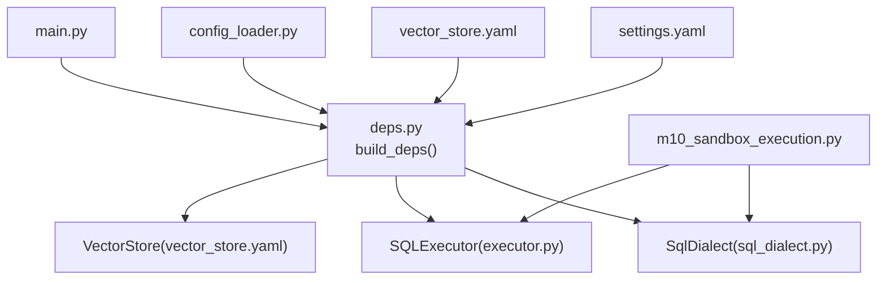
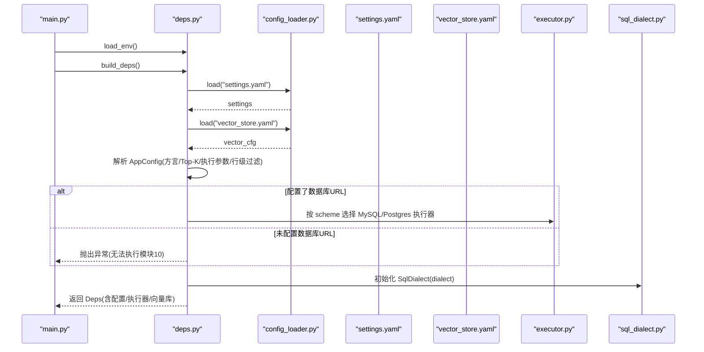
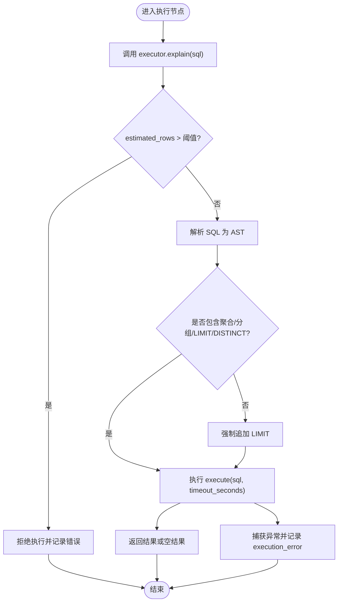
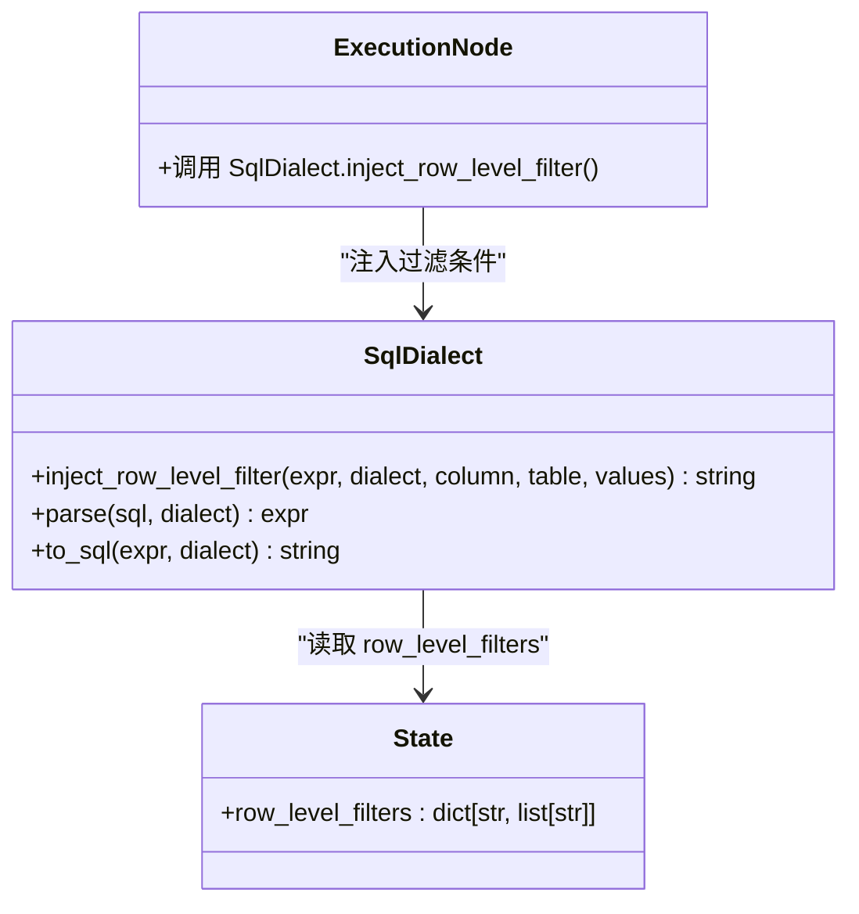
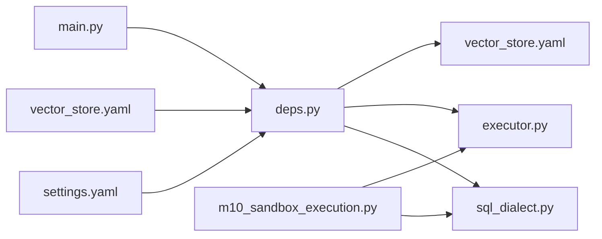

# 运行配置

<cite>
**本文引用的文件**   
- [settings.yaml](file://nl2sql_agent/config/settings.yaml)
- [config_loader.py](file://nl2sql_agent/services/config_loader.py)
- [deps.py](file://nl2sql_agent/services/deps.py)
- [sql_dialect.py](file://nl2sql_agent/services/sql_dialect.py)
- [executor.py](file://nl2sql_agent/services/executor.py)
- [m10_sandbox_execution.py](file://nl2sql_agent/nodes/m10_sandbox_execution.py)
- [vector_store.yaml](file://nl2sql_agent/config/vector_store.yaml)
- [main.py](file://nl2sql_agent/main.py)
</cite>

## 目录
1. [简介](#简介)
2. [项目结构](#项目结构)
3. [核心组件](#核心组件)
4. [架构总览](#架构总览)
5. [详细组件分析](#详细组件分析)
6. [依赖关系分析](#依赖关系分析)
7. [性能考虑](#性能考虑)
8. [故障排查指南](#故障排查指南)
9. [结论](#结论)
10. [附录](#附录)

## 简介
本文件为 NL2SQL Agent 的运行配置系统提供完整、深入的文档。重点覆盖：
- settings.yaml 所有参数的含义与用法，包括数据库方言（mysql/postgres/duckdb）、Schema 检索 Top-K、数据库连接（database_url、pg_database_url、pgvector_url）等
- execution 执行安全控制参数（只读模式、查询限制、超时、EXPLAIN 预估行数阈值）
- row_level_filter 行级过滤配置与权限隔离机制
- 配置加载优先级（环境变量覆盖、配置文件合并）、验证规则与默认值
- 常见配置场景示例、性能调优建议与故障排查
- 多环境配置管理最佳实践与配置热更新机制说明

## 项目结构
运行配置相关的关键文件与职责：
- nl2sql_agent/config/settings.yaml：运行时核心配置（方言、Top-K、数据库连接、执行与安全策略、行级过滤）
- nl2sql_agent/config/vector_store.yaml：向量存储后端选择与 pgvector URL
- nl2sql_agent/services/config_loader.py：YAML 配置加载器（本地缓存 + mtime 热更新）
- nl2sql_agent/services/deps.py：依赖装配与配置解析（AppConfig/Deps、环境变量覆盖、执行器构建）
- nl2sql_agent/services/sql_dialect.py：SQL 方言封装（AST 校验、危险操作检测、行级过滤注入、强制 LIMIT）
- nl2sql_agent/services/executor.py：沙箱执行器（PostgresExecutor、MySQLExecutor、InMemoryExecutor）
- nl2sql_agent/nodes/m10_sandbox_execution.py：执行节点（EXPLAIN 阈值、LIMIT 强制、超时处理）
- nl2sql_agent/main.py：HTTP 服务入口（加载 .env、构建图与依赖）

图表来源
- [settings.yaml:1-30](file://nl2sql_agent/config/settings.yaml#L1-L30)
- [vector_store.yaml:1-6](file://nl2sql_agent/config/vector_store.yaml#L1-L6)
- [config_loader.py:14-36](file://nl2sql_agent/services/config_loader.py#L14-L36)
- [deps.py:107-178](file://nl2sql_agent/services/deps.py#L107-L178)
- [sql_dialect.py:1-111](file://nl2sql_agent/services/sql_dialect.py#L1-L111)
- [executor.py:1-205](file://nl2sql_agent/services/executor.py#L1-L205)
- [m10_sandbox_execution.py:1-65](file://nl2sql_agent/nodes/m10_sandbox_execution.py#L1-L65)
- [main.py:1-152](file://nl2sql_agent/main.py#L1-L152)

章节来源
- [settings.yaml:1-30](file://nl2sql_agent/config/settings.yaml#L1-L30)
- [vector_store.yaml:1-6](file://nl2sql_agent/config/vector_store.yaml#L1-L6)
- [config_loader.py:14-36](file://nl2sql_agent/services/config_loader.py#L14-L36)
- [deps.py:107-178](file://nl2sql_agent/services/deps.py#L107-L178)
- [sql_dialect.py:1-111](file://nl2sql_agent/services/sql_dialect.py#L1-L111)
- [executor.py:1-205](file://nl2sql_agent/services/executor.py#L1-L205)
- [m10_sandbox_execution.py:1-65](file://nl2sql_agent/nodes/m10_sandbox_execution.py#L1-L65)
- [main.py:1-152](file://nl2sql_agent/main.py#L1-LL152)

## 核心组件
- AppConfig：集中承载运行时配置项（方言、Top-K、执行限制、超时、EXPLAIN 阈值、行级过滤、规则集等），并提供默认值
- Deps：装配依赖（LLM、TermMapping、SchemaCatalog、VectorStore、SQLExecutor、SqlDialect 等）
- ConfigLoader：YAML 配置加载器，支持基于 mtime 的热更新与本地缓存
- SqlDialect：SQL AST 工具（危险操作检测、表/列抽取、行级过滤注入、未聚合强制 LIMIT）
- SQLExecutor：执行器抽象与具体实现（Postgres/MySQL/内存）
- m10_sandbox_execution：执行节点，串联 EXPLAIN 阈值、LIMIT 强制、超时执行与错误回退

章节来源
- [deps.py:39-70](file://nl2sql_agent/services/deps.py#L39-L70)
- [deps.py:107-178](file://nl2sql_agent/services/deps.py#L107-L178)
- [config_loader.py:14-36](file://nl2sql_agent/services/config_loader.py#L14-L36)
- [sql_dialect.py:12-111](file://nl2sql_agent/services/sql_dialect.py#L12-L111)
- [executor.py:23-205](file://nl2sql_agent/services/executor.py#L23-L205)
- [m10_sandbox_execution.py:31-65](file://nl2sql_agent/nodes/m10_sandbox_execution.py#L31-L65)

## 架构总览
配置加载与使用的主流程：
- main.py 启动时加载 .env
- build_deps() 读取 settings.yaml 与 vector_store.yaml，解析 AppConfig
- 根据 database_url/pg_database_url 自动推断 dialect
- 按需构建 VectorStore（memory/pgvector）与 SQLExecutor（mysql/postgres）
- 将 SqlDialect、Executor、VectorStore 等注入到图节点中

图表来源
- [main.py:29-80](file://nl2sql_agent/main.py#L29-L80)
- [deps.py:107-178](file://nl2sql_agent/services/deps.py#L107-L178)
- [config_loader.py:14-36](file://nl2sql_agent/services/config_loader.py#L14-L36)
- [settings.yaml:1-30](file://nl2sql_agent/config/settings.yaml#L1-L30)
- [vector_store.yaml:1-6](file://nl2sql_agent/config/vector_store.yaml#L1-L6)
- [executor.py:72-84](file://nl2sql_agent/services/executor.py#L72-L84)
- [sql_dialect.py:12-21](file://nl2sql_agent/services/sql_dialect.py#L12-L21)

## 详细组件分析

### settings.yaml 参数详解
- dialect：SQL 方言（mysql/postgres/duckdb 等）。若未显式设置，将根据 database_url 的 scheme 自动推断；默认 postgres
- schema_search_top_k：Schema 检索 Top-K，用于向量兜底召回数量
- database_url：数据库连接字符串（优先于环境变量 DATABASE_URL）
- pg_database_url：兼容旧字段（仅 postgres 场景）
- pgvector_url：pgvector 连接串（仅在 postgres 且 backend=pgvector 时使用）
- execution.read_only：事务级只读（MySQL 使用 START TRANSACTION READ ONLY；Postgres 使用 READ ONLY 事务）
- execution.limit：未聚合查询强制 LIMIT 上限
- execution.timeout_seconds：查询超时秒数，超时视为 execution_error
- execution.explain_row_threshold：执行前 EXPLAIN 预估行数阈值，超过直接拒绝

章节来源
- [settings.yaml:1-30](file://nl2sql_agent/config/settings.yaml#L1-L30)

### 配置加载优先级与默认值
- 环境变量覆盖顺序（由 build_deps 决定）：
  - database_url：settings.yaml.database_url > 环境变量 DATABASE_URL > 环境变量 PG_DATABASE_URL > settings.yaml.pg_database_url
  - dialect：若从 database_url 解析出 mysql/postgres，则覆盖 settings.yaml.dialect
- 默认值：
  - AppConfig 内对 dialect、schema_search_top_k、execution_limit、execution_timeout_seconds、explain_row_threshold、row_level_filter 等提供默认值
  - 若未配置任何数据库连接，构建阶段抛出异常阻止进入执行模块

章节来源
- [deps.py:118-143](file://nl2sql_agent/services/deps.py#L118-L143)
- [deps.py:156-164](file://nl2sql_agent/services/deps.py#L156-L164)
- [deps.py:39-50](file://nl2sql_agent/services/deps.py#L39-L50)

### execution 执行配置与安全控制
- read_only：通过执行器层保证只读事务（MySQL/Postgres 均开启只读事务）
- limit：对未聚合查询强制追加 LIMIT，防止全表扫描
- timeout_seconds：通过数据库会话级超时控制（MySQL MAX_EXECUTION_TIME；Postgres statement_timeout）
- explain_row_threshold：在 m10 节点执行前调用 executor.explain，估算最大 rows，超过阈值直接拒绝

图表来源
- [m10_sandbox_execution.py:31-65](file://nl2sql_agent/nodes/m10_sandbox_execution.py#L31-L65)
- [executor.py:137-158](file://nl2sql_agent/services/executor.py#L137-L158)
- [executor.py:65-81](file://nl2sql_agent/services/executor.py#L65-L81)
- [sql_dialect.py:96-111](file://nl2sql_agent/services/sql_dialect.py#L96-L111)

章节来源
- [m10_sandbox_execution.py:31-65](file://nl2sql_agent/nodes/m10_sandbox_execution.py#L31-L65)
- [executor.py:53-81](file://nl2sql_agent/services/executor.py#L53-L81)
- [executor.py:83-158](file://nl2sql_agent/services/executor.py#L83-L158)
- [sql_dialect.py:96-111](file://nl2sql_agent/services/sql_dialect.py#L96-L111)

### row_level_filter 行级过滤配置
- enabled：是否启用行级过滤
- column：用于过滤的列名（例如 PLATFORM_CODE）
- 工作机制：
  - 由鉴权层向 state.row_level_filters 注入可信映射（如 {"PLATFORM_CODE": ["XXD","ZJ"]}）
  - SqlDialect.inject_row_level_filter 在 WHERE 中追加 <table>.<column> IN (values...)
  - data_scope 仅控制系统/表权限，不作为此字段的取值来源

图表来源
- [sql_dialect.py:80-93](file://nl2sql_agent/services/sql_dialect.py#L80-L93)
- [state.py:135-141](file://nl2sql_agent/state.py#L135-L141)

章节来源
- [settings.yaml:24-30](file://nl2sql_agent/config/settings.yaml#L24-L30)
- [sql_dialect.py:80-93](file://nl2sql_agent/services/sql_dialect.py#L80-L93)
- [state.py:135-141](file://nl2sql_agent/state.py#L135-L141)

### 向量存储配置（vector_store.yaml）
- backend：选择 memory 或 pgvector
- pgvector.url：pgvector 连接串，可通过环境变量 PGVECTOR_URL 注入
- 构建逻辑：
  - 若 backend=pgvector 但未提供 url，抛出异常
  - 否则默认使用 InMemoryVectorStore

章节来源
- [vector_store.yaml:1-6](file://nl2sql_agent/config/vector_store.yaml#L1-L6)
- [deps.py:86-104](file://nl2sql_agent/services/deps.py#L86-L104)

### 配置热更新机制
- ConfigLoader 基于文件 mtime 进行缓存失效判断
- 修改 YAML 后无需重启服务，下一次读取即自动重载
- 支持 reload() 清空缓存以立即生效

章节来源
- [config_loader.py:14-36](file://nl2sql_agent/services/config_loader.py#L14-L36)

## 依赖关系分析
- deps.py 负责装配 AppConfig 与 Deps，并依据 settings.yaml 与 vector_store.yaml 构建 SQLExecutor、VectorStore、SqlDialect
- sql_dialect.py 提供 AST 能力，被 m10_sandbox_execution 用于强制 LIMIT 与行级过滤注入
- executor.py 提供 Postgres/MySQL/内存三种执行器，分别实现 EXPLAIN 与 execute
- main.py 作为 HTTP 入口，加载 .env 并构建图与依赖

图表来源
- [deps.py:107-178](file://nl2sql_agent/services/deps.py#L107-L178)
- [sql_dialect.py:1-111](file://nl2sql_agent/services/sql_dialect.py#L1-L111)
- [executor.py:1-205](file://nl2sql_agent/services/executor.py#L1-L205)
- [m10_sandbox_execution.py:1-65](file://nl2sql_agent/nodes/m10_sandbox_execution.py#L1-L65)
- [main.py:1-152](file://nl2sql_agent/main.py#L1-L152)

章节来源
- [deps.py:107-178](file://nl2sql_agent/services/deps.py#L107-L178)
- [sql_dialect.py:1-111](file://nl2sql_agent/services/sql_dialect.py#L1-L111)
- [executor.py:1-205](file://nl2sql_agent/services/executor.py#L1-L205)
- [m10_sandbox_execution.py:1-65](file://nl2sql_agent/nodes/m10_sandbox_execution.py#L1-L65)
- [main.py:1-152](file://nl2sql_agent/main.py#L1-L152)

## 性能考虑
- EXPLAIN 阈值：合理设置 execution.explain_row_threshold，避免大表扫描
- LIMIT 强制：对未聚合查询设置合适的 execution.limit，降低结果集大小
- 超时控制：根据业务 SLA 调整 execution.timeout_seconds，避免长耗时查询
- 向量存储：生产建议使用 pgvector，减少内存占用并提升检索稳定性
- 方言选择：确保 dialect 与实际数据库一致，避免不必要的转换开销

[本节为通用指导，不直接分析具体文件]

## 故障排查指南
- 未配置数据库连接：
  - 现象：构建阶段抛出“未配置数据库连接”异常
  - 解决：设置 DATABASE_URL 或 settings.yaml.database_url/pg_database_url
- EXPLAIN 失败：
  - 现象：执行节点记录“EXPLAIN 失败”错误
  - 解决：检查 SQL 语法与数据库权限，确认 EXPLAIN 可用
- 执行报错：
  - 现象：execution_error 非空，可能触发重试或降级
  - 解决：查看错误信息，修正 SQL 或调整超时/阈值
- 向量存储未配置：
  - 现象：backend=pgvector 但未提供 url
  - 解决：设置 PGVECTOR_URL 或在 vector_store.yaml 中填写 url

章节来源
- [deps.py:156-164](file://nl2sql_agent/services/deps.py#L156-L164)
- [m10_sandbox_execution.py:31-65](file://nl2sql_agent/nodes/m10_sandbox_execution.py#L31-L65)
- [deps.py:86-104](file://nl2sql_agent/services/deps.py#L86-L104)

## 结论
本配置系统通过 settings.yaml 与 vector_store.yaml 集中管理运行时参数，结合环境变量覆盖与 ConfigLoader 热更新机制，实现了灵活、安全、可观测的执行环境。通过 SqlDialect 的 AST 能力与 SQLExecutor 的多方言实现，系统在只读、限流、超时与 EXPLAIN 防护等方面提供了完善的安全保障。推荐在生产环境中启用 pgvector、合理设置阈值与超时，并结合行级过滤实现细粒度数据隔离。

[本节为总结性内容，不直接分析具体文件]

## 附录

### 常见配置场景示例
- 开发演示（无外部依赖）：
  - 设置环境变量 NL2SQL_DEMO=1，使用 FakeLLM 与 InMemoryExecutor
  - vector_store.yaml.backend=memory
- 生产 Postgres：
  - 设置 DATABASE_URL=postgresql://...，dialect 自动推断为 postgres
  - vector_store.yaml.backend=pgvector，PGVECTOR_URL 指向 pgvector 实例
- 生产 MySQL：
  - 设置 DATABASE_URL=mysql://...，dialect 自动推断为 mysql
  - vector_store.yaml.backend=memory（MySQL 无 pgvector）

章节来源
- [main.py:73-79](file://nl2sql_agent/main.py#L73-L79)
- [deps.py:126-132](file://nl2sql_agent/services/deps.py#L126-L132)
- [vector_store.yaml:1-6](file://nl2sql_agent/config/vector_store.yaml#L1-L6)

### 多环境配置管理最佳实践
- 使用 .env 管理敏感信息（API Key、数据库连接串）
- 通过 settings.yaml 管理非敏感运行时参数
- 利用 ConfigLoader 热更新能力，在不重启的情况下调整阈值与规则
- 不同环境切换 backend（memory/pgvector）与 dialect（mysql/postgres）

章节来源
- [config_loader.py:14-36](file://nl2sql_agent/services/config_loader.py#L14-L36)
- [deps.py:31-37](file://nl2sql_agent/services/deps.py#L31-L37)

### 配置热更新机制说明
- ConfigLoader 基于 mtime 比对，文件修改后下次读取自动重载
- 支持 reload() 方法清空缓存，立即生效
- 适用于规则文件与 settings.yaml 的动态调整

章节来源
- [config_loader.py:14-36](file://nl2sql_agent/services/config_loader.py#L14-L36)