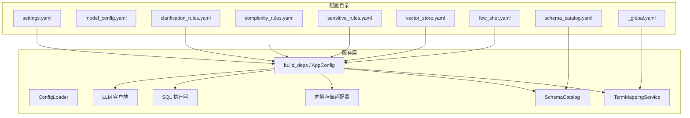
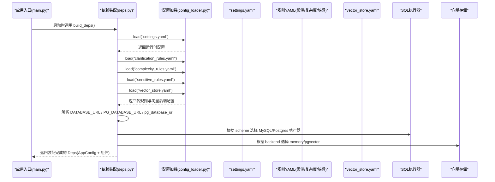
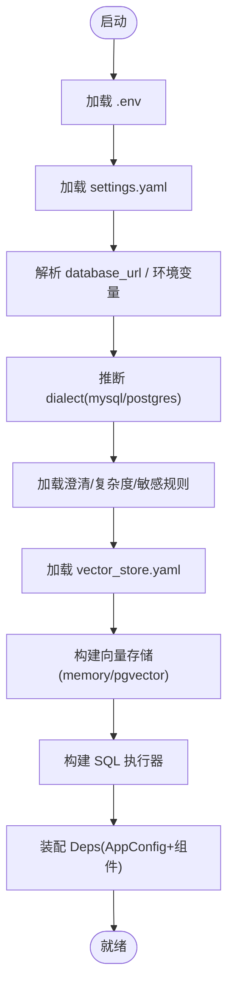

# 配置管理

<cite>
**本文引用的文件**   
- [settings.yaml](file://nl2sql_agent/config/settings.yaml)
- [model_config.yaml](file://nl2sql_agent/config/model_config.yaml)
- [clarification_rules.yaml](file://nl2sql_agent/config/clarification_rules.yaml)
- [complexity_rules.yaml](file://nl2sql_agent/config/complexity_rules.yaml)
- [sensitive_rules.yaml](file://nl2sql_agent/config/sensitive_rules.yaml)
- [vector_store.yaml](file://nl2sql_agent/config/vector_store.yaml)
- [few_shot.yaml](file://nl2sql_agent/config/few_shot.yaml)
- [schema_catalog.yaml](file://nl2sql_agent/config/schema_catalog.yaml)
- [_global.yaml](file://nl2sql_agent/config/term_mapping/_global.yaml)
- [config_loader.py](file://nl2sql_agent/services/config_loader.py)
- [deps.py](file://nl2sql_agent/services/deps.py)
- [main.py](file://nl2sql_agent/main.py)
</cite>

## 目录
1. [简介](#简介)
2. [项目结构](#项目结构)
3. [核心组件](#核心组件)
4. [架构总览](#架构总览)
5. [详细组件分析](#详细组件分析)
6. [依赖关系分析](#依赖关系分析)
7. [性能考量](#性能考量)
8. [故障排查指南](#故障排查指南)
9. [结论](#结论)
10. [附录](#附录)

## 简介
本文件为 NL2SQL 项目的配置管理系统提供完整文档，覆盖运行时配置、模型配置、规则配置、热更新机制、环境变量优先级与验证策略，以及最佳实践、模板与常见问题解决方案。读者可据此快速理解并安全地调整系统行为，同时满足运维侧对多环境、版本控制与发布流程的要求。

## 项目结构
配置集中在 nl2sql_agent/config 目录下，按职责划分：
- settings.yaml：运行时基础设置（数据库连接、执行限制、行级过滤等）
- model_config.yaml：嵌入模型与各节点模型配置
- clarification_rules.yaml：意图澄清规则（时间范围缺失、检索置信度）
- complexity_rules.yaml：复杂度判断规则（纯确定性规则）
- sensitive_rules.yaml：敏感操作判定规则（字段扫描量、金额聚合导出等）
- vector_store.yaml：向量存储后端选择（内存或 pgvector）
- few_shot.yaml：少样本示例库（简单路径 SQL 生成参考）
- schema_catalog.yaml：Schema 元数据（表/字段定义、语义角色、敏感标记）
- term_mapping/_global.yaml：跨业务线术语映射（指标到字段的解析）

图表来源 
- [settings.yaml:1-30](file://nl2sql_agent/config/settings.yaml#L1-L30)
- [model_config.yaml:1-16](file://nl2sql_agent/config/model_config.yaml#L1-L16)
- [clarification_rules.yaml:1-46](file://nl2sql_agent/config/clarification_rules.yaml#L1-L46)
- [complexity_rules.yaml:1-17](file://nl2sql_agent/config/complexity_rules.yaml#L1-L17)
- [sensitive_rules.yaml:1-24](file://nl2sql_agent/config/sensitive_rules.yaml#L1-L24)
- [vector_store.yaml:1-6](file://nl2sql_agent/config/vector_store.yaml#L1-L6)
- [few_shot.yaml:1-32](file://nl2sql_agent/config/few_shot.yaml#L1-L32)
- [schema_catalog.yaml:1-800](file://nl2sql_agent/config/schema_catalog.yaml#L1-L800)
- [_global.yaml:1-43](file://nl2sql_agent/config/term_mapping/_global.yaml#L1-L43)
- [config_loader.py:1-36](file://nl2sql_agent/services/config_loader.py#L1-L36)
- [deps.py:1-178](file://nl2sql_agent/services/deps.py#L1-L178)

章节来源
- [settings.yaml:1-30](file://nl2sql_agent/config/settings.yaml#L1-L30)
- [model_config.yaml:1-16](file://nl2sql_agent/config/model_config.yaml#L1-L16)
- [clarification_rules.yaml:1-46](file://nl2sql_agent/config/clarification_rules.yaml#L1-L46)
- [complexity_rules.yaml:1-17](file://nl2sql_agent/config/complexity_rules.yaml#L1-L17)
- [sensitive_rules.yaml:1-24](file://nl2sql_agent/config/sensitive_rules.yaml#L1-L24)
- [vector_store.yaml:1-6](file://nl2sql_agent/config/vector_store.yaml#L1-L6)
- [few_shot.yaml:1-32](file://nl2sql_agent/config/few_shot.yaml#L1-L32)
- [schema_catalog.yaml:1-800](file://nl2sql_agent/config/schema_catalog.yaml#L1-L800)
- [_global.yaml:1-43](file://nl2sql_agent/config/term_mapping/_global.yaml#L1-L43)
- [config_loader.py:1-36](file://nl2sql_agent/services/config_loader.py#L1-L36)
- [deps.py:1-178](file://nl2sql_agent/services/deps.py#L1-L178)

## 核心组件
- ConfigLoader：YAML 配置加载器，具备本地缓存与基于 mtime 的热更新能力，所有规则与参数均通过该组件读取，避免硬编码。
- build_deps/AppConfig：装配依赖与运行期配置，统一从 settings.yaml 与规则 YAML 中读取，并按环境变量与 URL scheme 推导方言与执行器。
- 向量存储适配：根据 vector_store.yaml 显式选择后端（memory/pgvector），pgvector 需配置 PGVECTOR_URL。
- SchemaCatalog/TermMappingService：分别负责 Schema 元数据与术语映射，支撑检索与指标解析。
- LLM/SQL LLM：主模型与 SQL 专用模型，由 deps 构建；SQL 专用模型未配置时回退至主模型。
- SQLExecutor：按 database_url 的 scheme 自动选择 MySQL/Postgres 执行器。

章节来源
- [config_loader.py:1-36](file://nl2sql_agent/services/config_loader.py#L1-L36)
- [deps.py:1-178](file://nl2sql_agent/services/deps.py#L1-L178)

## 架构总览
下图展示配置加载与依赖装配的关键流程，包括环境变量、YAML 配置与运行时参数的融合。

图表来源 
- [main.py:1-152](file://nl2sql_agent/main.py#L1-L152)
- [deps.py:107-178](file://nl2sql_agent/services/deps.py#L107-L178)
- [config_loader.py:14-36](file://nl2sql_agent/services/config_loader.py#L14-L36)
- [settings.yaml:1-30](file://nl2sql_agent/config/settings.yaml#L1-L30)
- [vector_store.yaml:1-6](file://nl2sql_agent/config/vector_store.yaml#L1-L6)

## 详细组件分析

### settings.yaml 运行时配置
- dialect：SQL 方言（mysql/postgres/duckdb 等），默认 postgres；若 database_url 存在则按 scheme 自动覆盖为 mysql 或 postgres。
- schema_search_top_k：Schema 检索 Top-K 数量。
- database_url：数据库连接字符串，支持 .env 的 DATABASE_URL 覆盖；兼容旧字段 PG_DATABASE_URL 与 pg_database_url。
- execution：执行限制
  - read_only：事务级只读（MySQL 使用 START TRANSACTION READ ONLY）。
  - limit：未聚合查询强制 LIMIT。
  - timeout_seconds：查询超时阈值。
  - explain_row_threshold：EXPLAIN 预估行数超过即拒绝。
- row_level_filter：行级过滤开关与列名（如 PLATFORM_CODE），用于平台隔离。

修改方法：直接编辑 nl2sql_agent/config/settings.yaml，无需重启服务即可生效（下一次读取时重载）。

章节来源
- [settings.yaml:1-30](file://nl2sql_agent/config/settings.yaml#L1-L30)
- [deps.py:118-143](file://nl2sql_agent/services/deps.py#L118-L143)

### model_config.yaml 模型配置
- embedding.provider：嵌入提供者（local/fake），local 使用 sentence-transformers，fake 为测试用确定性词袋向量。
- embedding.model：模型名称。
- embedding.model_path：本地已下载模型目录（相对项目根解析），不配则从 huggingface 下载。
- embedding.dimension：向量维度。
- nodes：各节点模型配置（例如 schema_comment_generation 使用 deepseek-chat），便于离线任务使用更便宜模型。

修改方法：编辑 nl2sql_agent/config/model_config.yaml；embedding 与 nodes 均可按需切换。

章节来源
- [model_config.yaml:1-16](file://nl2sql_agent/config/model_config.yaml#L1-L16)

### 意图澄清规则（clarification_rules.yaml）
- enabled/sensitivity：整体开关与敏感度阈值（越低越易触发）。
- time_range_missing：缺时间范围拦截
  - reliability：命中后的可靠性评分。
  - time_intent_keywords：识别“时间意图”的关键词集合。
  - range_present_patterns：明确时间范围的匹配模式（支持中文数字与量词）。
  - message：追问提示语。
- retrieval_confidence：检索后置信度判定
  - confidence_threshold：低于阈值触发低置信澄清。
  - candidate_gap_threshold：Top-2 候选置信度差小于阈值视为相近候选，触发候选澄清。
  - supplement_top_n/supplement_threshold：补充关联表的数量与最低置信度。
  - field_relevance_weight/table_vector_weight/column_vector_weight：融合权重。
  - relation_expand_top_n/relation_threshold：关系向量扩展阈值。

修改方法：在 clarification_rules.yaml 中调整阈值与关键词/模式，无需重启。

章节来源
- [clarification_rules.yaml:1-46](file://nl2sql_agent/config/clarification_rules.yaml#L1-L46)

### 复杂度判断规则（complexity_rules.yaml）
- conservative：保守模式（任意一条规则命中即判定复杂）。
- multi_table_threshold：涉及表数量阈值。
- composite_metric_trigger：命中术语映射中 composite_metric=true 的指标即复杂。
- multi_step_keywords/keyword_trigger：命中多步聚合语义关键词即复杂。

修改方法：在 complexity_rules.yaml 中调整阈值与关键词列表。

章节来源
- [complexity_rules.yaml:1-17](file://nl2sql_agent/config/complexity_rules.yaml#L1-L17)

### 敏感操作规则（sensitive_rules.yaml）
- sensitive_fields：敏感字段列表（name/keywords），命中即触发人工确认。
- explain_scan：扫描量硬安全边界（threshold/action），超限直接阻断。
- amount_field_keywords：金额类字段关键词（聚合/导出触发）。
- aggregation_trigger/export_trigger：是否启用聚合/导出触发。

修改方法：在 sensitive_rules.yaml 中调整字段、阈值与动作（hard_block/approval_required）。

章节来源
- [sensitive_rules.yaml:1-24](file://nl2sql_agent/config/sensitive_rules.yaml#L1-L24)

### 向量存储后端（vector_store.yaml）
- backend：memory（内存，重启重建）或 pgvector（Postgres + pgvector 扩展）。
- pgvector.url：PGVECTOR_URL 环境变量注入。

修改方法：在 vector_store.yaml 中选择 backend，并确保 pgvector.url 有效。

章节来源
- [vector_store.yaml:1-6](file://nl2sql_agent/config/vector_store.yaml#L1-L6)
- [deps.py:86-104](file://nl2sql_agent/services/deps.py#L86-L104)

### 少样本示例库（few_shot.yaml）
- examples：用户问题与对应 SQL、使用表与标签，供简单路径生成参考。
- 注意：行级权限过滤由模块 8 自动注入，示例中不应包含；语法应与 dialect 一致。

修改方法：在 few_shot.yaml 中增删示例，保持 SQL 与 schema/catalog 一致。

章节来源
- [few_shot.yaml:1-32](file://nl2sql_agent/config/few_shot.yaml#L1-L32)

### Schema 元数据（schema_catalog.yaml）
- _meta：生成信息（版本、来源、快照 ID、语义哈希、生成时间等）。
- risk_mart.tables：表定义（name/comment/business_line/shared），columns：字段定义（name/type/raw_type/nullable/primary_key/unique/indexed/category/semantic_role/time_granularity/sensitive）。

用途：支撑检索、语义角色识别与敏感字段标记。

章节来源
- [schema_catalog.yaml:1-800](file://nl2sql_agent/config/schema_catalog.yaml#L1-L800)

### 术语映射（term_mapping/_global.yaml）
- 全局术语映射（business_line=global），将业务术语解析为 resolved_fields，支持 aliases 与 composite_metric 标识。

用途：指标到字段的标准化解析，配合复杂度与敏感规则。

章节来源
- [_global.yaml:1-43](file://nl2sql_agent/config/term_mapping/_global.yaml#L1-L43)

## 依赖关系分析
- 配置加载顺序与优先级
  - 环境变量优先：load_env() 加载 .env（不覆盖已有系统环境变量）。
  - settings.yaml 中的 database_url 优先于 .env 的 DATABASE_URL，再兼容 PG_DATABASE_URL/pg_database_url。
  - dialect 可由 database_url 的 scheme 自动覆盖。
- 组件装配
  - build_deps() 组装 AppConfig、ConfigLoader、LLM、TermMappingService、SchemaCatalog、VectorStoreAdapter、SQLExecutor、FewShotStore、SqlDialect。
  - vector_store.yaml 显式选择后端，pgvector 需要 PGVECTOR_URL。
  - executor 根据 database_url 的 scheme 选择 MySQL/Postgres 执行器。

图表来源 
- [deps.py:31-37](file://nl2sql_agent/services/deps.py#L31-L37)
- [deps.py:107-178](file://nl2sql_agent/services/deps.py#L107-L178)
- [vector_store.yaml:1-6](file://nl2sql_agent/config/vector_store.yaml#L1-L6)

章节来源
- [deps.py:1-178](file://nl2sql_agent/services/deps.py#L1-L178)

## 性能考量
- 执行限制：execution.limit 与 execution.timeout_seconds 防止长尾查询影响吞吐。
- EXPLAIN 预检：explain_row_threshold 拦截高代价查询，降低风险与资源消耗。
- 向量存储：memory 适合开发/测试；pgvector 适合生产持久化与大规模检索。
- 缓存与热更新：ConfigLoader 基于 mtime 缓存，减少重复 IO；规则变更即时生效，无需重启。

[本节为通用指导，不直接分析具体文件]

## 故障排查指南
- 未配置数据库连接
  - 现象：启动时报错提示未配置 DATABASE_URL / settings.yaml 的 database_url。
  - 处理：在 .env 设置 DATABASE_URL，或在 settings.yaml 设置 database_url；确保 scheme 为 mysql/postgres。
- 向量存储后端错误
  - 现象：backend=pgvector 但未设置 PGVECTOR_URL。
  - 处理：在 vector_store.yaml 中配置 pgvector.url，或通过环境变量 PGVECTOR_URL 注入。
- 规则未生效
  - 现象：调整 rules 后无变化。
  - 处理：确认 ConfigLoader 缓存已因 mtime 变化而刷新；必要时调用 reload() 清空缓存。
- 方言不一致
  - 现象：dialect 与 database_url scheme 不一致导致执行异常。
  - 处理：让 build_deps() 自动推断 dialect，或显式设置 settings.yaml 的 dialect。

章节来源
- [deps.py:156-164](file://nl2sql_agent/services/deps.py#L156-L164)
- [deps.py:86-104](file://nl2sql_agent/services/deps.py#L86-L104)
- [config_loader.py:14-36](file://nl2sql_agent/services/config_loader.py#L14-L36)

## 结论
本项目采用集中式 YAML 配置与轻量热更新机制，结合环境变量与 URL scheme 自动推断，实现了灵活、安全且高性能的配置管理。通过清晰的规则分层（澄清/复杂度/敏感）与向量存储后端选择，既能满足初学者快速上手，又能为运维提供完善的配置治理方案。建议在生产环境严格遵循最佳实践，实施多环境隔离、版本控制与发布流程，确保配置变更的可追溯性与稳定性。

[本节为总结性内容，不直接分析具体文件]

## 附录

### 配置热更新机制
- 机制：ConfigLoader 以 mtime 作为缓存键，文件修改后下次读取自动重载。
- 适用：所有规则与 settings.yaml 均可热更新，无需重启服务。
- 注意事项：频繁写入可能导致缓存抖动，建议在批量变更后一次性保存。

章节来源
- [config_loader.py:14-36](file://nl2sql_agent/services/config_loader.py#L14-L36)

### 环境变量优先级与验证
- 优先级：.env 不覆盖已有系统环境变量；database_url 优先于 DATABASE_URL；PG_DATABASE_URL/pg_database_url 为兼容字段。
- 验证：build_deps() 在缺少必要配置时抛出明确错误，便于快速定位。

章节来源
- [deps.py:31-37](file://nl2sql_agent/services/deps.py#L31-L37)
- [deps.py:118-143](file://nl2sql_agent/services/deps.py#L118-L143)

### 配置最佳实践
- 将可调项全部放入配置，禁止写死在代码中。
- 使用 vector_store.yaml 显式选择后端，避免隐式二选一。
- 在 settings.yaml 中合理设置 execution 限制与 explain_row_threshold，保障稳定性。
- 在 sensitive_rules.yaml 中设定 hard_block 阈值，防止超量扫描。
- 在 clarification_rules.yaml 中调优 sensitivity 与阈值，平衡召回与误报。

章节来源
- [settings.yaml:1-30](file://nl2sql_agent/config/settings.yaml#L1-L30)
- [vector_store.yaml:1-6](file://nl2sql_agent/config/vector_store.yaml#L1-L6)
- [sensitive_rules.yaml:1-24](file://nl2sql_agent/config/sensitive_rules.yaml#L1-L24)
- [clarification_rules.yaml:1-46](file://nl2sql_agent/config/clarification_rules.yaml#L1-L46)

### 配置模板与常见配置问题
- settings.yaml 模板要点：dialect、schema_search_top_k、database_url、execution.*、row_level_filter。
- model_config.yaml 模板要点：embedding.provider/model/model_path/dimension、nodes.*。
- 常见问题：
  - 未配置 database_url：检查 .env 与 settings.yaml。
  - pgvector 未配置 URL：检查 vector_store.yaml 与 PGVECTOR_URL。
  - 规则未生效：确认 mtime 变化与缓存刷新。

章节来源
- [settings.yaml:1-30](file://nl2sql_agent/config/settings.yaml#L1-L30)
- [model_config.yaml:1-16](file://nl2sql_agent/config/model_config.yaml#L1-L16)
- [vector_store.yaml:1-6](file://nl2sql_agent/config/vector_store.yaml#L1-L6)
- [config_loader.py:14-36](file://nl2sql_agent/services/config_loader.py#L14-L36)

### 配置管理工具与备份恢复
- 工具：ConfigLoader 提供 reload() 清空缓存；测试夹具复制 config 目录隔离测试。
- 备份恢复：建议对 nl2sql_agent/config 目录进行版本化管理与定期备份；恢复时确保 mtime 变化触发重载。

章节来源
- [config_loader.py:34-36](file://nl2sql_agent/services/config_loader.py#L34-L36)
- [conftest.py:46-56](file://nl2sql_agent/tests/conftest.py#L46-L56)

### 多环境配置管理、版本控制与发布流程
- 多环境：通过 .env 与 vector_store.yaml/pgvector.url 区分 dev/test/prod；settings.yaml 中保留公共默认值。
- 版本控制：将 config/ 纳入 Git，使用分支与 PR 管理变更；schema_catalog.yaml 由脚本生成，应纳入版本快照。
- 发布流程：变更规则与模型配置前进行回归测试；发布后观察日志与执行结果，必要时回滚。

章节来源
- [deps.py:31-37](file://nl2sql_agent/services/deps.py#L31-L37)
- [deps.py:86-104](file://nl2sql_agent/services/deps.py#L86-L104)
- [schema_catalog.yaml:1-800](file://nl2sql_agent/config/schema_catalog.yaml#L1-L800)