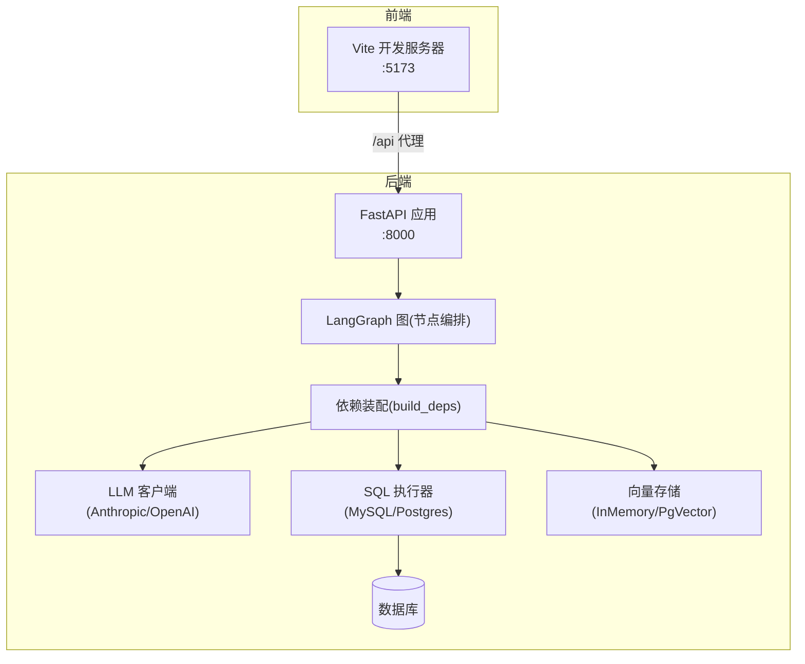
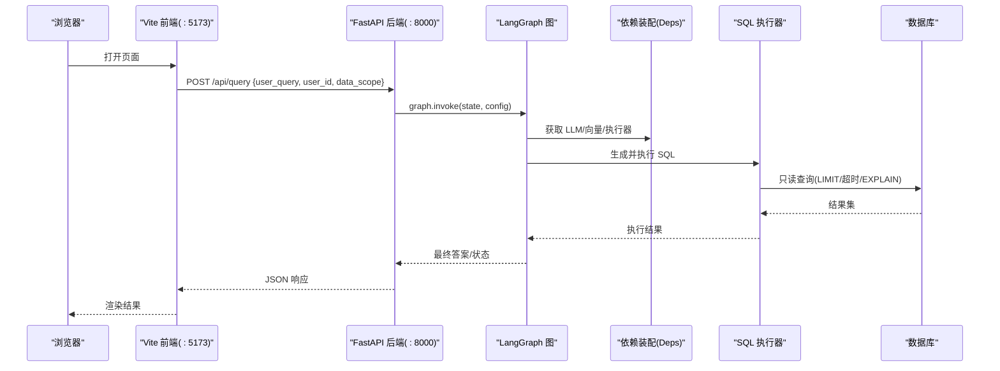
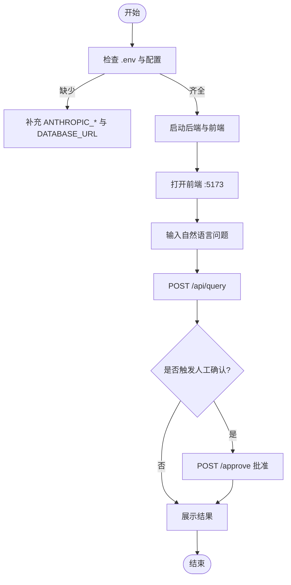
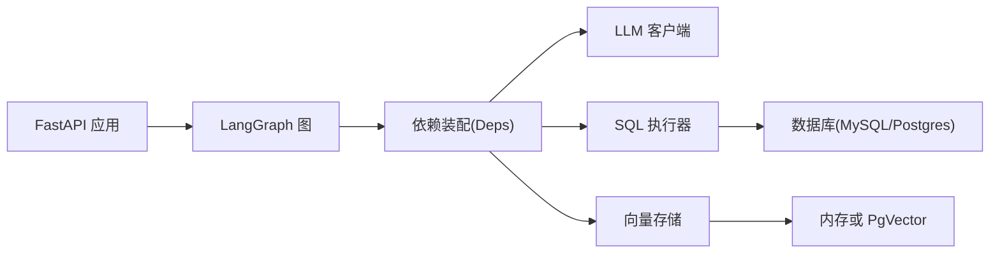

# 快速开始指南

<cite>
**本文引用的文件**   
- [pyproject.toml](file://pyproject.toml)
- [requirements.txt](file://requirements.txt)
- [nl2sql_agent/main.py](file://nl2sql_agent/main.py)
- [nl2sql_agent/services/deps.py](file://nl2sql_agent/services/deps.py)
- [nl2sql_agent/config/settings.yaml](file://nl2sql_agent/config/settings.yaml)
- [nl2sql_agent/config/model_config.yaml](file://nl2sql_agent/config/model_config.yaml)
- [nl2sql_agent/config/vector_store.yaml](file://nl2sql_agent/config/vector_store.yaml)
- [web/package.json](file://web/package.json)
- [web/vite.config.ts](file://web/vite.config.ts)
- [scripts/dev.ps1](file://scripts/dev.ps1)
- [restart.bat](file://restart.bat)
- [NL2SQL.md](file://NL2SQL.md)
</cite>

## 目录
1. [简介](#简介)
2. [项目结构](#项目结构)
3. [核心组件](#核心组件)
4. [架构总览](#架构总览)
5. [详细组件分析](#详细组件分析)
6. [依赖关系分析](#依赖关系分析)
7. [性能注意事项](#性能注意事项)
8. [故障排除指南](#故障排除指南)
9. [结论](#结论)
10. [附录](#附录)

## 简介
本指南面向首次接触 NL2SQL 项目的用户，提供从零到一的环境搭建、服务启动与第一个自然语言查询的完整流程。你将学会：
- 准备 Python 环境与依赖（支持 uv 或 pip）
- 配置数据库连接与向量存储后端
- 启动后端 FastAPI 服务与前端开发服务器
- 使用 .env 与 YAML 配置文件完成基础设置
- 通过 API 发起一次完整的 NL2SQL 查询并查看结果

## 项目结构
本项目采用前后端分离架构：
- 后端：FastAPI + LangGraph 智能体，暴露 /query、/approve、/thread 等接口
- 前端：React + Vite，默认监听 5173 端口，并通过代理访问后端 /api
- 配置：settings.yaml、model_config.yaml、vector_store.yaml 等集中管理运行参数
- 脚本：Windows 一键启停脚本 dev.ps1 与 restart.bat

**图表来源** 
- [nl2sql_agent/main.py:1-152](file://nl2sql_agent/main.py#L1-L152)
- [nl2sql_agent/services/deps.py:113-184](file://nl2sql_agent/services/deps.py#L113-L184)
- [web/vite.config.ts:1-21](file://web/vite.config.ts#L1-L21)

**章节来源**
- [pyproject.toml:1-44](file://pyproject.toml#L1-L44)
- [requirements.txt:1-15](file://requirements.txt#L1-L15)
- [web/package.json:1-26](file://web/package.json#L1-L26)
- [web/vite.config.ts:1-21](file://web/vite.config.ts#L1-L21)

## 核心组件
- 后端入口与路由：FastAPI 应用定义、CORS、/query、/approve、/thread 接口
- 依赖装配：加载 .env、YAML 配置，构建 LLM、向量存储、SQL 执行器等
- 配置中心：settings.yaml（执行策略、方言、行级过滤）、model_config.yaml（嵌入模型与节点模型）、vector_store.yaml（向量后端选择）
- 前端开发服务器：Vite 代理 /api 到后端，便于本地联调

**章节来源**
- [nl2sql_agent/main.py:1-152](file://nl2sql_agent/main.py#L1-L152)
- [nl2sql_agent/services/deps.py:1-184](file://nl2sql_agent/services/deps.py#L1-L184)
- [nl2sql_agent/config/settings.yaml:1-30](file://nl2sql_agent/config/settings.yaml#L1-L30)
- [nl2sql_agent/config/model_config.yaml:1-18](file://nl2sql_agent/config/model_config.yaml#L1-L18)
- [nl2sql_agent/config/vector_store.yaml:1-6](file://nl2sql_agent/config/vector_store.yaml#L1-L6)

## 架构总览
下图展示了从前端发起查询到后端执行 SQL 的关键调用链路与数据流。

**图表来源** 
- [nl2sql_agent/main.py:83-121](file://nl2sql_agent/main.py#L83-L121)
- [nl2sql_agent/services/deps.py:113-184](file://nl2sql_agent/services/deps.py#L113-L184)

## 详细组件分析

### 环境搭建与依赖安装
- Python 版本要求：>=3.11
- 依赖管理：推荐使用 uv；也可使用 pip 基于 requirements.txt
- 安装步骤：
  - 使用 uv：在项目根目录执行 uv sync（会自动读取 pyproject.toml 与 uv.lock）
  - 使用 pip：pip install -r requirements.txt

**章节来源**
- [pyproject.toml:1-44](file://pyproject.toml#L1-L44)
- [requirements.txt:1-15](file://requirements.txt#L1-L15)

### 环境变量与 .env 配置
- 项目会在启动时自动加载根目录 .env（不覆盖已存在的环境变量）
- 常用环境变量：
  - ANTHROPIC_API_KEY、ANTHROPIC_MODEL：LLM 鉴权与模型名
  - DATABASE_URL：数据库连接串（mysql:// 或 postgresql://）
  - PGVECTOR_URL：pgvector 后端连接串（当 vector_store 使用 pgvector 时）
  - NL2SQL_DEMO=1：启用演示模式（FakeLLM + InMemoryExecutor，无需外部依赖）
- 加载位置与优先级：
  - build_deps 中先 load_env()，再读取 settings.yaml 与 os.getenv
  - database_url 优先顺序：settings.yaml > DATABASE_URL > PG_DATABASE_URL > pg_database_url

**章节来源**
- [nl2sql_agent/services/deps.py:32-38](file://nl2sql_agent/services/deps.py#L32-L38)
- [nl2sql_agent/services/deps.py:121-137](file://nl2sql_agent/services/deps.py#L121-L137)
- [nl2sql_agent/main.py:29](file://nl2sql_agent/main.py#L29)

### 数据库初始化与连接配置
- 支持的数据库类型：MySQL、PostgreSQL（根据 URL scheme 自动选择执行器）
- 连接方式：
  - 在 settings.yaml 中设置 database_url
  - 或在 .env 中设置 DATABASE_URL
- 执行策略（settings.yaml）：
  - execution.read_only=true：事务级只读
  - execution.limit=1000：未聚合查询强制 LIMIT
  - execution.timeout_seconds=30：查询超时熔断
  - execution.explain_row_threshold=1000000：预估行数过大直接拒绝
- 行级过滤（可选）：row_level_filter.enabled=false 可关闭，column 指定过滤列

**章节来源**
- [nl2sql_agent/config/settings.yaml:1-30](file://nl2sql_agent/config/settings.yaml#L1-L30)
- [nl2sql_agent/services/deps.py:73-84](file://nl2sql_agent/services/deps.py#L73-L84)

### 向量存储后端配置
- 后端选择：memory（内存，重启重建）或 pgvector（Postgres + pgvector 扩展）
- 配置位置：config/vector_store.yaml
- 若使用 pgvector，需设置 pgvector.url（支持 ${PGVECTOR_URL} 环境变量替换）
- 默认回退：未显式配置或 backend=memory 时使用 InMemoryVectorStore

**章节来源**
- [nl2sql_agent/config/vector_store.yaml:1-6](file://nl2sql_agent/config/vector_store.yaml#L1-L6)
- [nl2sql_agent/services/deps.py:87-111](file://nl2sql_agent/services/deps.py#L87-L111)

### 模型配置（嵌入与节点模型）
- embedding.provider：local（sentence-transformers）或 fake（测试用）
- embedding.model：模型名称或本地路径（model_path）
- nodes.schema_comment_generation.model：表注释缺失时的辅助模型
- 注意：更换中文金融领域模型后，应同步 dimension 并评估召回率等指标

**章节来源**
- [nl2sql_agent/config/model_config.yaml:1-18](file://nl2sql_agent/config/model_config.yaml#L1-L18)

### 后端服务启动
- 启动命令：uvicorn nl2sql_agent.main:app（默认 :8000）
- 跨域：允许 http://localhost:5173 与 http://127.0.0.1:5173
- 演示模式：设置 NL2SQL_DEMO=1 可跳过真实 LLM 与数据库，便于无依赖体验
- 检查点：SQLite 持久化 LangGraph 线程状态（data/langgraph_checkpoints.db）

**章节来源**
- [nl2sql_agent/main.py:46-57](file://nl2sql_agent/main.py#L46-L57)
- [nl2sql_agent/main.py:63-80](file://nl2sql_agent/main.py#L63-L80)
- [nl2sql_agent/main.py:148-152](file://nl2sql_agent/main.py#L148-L152)

### 前端开发服务器运行
- 进入 web 目录，安装依赖后运行 npm run dev
- 默认监听 :5173，并将 /api 请求代理到后端（默认 http://localhost:8000）
- 可通过环境变量 VITE_PROXY_TARGET 覆盖代理目标

**章节来源**
- [web/package.json:1-26](file://web/package.json#L1-L26)
- [web/vite.config.ts:1-21](file://web/vite.config.ts#L1-L21)

### 一键启停脚本（Windows）
- 使用 PowerShell 脚本 scripts/dev.ps1 管理后端与前端进程
- 常用命令：start、stop、restart、status
- 日志输出至 logs/backend.log、logs/frontend.log 等
- 双击 restart.bat 即可一键重启

**章节来源**
- [scripts/dev.ps1:1-134](file://scripts/dev.ps1#L1-L134)
- [restart.bat:1-10](file://restart.bat#L1-L10)

### 第一个查询示例（端到端）
- 前置条件：
  - 已配置 .env（至少包含 ANTHROPIC_API_KEY、ANTHROPIC_MODEL、DATABASE_URL）
  - 后端服务运行在 :8000，前端运行在 :5173
- 操作步骤：
  - 在前端 QueryPage 输入自然语言问题，附带 user_id 与 data_scope
  - 点击提交，前端将请求转发到 /api/query
  - 后端返回 thread_id、status、sql、final_answer 等字段
  - 若触发敏感规则，状态为 human_review_pending，需调用 /approve 继续
- 调试建议：
  - 使用 /thread/{id} 查看中间状态
  - 查看 logs 目录下的后端与前端日志

**图表来源** 
- [nl2sql_agent/main.py:83-145](file://nl2sql_agent/main.py#L83-L145)

**章节来源**
- [nl2sql_agent/main.py:83-145](file://nl2sql_agent/main.py#L83-L145)

## 依赖关系分析
- 后端依赖：FastAPI、uvicorn、langgraph、pydantic、sqlglot、anthropic/openai、psycopg/pymysql、sentence-transformers 等
- 前端依赖：React、Ant Design、Vite、TypeScript
- 配置依赖：PyYAML、python-dotenv
- 运行时依赖：数据库驱动、向量存储后端（内存或 pgvector）

**图表来源** 
- [pyproject.toml:1-44](file://pyproject.toml#L1-L44)
- [web/package.json:1-26](file://web/package.json#L1-L26)
- [nl2sql_agent/services/deps.py:113-184](file://nl2sql_agent/services/deps.py#L113-L184)

**章节来源**
- [pyproject.toml:1-44](file://pyproject.toml#L1-L44)
- [requirements.txt:1-15](file://requirements.txt#L1-L15)
- [web/package.json:1-26](file://web/package.json#L1-L26)

## 性能注意事项
- 执行限制：execution.limit 与 execution.timeout_seconds 防止长尾查询
- EXPLAIN 阈值：execution.explain_row_threshold 拦截大扫描量查询
- 只读事务：execution.read_only=true 降低写风险
- 向量缓存：InMemoryVectorStore 按 embedding 配置签名缓存，避免重复计算
- 演示模式：NL2SQL_DEMO=1 跳过外部依赖，适合快速验证

**章节来源**
- [nl2sql_agent/config/settings.yaml:18-23](file://nl2sql_agent/config/settings.yaml#L18-L23)
- [nl2sql_agent/services/deps.py:87-111](file://nl2sql_agent/services/deps.py#L87-L111)

## 故障排除指南
- 端口占用（10048）：使用 scripts/dev.ps1 stop 释放端口后再 start
- 数据库连接失败：检查 DATABASE_URL 或 settings.yaml 的 database_url，确保网络与账号权限
- 向量后端错误：若使用 pgvector，确认 PGVECTOR_URL 已设置且扩展已启用
- LLM 调用失败：检查 ANTHROPIC_API_KEY 与 ANTHROPIC_MODEL 是否正确
- 前端无法访问后端：确认 vite.config.ts 的代理目标与后端端口一致
- 日志定位：查看 logs/backend.log、logs/frontend.log 与后端控制台输出

**章节来源**
- [scripts/dev.ps1:90-109](file://scripts/dev.ps1#L90-L109)
- [web/vite.config.ts:12-17](file://web/vite.config.ts#L12-L17)
- [nl2sql_agent/services/deps.py:125-137](file://nl2sql_agent/services/deps.py#L125-L137)

## 结论
通过以上步骤，你可以在本地快速搭建 NL2SQL 的开发与演示环境，完成从自然语言到 SQL 的端到端查询。建议在生产环境中：
- 严格配置只读账号与执行限制
- 使用 pgvector 提升语义检索稳定性
- 完善术语映射与 few-shot 案例以提升准确率
- 结合敏感规则与人工确认保障数据安全

## 附录
- 系统提示词与整体设计思路参考：NL2SQL.md
- 如需离线或本地模型部署，请参考 model_config.yaml 的 embedding 配置

**章节来源**
- [NL2SQL.md:1-76](file://NL2SQL.md#L1-L76)
- [nl2sql_agent/config/model_config.yaml:1-18](file://nl2sql_agent/config/model_config.yaml#L1-L18)