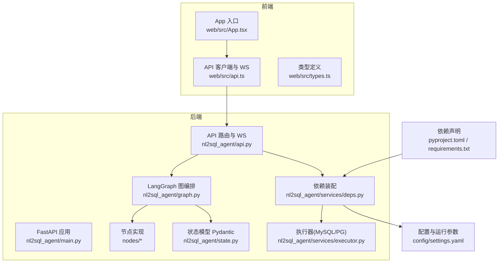
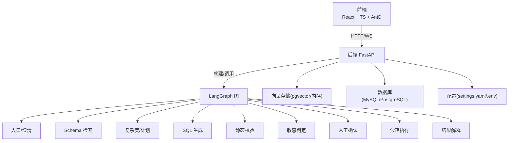
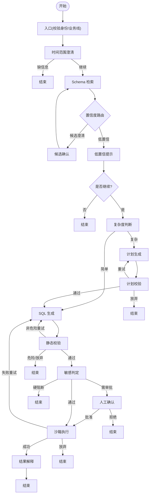
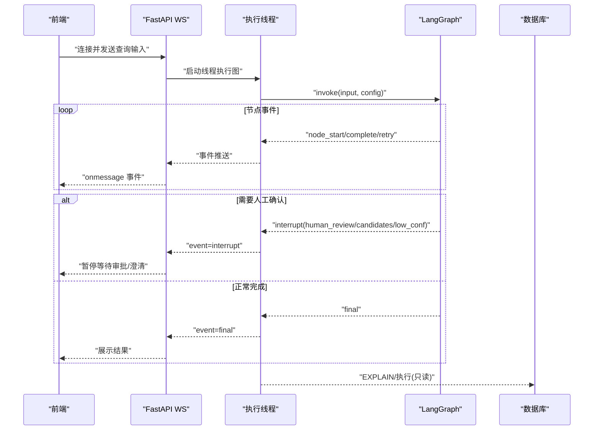
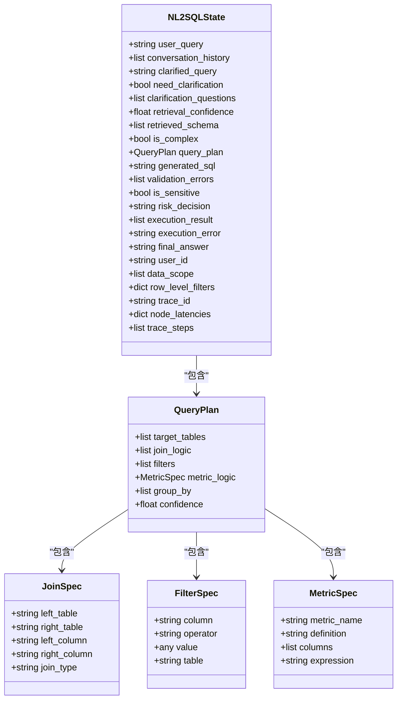
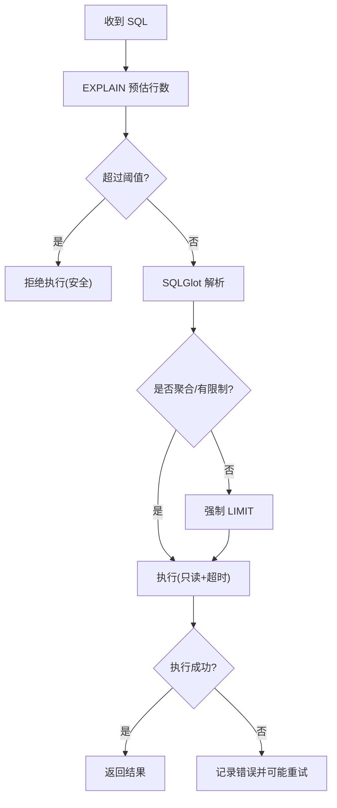
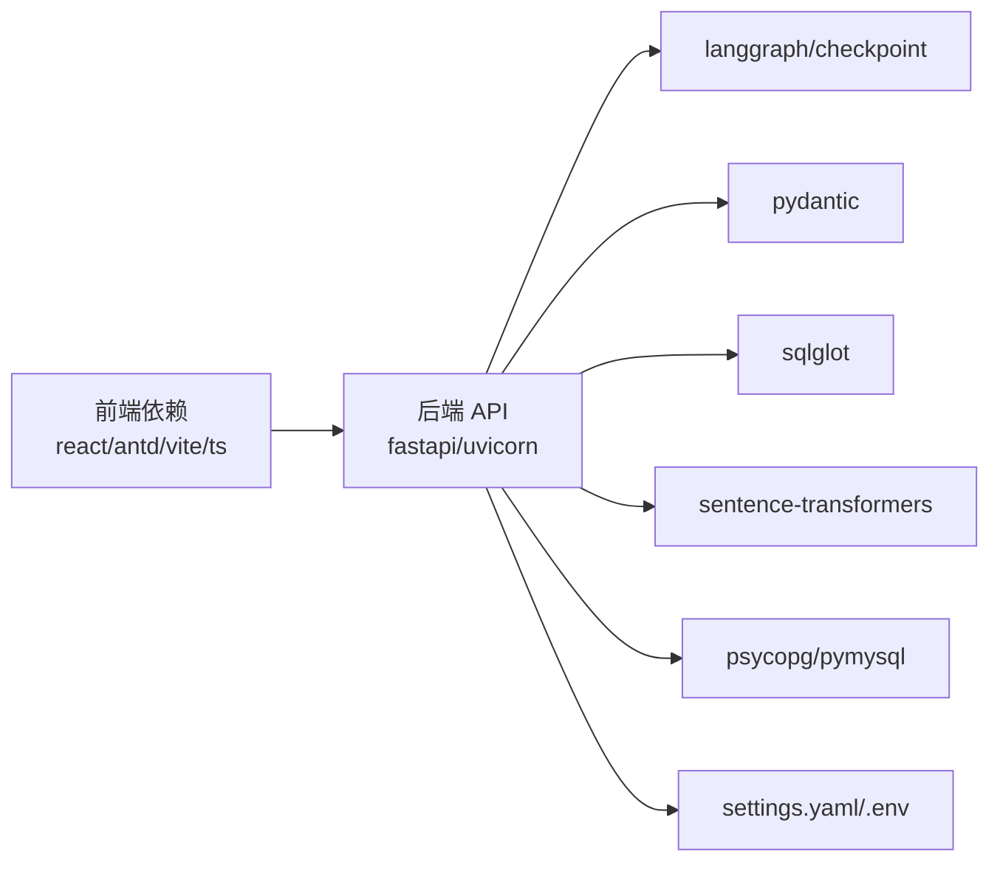

# 技术架构概览

<cite>
**本文引用的文件**   
- [nl2sql_agent/main.py](file://nl2sql_agent/main.py)
- [nl2sql_agent/api.py](file://nl2sql_agent/api.py)
- [nl2sql_agent/graph.py](file://nl2sql_agent/graph.py)
- [nl2sql_agent/state.py](file://nl2sql_agent/state.py)
- [nl2sql_agent/services/deps.py](file://nl2sql_agent/services/deps.py)
- [nl2sql_agent/services/executor.py](file://nl2sql_agent/services/executor.py)
- [nl2sql_agent/nodes/m1_entry.py](file://nl2sql_agent/nodes/m1_entry.py)
- [nl2sql_agent/nodes/m7_sql_generation.py](file://nl2sql_agent/nodes/m7_sql_generation.py)
- [nl2sql_agent/nodes/m10_sandbox_execution.py](file://nl2sql_agent/nodes/m10_sandbox_execution.py)
- [web/src/App.tsx](file://web/src/App.tsx)
- [web/src/api.ts](file://web/src/api.ts)
- [web/src/types.ts](file://web/src/types.ts)
- [pyproject.toml](file://pyproject.toml)
- [requirements.txt](file://requirements.txt)
- [nl2sql_agent/config/settings.yaml](file://nl2sql_agent/config/settings.yaml)
</cite>

## 目录
1. [简介](#简介)
2. [项目结构](#项目结构)
3. [核心组件](#核心组件)
4. [架构总览](#架构总览)
5. [详细组件分析](#详细组件分析)
6. [依赖关系分析](#依赖关系分析)
7. [性能考量](#性能考量)
8. [故障排查指南](#故障排查指南)
9. [结论](#结论)
10. [附录](#附录)

## 简介
本技术架构概览面向 NL2SQL 项目，系统阐述基于 Python FastAPI + LangGraph 的后端工作流编排、React + TypeScript + Ant Design 的前端交互界面，以及 MySQL/PostgreSQL 与 pgvector 向量存储的支撑能力。重点说明关键依赖库的作用：LangGraph（工作流编排）、Pydantic（数据验证）、SQLGlot（SQL 解析）、sentence-transformers（文本向量化），并解释前后端分离设计、WebSocket 实时通信机制与微服务倾向的模块化组织方式。

## 项目结构
后端以 nl2sql_agent 包为核心，包含 API 层、LangGraph 图编排、状态定义、节点实现与服务层；前端位于 web 目录，采用 Vite + React + TypeScript + Ant Design。配置集中于 nl2sql_agent/config，数据库与执行器通过 settings.yaml 与环境变量装配。

图表来源 
- [nl2sql_agent/main.py:1-152](file://nl2sql_agent/main.py#L1-L152)
- [nl2sql_agent/api.py:1-573](file://nl2sql_agent/api.py#L1-L573)
- [nl2sql_agent/graph.py:1-313](file://nl2sql_agent/graph.py#L1-L313)
- [nl2sql_agent/state.py:1-146](file://nl2sql_agent/state.py#L1-L146)
- [nl2sql_agent/services/deps.py:1-181](file://nl2sql_agent/services/deps.py#L1-L181)
- [nl2sql_agent/services/executor.py:1-205](file://nl2sql_agent/services/executor.py#L1-L205)
- [web/src/App.tsx:1-58](file://web/src/App.tsx#L1-L58)
- [web/src/api.ts:1-50](file://web/src/api.ts#L1-L50)
- [web/src/types.ts:1-72](file://web/src/types.ts#L1-L72)
- [nl2sql_agent/config/settings.yaml:1-30](file://nl2sql_agent/config/settings.yaml#L1-L30)
- [pyproject.toml:1-44](file://pyproject.toml#L1-L44)

章节来源
- [nl2sql_agent/main.py:1-152](file://nl2sql_agent/main.py#L1-L152)
- [nl2sql_agent/api.py:1-573](file://nl2sql_agent/api.py#L1-L573)
- [nl2sql_agent/graph.py:1-313](file://nl2sql_agent/graph.py#L1-L313)
- [nl2sql_agent/state.py:1-146](file://nl2sql_agent/state.py#L1-L146)
- [nl2sql_agent/services/deps.py:1-181](file://nl2sql_agent/services/deps.py#L1-L181)
- [nl2sql_agent/services/executor.py:1-205](file://nl2sql_agent/services/executor.py#L1-L205)
- [web/src/App.tsx:1-58](file://web/src/App.tsx#L1-L58)
- [web/src/api.ts:1-50](file://web/src/api.ts#L1-L50)
- [web/src/types.ts:1-72](file://web/src/types.ts#L1-L72)
- [nl2sql_agent/config/settings.yaml:1-30](file://nl2sql_agent/config/settings.yaml#L1-L30)
- [pyproject.toml:1-44](file://pyproject.toml#L1-L44)

## 核心组件
- 后端服务与路由
  - FastAPI 应用启动、CORS 配置、REST 接口（/query、/approve、/thread）与 WebSocket（/api/ws/query）。
  - 事件桥接：同步线程执行 LangGraph，通过 EventStream 将 node_start/complete/retry/interrupt/final/error 等事件推送至前端。
- 工作流编排（LangGraph）
  - 11 个模块节点：入口、时间范围澄清、Schema 检索、候选/低置信澄清、复杂度判断、计划生成与校验、SQL 生成、静态校验、敏感判定、人工确认、沙箱执行、结果解释。
  - 两条重试回路：计划校验失败回退至计划生成；执行报错回退至 SQL 生成。
- 状态与数据模型（Pydantic）
  - NL2SQLState 统一承载用户问题、权限、检索结果、查询计划、SQL、校验与执行结果、审计追踪等字段。
- 依赖装配与外部服务
  - Deps 装配 LLM、SQL 专用模型、TermMapping、SchemaCatalog、VectorStore、Executor、FewShot、SqlDialect。
  - 支持 MySQL/PostgreSQL 执行器，pgvector 或内存向量存储。
- 前端（React + TS + Ant Design）
  - App 页面导航、QueryPage 等子页面；WebSocket 提交查询并接收事件流；类型定义与后端对齐。

章节来源
- [nl2sql_agent/main.py:1-152](file://nl2sql_agent/main.py#L1-L152)
- [nl2sql_agent/api.py:1-573](file://nl2sql_agent/api.py#L1-L573)
- [nl2sql_agent/graph.py:1-313](file://nl2sql_agent/graph.py#L1-L313)
- [nl2sql_agent/state.py:1-146](file://nl2sql_agent/state.py#L1-L146)
- [nl2sql_agent/services/deps.py:1-181](file://nl2sql_agent/services/deps.py#L1-L181)
- [web/src/App.tsx:1-58](file://web/src/App.tsx#L1-L58)
- [web/src/api.ts:1-50](file://web/src/api.ts#L1-L50)
- [web/src/types.ts:1-72](file://web/src/types.ts#L1-L72)

## 架构总览
整体采用前后端分离：前端通过 REST 与 WebSocket 与后端交互；后端以 FastAPI 暴露接口，内部由 LangGraph 驱动多阶段工作流，结合 LLM、向量检索、SQL 解析与执行器完成“自然语言 → SQL → 执行 → 解释”的全链路。

图表来源 
- [nl2sql_agent/main.py:1-152](file://nl2sql_agent/main.py#L1-L152)
- [nl2sql_agent/api.py:1-573](file://nl2sql_agent/api.py#L1-L573)
- [nl2sql_agent/graph.py:1-313](file://nl2sql_agent/graph.py#L1-L313)
- [nl2sql_agent/services/deps.py:1-181](file://nl2sql_agent/services/deps.py#L1-L181)
- [nl2sql_agent/services/executor.py:1-205](file://nl2sql_agent/services/executor.py#L1-L205)
- [nl2sql_agent/config/settings.yaml:1-30](file://nl2sql_agent/config/settings.yaml#L1-L30)

## 详细组件分析

### 工作流编排（LangGraph）
- 节点与路由
  - 入口节点校验 user_id/data_scope，注入 trace_id。
  - 时间范围澄清：缺失则结束；否则进入 Schema 检索。
  - Schema 检索后根据置信度路由到候选澄清/低置信澄清或直接复杂度判断。
  - 复杂查询走计划生成→计划校验→SQL 生成；简单查询直接 SQL 生成。
  - SQL 生成→静态校验→敏感判定→人工确认→沙箱执行→结果解释。
  - 计划校验失败仅在计划生成内重试；执行报错仅退回 SQL 生成重试。
- 事件与追踪
  - 每个节点被 _traced 包装，记录延迟与步骤，并通过 event_sink 推送事件。
  - 中断点：human_review、clarify_candidates、clarify_low_confidence。

图表来源 
- [nl2sql_agent/graph.py:1-313](file://nl2sql_agent/graph.py#L1-L313)
- [nl2sql_agent/nodes/m1_entry.py:1-28](file://nl2sql_agent/nodes/m1_entry.py#L1-L28)
- [nl2sql_agent/nodes/m7_sql_generation.py:1-113](file://nl2sql_agent/nodes/m7_sql_generation.py#L1-L113)
- [nl2sql_agent/nodes/m10_sandbox_execution.py:1-65](file://nl2sql_agent/nodes/m10_sandbox_execution.py#L1-L65)

章节来源
- [nl2sql_agent/graph.py:1-313](file://nl2sql_agent/graph.py#L1-L313)
- [nl2sql_agent/nodes/m1_entry.py:1-28](file://nl2sql_agent/nodes/m1_entry.py#L1-L28)
- [nl2sql_agent/nodes/m7_sql_generation.py:1-113](file://nl2sql_agent/nodes/m7_sql_generation.py#L1-L113)
- [nl2sql_agent/nodes/m10_sandbox_execution.py:1-65](file://nl2sql_agent/nodes/m10_sandbox_execution.py#L1-L65)

### 实时通信（WebSocket）
- 前端建立 ws:// 连接，发送 user_query/user_id/data_scope 等输入。
- 后端在独立线程中执行图，EventStream 将 node_start/node_complete/retry/interrupt/final/error/done 等事件推送到前端。
- 断线重连：携带 trace_id 恢复当前状态（pending_review/done/blocked/error）。

图表来源 
- [nl2sql_agent/api.py:1-573](file://nl2sql_agent/api.py#L1-L573)
- [nl2sql_agent/graph.py:1-313](file://nl2sql_agent/graph.py#L1-L313)
- [web/src/api.ts:1-50](file://web/src/api.ts#L1-L50)

章节来源
- [nl2sql_agent/api.py:1-573](file://nl2sql_agent/api.py#L1-L573)
- [web/src/api.ts:1-50](file://web/src/api.ts#L1-L50)

### 数据模型与验证（Pydantic）
- NL2SQLState 集中定义查询生命周期中的全部状态字段，包括权限、检索、计划、SQL、校验、执行与审计追踪。
- 子模型如 SchemaHit、JoinSpec、FilterSpec、MetricSpec、QueryPlan 提供严格类型约束与规范化逻辑。

图表来源 
- [nl2sql_agent/state.py:1-146](file://nl2sql_agent/state.py#L1-L146)

章节来源
- [nl2sql_agent/state.py:1-146](file://nl2sql_agent/state.py#L1-L146)

### 执行器与安全（SQLGlot + Executor）
- SQLGlot 用于解析 SQL、检测聚合/限制、强制 LIMIT、方言适配。
- PostgresExecutor/MySQLExecutor 保证只读事务、超时控制与 EXPLAIN 预估行数阈值拦截。
- InMemoryExecutor 用于测试/演示，可模拟失败与空结果。

图表来源 
- [nl2sql_agent/services/executor.py:1-205](file://nl2sql_agent/services/executor.py#L1-L205)
- [nl2sql_agent/nodes/m10_sandbox_execution.py:1-65](file://nl2sql_agent/nodes/m10_sandbox_execution.py#L1-L65)

章节来源
- [nl2sql_agent/services/executor.py:1-205](file://nl2sql_agent/services/executor.py#L1-L205)
- [nl2sql_agent/nodes/m10_sandbox_execution.py:1-65](file://nl2sql_agent/nodes/m10_sandbox_execution.py#L1-L65)

### 前端交互（React + TS + Ant Design）
- App.tsx 提供页面导航（数据问答、审批队列、表与注释、历史与审计、配置管理）。
- api.ts 封装 fetch 请求与 WebSocket 提交，统一 onEvent 回调处理事件流。
- types.ts 定义 PipelineEvent、QueryRecord 等类型，与后端 state 和 API 对齐。

章节来源
- [web/src/App.tsx:1-58](file://web/src/App.tsx#L1-L58)
- [web/src/api.ts:1-50](file://web/src/api.ts#L1-L50)
- [web/src/types.ts:1-72](file://web/src/types.ts#L1-L72)

## 依赖关系分析
- 后端依赖
  - langgraph/langgraph-checkpoint：工作流与检查点持久化（SQLite）。
  - pydantic：强类型状态与请求体校验。
  - sqlglot：SQL 解析与改写。
  - sentence-transformers：文本向量化（配合向量存储）。
  - fastapi/uvicorn：HTTP/WebSocket 服务。
  - psycopg/pymysql：数据库连接。
- 前端依赖
  - react/react-dom：UI 框架。
  - antd/@ant-design/icons：组件与图标。
  - vite/typescript：构建与类型检查。

图表来源 
- [pyproject.toml:1-44](file://pyproject.toml#L1-L44)
- [requirements.txt:1-15](file://requirements.txt#L1-L15)
- [nl2sql_agent/config/settings.yaml:1-30](file://nl2sql_agent/config/settings.yaml#L1-L30)

章节来源
- [pyproject.toml:1-44](file://pyproject.toml#L1-L44)
- [requirements.txt:1-15](file://requirements.txt#L1-L15)
- [nl2sql_agent/config/settings.yaml:1-30](file://nl2sql_agent/config/settings.yaml#L1-L30)

## 性能考量
- 工作流层面
  - 节点级延迟统计与步骤追踪，便于定位瓶颈。
  - 计划校验与执行重试上限避免死循环。
- 执行层面
  - EXPLAIN 预估行数阈值拦截大扫描风险。
  - 未聚合查询强制 LIMIT，防止全表扫描。
  - 只读事务与语句级超时保障稳定性。
- 向量检索
  - 按配置选择 pgvector 或内存实现，减少不必要的嵌入开销。
- 前端体验
  - WebSocket 事件流即时反馈，断线重连恢复状态。

[本节为通用指导，不直接分析具体文件]

## 故障排查指南
- 常见问题定位
  - 查看 trace_id 与 trace_steps，确认卡在哪个节点。
  - 若处于 pending_review，使用 /api/query/{trace_id}/approve 或 /resume 恢复流程。
  - 执行报错时关注 execution_error 与 retry_count，必要时调整 max_retries 或 SQL。
- 日志与事件
  - 前端 onEvent 打印 node_start/node_complete/retry/interrupt/final/error。
  - 后端异常会被捕获并写入 error 事件与持久化记录。
- 配置与环境
  - 检查 DATABASE_URL/PGVECTOR_URL 与 dialect 设置。
  - 确认 vector_store.yaml 的 backend 与 embedding 配置。

章节来源
- [nl2sql_agent/api.py:1-573](file://nl2sql_agent/api.py#L1-L573)
- [nl2sql_agent/graph.py:1-313](file://nl2sql_agent/graph.py#L1-L313)
- [nl2sql_agent/config/settings.yaml:1-30](file://nl2sql_agent/config/settings.yaml#L1-L30)

## 结论
NL2SQL 项目通过 FastAPI + LangGraph 构建了高可控、可观测、可扩展的自然语言转 SQL 工作流，结合 Pydantic 强类型、SQLGlot 安全解析与句向量检索，实现了从意图澄清、Schema 检索、计划生成、SQL 生成、静态校验、敏感判定、人工确认到沙箱执行的完整闭环。前后端分离与 WebSocket 实时通信提升了用户体验，微服务倾向的模块化设计便于后续扩展与维护。

[本节为总结性内容，不直接分析具体文件]

## 附录
- 关键依赖作用速览
  - LangGraph：工作流编排与检查点持久化。
  - Pydantic：数据模型与请求体校验。
  - SQLGlot：SQL 解析、改写与方言适配。
  - sentence-transformers：文本向量化，支撑语义检索。
- 运行要点
  - 启动后端：uvicorn nl2sql_agent.main:app。
  - 前端开发：vite dev。
  - 环境变量：ANTHROPIC_API_KEY/ANTHROPIC_MODEL/DATABASE_URL 等。

[本节为补充信息，不直接分析具体文件]