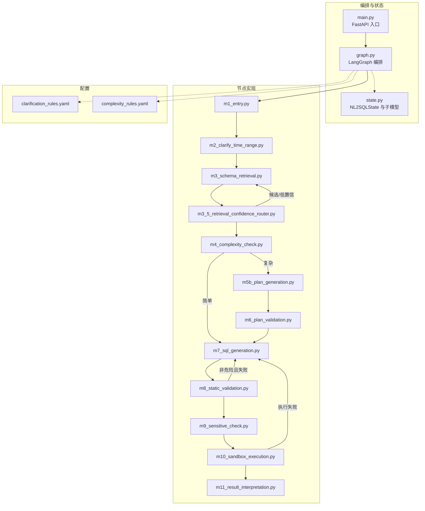
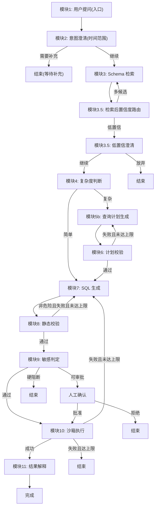
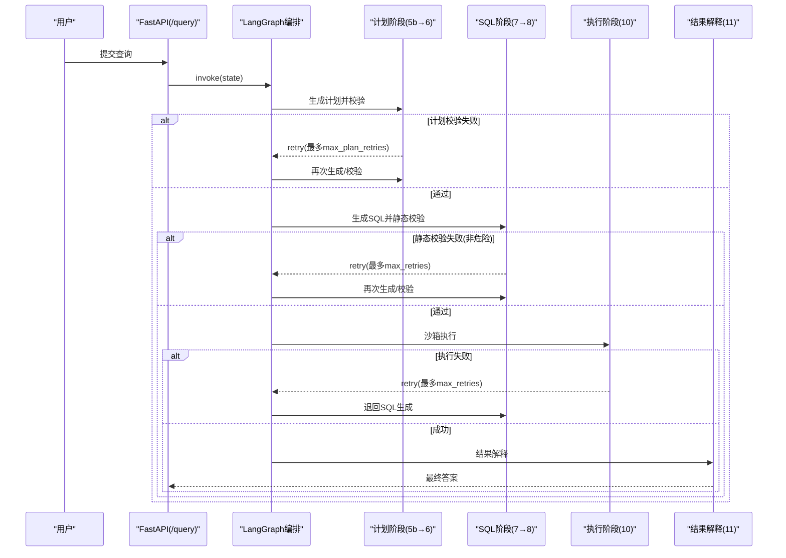
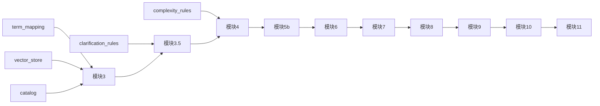

# 核心功能特性

<cite>
**本文引用的文件**   
- [graph.py](file://nl2sql_agent/graph.py)
- [state.py](file://nl2sql_agent/state.py)
- [main.py](file://nl2sql_agent/main.py)
- [NL2SQL.md](file://NL2SQL.md)
- [m1_entry.py](file://nl2sql_agent/nodes/m1_entry.py)
- [m2_clarify_time_range.py](file://nl2sql_agent/nodes/m2_clarify_time_range.py)
- [m3_schema_retrieval.py](file://nl2sql_agent/nodes/m3_schema_retrieval.py)
- [m3_5_retrieval_confidence_router.py](file://nl2sql_agent/nodes/m3_5_retrieval_confidence_router.py)
- [m4_complexity_check.py](file://nl2sql_agent/nodes/m4_complexity_check.py)
- [m5b_plan_generation.py](file://nl2sql_agent/nodes/m5b_plan_generation.py)
- [m6_plan_validation.py](file://nl2sql_agent/nodes/m6_plan_validation.py)
- [m7_sql_generation.py](file://nl2sql_agent/nodes/m7_sql_generation.py)
- [m8_static_validation.py](file://nl2sql_agent/nodes/m8_static_validation.py)
- [m9_sensitive_check.py](file://nl2sql_agent/nodes/m9_sensitive_check.py)
- [m10_sandbox_execution.py](file://nl2sql_agent/nodes/m10_sandbox_execution.py)
- [m11_result_interpretation.py](file://nl2sql_agent/nodes/m11_result_interpretation.py)
- [clarification_rules.yaml](file://nl2sql_agent/config/clarification_rules.yaml)
- [complexity_rules.yaml](file://nl2sql_agent/config/complexity_rules.yaml)
</cite>

## 目录
1. [简介](#简介)
2. [项目结构](#项目结构)
3. [核心组件](#核心组件)
4. [架构总览](#架构总览)
5. [详细组件分析](#详细组件分析)
6. [依赖关系分析](#依赖关系分析)
7. [性能考量](#性能考量)
8. [故障排查指南](#故障排查指南)
9. [结论](#结论)
10. [附录](#附录)

## 简介
本文件面向 NL2SQL 项目的核心功能特性，围绕 11 个节点的完整工作流进行系统化说明。内容涵盖：用户提问入口、意图澄清、Schema 检索、复杂度判断、简单查询处理、查询计划生成、计划校验、SQL 生成、静态校验、敏感判定、沙箱执行、结果解释。重点阐述两条回路的边界设计：计划校验失败仅在计划阶段内部打转；执行报错只退回 SQL 生成阶段。同时给出节点职责、输入输出、处理逻辑与错误处理机制，并配以流程图与时序图帮助理解数据流转与协作关系。

## 项目结构
- 编排与状态
  - graph.py：LangGraph 编排，定义 11 个节点与路由、重试回路、中断点（人工确认/候选澄清）。
  - state.py：全局状态 NL2SQLState 与各子模型（SchemaHit、QueryPlan、JoinSpec、FilterSpec、MetricSpec），贯穿全链路的数据契约。
  - main.py：FastAPI 服务入口，提供 /query、/approve、/thread/{id} 接口，负责线程管理与状态快照返回。
- 节点实现
  - nodes/m1~m11：对应 11 个处理节点，每个节点以 make_*_node(deps) 工厂函数暴露。
- 配置
  - clarification_rules.yaml：时间范围澄清与检索置信度阈值等规则。
  - complexity_rules.yaml：复杂度判断的确定性规则。
- 业务文档
  - NL2SQL.md：对 11 个模块的职责与两条回路的边界做了高层说明。

**图表来源** 
- [graph.py:174-312](file://nl2sql_agent/graph.py#L174-L312)
- [state.py:83-146](file://nl2sql_agent/state.py#L83-L146)

**章节来源**
- [graph.py:1-313](file://nl2sql_agent/graph.py#L1-L313)
- [state.py:1-146](file://nl2sql_agent/state.py#L1-L146)
- [main.py:1-152](file://nl2sql_agent/main.py#L1-L152)
- [NL2SQL.md:28-66](file://NL2SQL.md#L28-L66)

## 核心组件
- 全局状态 NL2SQLState
  - 承载用户问题、历史对话、澄清信息、Schema 检索结果、复杂度标记、查询计划、SQL 与校验错误、敏感判定、执行结果与最终答案、权限与追踪字段。
  - 关键字段包括 user_query、retrieved_schema、is_complex、query_plan、generated_sql、validation_errors、risk_decision、execution_result、final_answer、user_id、data_scope、row_level_filters、trace_id 等。
- 查询计划 QueryPlan
  - 强类型结构：target_tables、join_logic、filters、metric_logic、group_by、confidence。
  - 仅表达 SELECT 类元素，危险操作在结构上不可表达，从类型层面保障安全。
- 编排器
  - 通过 LangGraph StateGraph 将 11 个节点串联，定义条件边与重试回路，并在关键节点设置中断（human_review、clarify_candidates、clarify_low_confidence）。

**章节来源**
- [state.py:14-82](file://nl2sql_agent/state.py#L14-L82)
- [state.py:83-146](file://nl2sql_agent/state.py#L83-L146)
- [graph.py:174-312](file://nl2sql_agent/graph.py#L174-L312)

## 架构总览
下图展示 11 个节点的整体流程与两条重试回路的边界。

**图表来源** 
- [graph.py:174-312](file://nl2sql_agent/graph.py#L174-L312)

**章节来源**
- [graph.py:1-313](file://nl2sql_agent/graph.py#L1-L313)
- [NL2SQL.md:28-66](file://NL2SQL.md#L28-L66)

## 详细组件分析

### 模块1：用户提问（入口）
- 职责
  - 接收原始自然语言问题，校验 user_id、data_scope 与 user_query 必填，规范化 query，注入 trace_id。
- 输入
  - state.user_query、state.user_id、state.data_scope、state.conversation_history、state.trace_id
- 输出
  - 规范化后的 user_query、trace_id
- 处理逻辑
  - 校验必填项，生成 trace_id，不做权限二次查询（上游已注入）。
- 错误处理
  - 缺失必填字段直接抛出异常，阻止后续流程。

**章节来源**
- [m1_entry.py:1-28](file://nl2sql_agent/nodes/m1_entry.py#L1-L28)

### 模块2：意图澄清（时间范围）
- 职责
  - 基于规则检测“有时间内涵但缺明确范围”的问题，必要时要求用户补充。
- 输入
  - clarified_query 或 user_query、conversation_history、clarification_rules
- 输出
  - need_clarification、clarification_questions、clarification_reason、final_answer
- 处理逻辑
  - 读取 time_range_missing 规则，结合历史上下文判断是否已有明确范围；按 sensitivity 阈值决定是否触发。
- 错误处理
  - 规则关闭或未达到敏感度则不拦截；命中时返回澄清问题。

**章节来源**
- [m2_clarify_time_range.py:1-62](file://nl2sql_agent/nodes/m2_clarify_time_range.py#L1-L62)
- [clarification_rules.yaml:1-26](file://nl2sql_agent/config/clarification_rules.yaml#L1-L26)

### 模块3：Schema 检索
- 职责
  - 混合检索：术语映射优先，向量召回兜底，关系向量与最短 FK 路径补充关联表；严格按 data_scope 过滤。
- 输入
  - user_query/clarified_query、data_scope、vector_store、term_mapping、catalog
- 输出
  - retrieved_schema、retrieval_confidence、retrieval_candidates、main_table_count
- 处理逻辑
  - 术语解析 → 向量融合（表级+字段级）→ 关系扩展 → 去重与排序 → 置信度与候选计算。
- 错误处理
  - 无术语命中时走纯向量路径；置信度低由模块 3.5 决定后续澄清。

**章节来源**
- [m3_schema_retrieval.py:1-331](file://nl2sql_agent/nodes/m3_schema_retrieval.py#L1-L331)

### 模块3.5：检索后置信度路由
- 职责
  - 根据检索结果分布决定是否需要候选澄清或低置信澄清，否则放行至复杂度判断。
- 输入
  - retrieval_confidence、retrieval_candidates
- 输出
  - 路由到 clarify_candidates / clarify_low_confidence / complexity_check
- 处理逻辑
  - 多候选相近 → 候选澄清；置信度低于阈值 → 低置信澄清；否则放行。
- 错误处理
  - 候选选择无效时重新澄清；低置信选择不继续则结束。

**章节来源**
- [m3_5_retrieval_confidence_router.py:1-127](file://nl2sql_agent/nodes/m3_5_retrieval_confidence_router.py#L1-L127)
- [clarification_rules.yaml:27-62](file://nl2sql_agent/config/clarification_rules.yaml#L27-L62)

### 模块4：复杂度判断
- 职责
  - 纯确定性规则路由：单表/无复合口径 → 简单路径；否则进入计划路径。
- 输入
  - main_table_count、term_mapping、complexity_rules
- 输出
  - is_complex、complex_reasons
- 处理逻辑
  - 表数量阈值、复合口径指标、多步聚合关键词任一命中即判复杂（保守策略）。
- 错误处理
  - 低置信度强制走计划路径。

**章节来源**
- [m4_complexity_check.py:1-53](file://nl2sql_agent/nodes/m4_complexity_check.py#L1-L53)
- [complexity_rules.yaml:1-17](file://nl2sql_agent/config/complexity_rules.yaml#L1-L17)

### 模块5b：查询计划生成
- 职责
  - 调用 LLM 输出结构化 QueryPlan（强类型 JSON），禁止写操作/DDL。
- 输入
  - retrieved_schema、term_mapping、user_query、plan_validation_errors（用于反馈）
- 输出
  - query_plan、清空 plan_validation_errors
- 处理逻辑
  - 构建提示词（含权限说明、术语口径、上次失败反馈），结构化解析并返回。
- 错误处理
  - 结构化解析失败记入 plan_validation_errors，交由计划校验判定重试。

**章节来源**
- [m5b_plan_generation.py:1-90](file://nl2sql_agent/nodes/m5b_plan_generation.py#L1-L90)

### 模块6：计划校验
- 职责
  - 交叉核对计划与检索到的 Schema 与术语口径，拦截业务逻辑错误。
- 输入
  - query_plan、retrieved_schema、term_mapping、data_scope
- 输出
  - plan_validation_errors、plan_retry_count、可能 final_answer
- 处理逻辑
  - 检查 target_tables、join 引用、字段归属、复合口径 definition 一致性。
- 错误处理
  - 失败则回退至模块5b重试；达到 max_plan_retries 则结束并提示人工介入。

**章节来源**
- [m6_plan_validation.py:1-127](file://nl2sql_agent/nodes/m6_plan_validation.py#L1-L127)

### 模块7：SQL 生成
- 职责
  - 机械翻译：有计划则按 QueryPlan 生成 SQL；无计划则基于 few-shot 与 schema 生成。
- 输入
  - query_plan/retrieved_schema/few_shot、data_scope、上次失败反馈
- 输出
  - generated_sql、used_tables、清空 validation_errors 与 execution_error
- 处理逻辑
  - 构建提示词（强调只读、禁止命名空间泄露、输出 used_tables），调用 SQL 专用模型。
- 错误处理
  - 每次重新生成清空上一轮校验错误，避免污染。

**章节来源**
- [m7_sql_generation.py:1-113](file://nl2sql_agent/nodes/m7_sql_generation.py#L1-L113)

### 模块8：静态校验
- 职责
  - 基于 sqlglot AST 校验语法/方言、危险操作、表字段一致性、行级权限注入。
- 输入
  - generated_sql、used_tables、retrieved_schema、dialect、row_level_filter
- 输出
  - validation_errors、blocked_reason（危险）、injected SQL（注入后）
- 处理逻辑
  - 解析 AST → 危险检测 → scope 值泄露检查 → 表/字段一致性 → 别名与字段幻觉 → 行级权限注入。
- 错误处理
  - 非危险错误带具体原因退回模块7重试；危险操作直接阻断并结束。

**章节来源**
- [m8_static_validation.py:1-153](file://nl2sql_agent/nodes/m8_static_validation.py#L1-L153)

### 模块9：敏感判定
- 职责
  - 基于规则判定风险三态：pass / approval_required / hard_block。
- 输入
  - generated_sql、retrieved_schema、sensitive_rules、low_confidence_flag
- 输出
  - risk_decision、is_sensitive、sensitive_reasons、blocked_reason（硬阻断）
- 处理逻辑
  - 敏感字段匹配、EXPLAIN 预估行数阈值、金额字段聚合/导出、低置信强制人工确认。
- 错误处理
  - 硬阻断直接结束；可审批进入人工确认；通过则继续执行。

**章节来源**
- [m9_sensitive_check.py:1-106](file://nl2sql_agent/nodes/m9_sensitive_check.py#L1-L106)

### 模块10：沙箱执行
- 职责
  - 只读账号执行、EXPLAIN 守门、未聚合强制 LIMIT、超时熔断。
- 输入
  - generated_sql、executor、config.explain_row_threshold、execution_limit、timeout
- 输出
  - execution_result 或 execution_error、retry_count
- 处理逻辑
  - EXPLAIN 预估过大则拒绝；未聚合加 LIMIT；执行带超时；失败携带错误文本。
- 错误处理
  - 失败退回模块7重试；打满次数降级为人工介入。

**章节来源**
- [m10_sandbox_execution.py:1-65](file://nl2sql_agent/nodes/m10_sandbox_execution.py#L1-L65)

### 模块11：结果解释
- 职责
  - 将结构化结果转为自然语言摘要，保留原始数据供核对；LLM 不可用时降级确定性摘要。
- 输入
  - execution_result、user_query
- 输出
  - final_answer
- 处理逻辑
  - 尝试 LLM 摘要；失败或空结果使用确定性模板。
- 错误处理
  - 兜底确定性摘要保证可用性。

**章节来源**
- [m11_result_interpretation.py:1-39](file://nl2sql_agent/nodes/m11_result_interpretation.py#L1-L39)

### 两条回路的边界设计（时序图）

**图表来源** 
- [graph.py:237-291](file://nl2sql_agent/graph.py#L237-L291)

**章节来源**
- [graph.py:174-312](file://nl2sql_agent/graph.py#L174-L312)

## 依赖关系分析
- 节点间耦合
  - 模块3依赖 term_mapping、vector_store、catalog；模块3.5依赖 clarification_rules；模块4依赖 term_mapping 与 complexity_rules。
  - 模块5b/6依赖 term_mapping 与 QueryPlan 类型；模块7依赖 few_shot 与 SQL 模型；模块8依赖 sqlglot/sql 服务；模块9依赖 executor.explain；模块10依赖 executor.execute。
- 外部依赖
  - vector_store（内存或 PG）、LLM（主模型/SQL 专用模型）、Executor（只读数据库连接）、sqlglot（AST 解析）。
- 循环依赖
  - 通过路由函数与状态字段实现“局部重试”，避免跨阶段大回退。

**图表来源** 
- [m3_schema_retrieval.py:1-331](file://nl2sql_agent/nodes/m3_schema_retrieval.py#L1-L331)
- [m3_5_retrieval_confidence_router.py:1-127](file://nl2sql_agent/nodes/m3_5_retrieval_confidence_router.py#L1-L127)
- [m4_complexity_check.py:1-53](file://nl2sql_agent/nodes/m4_complexity_check.py#L1-L53)
- [m5b_plan_generation.py:1-90](file://nl2sql_agent/nodes/m5b_plan_generation.py#L1-L90)
- [m6_plan_validation.py:1-127](file://nl2sql_agent/nodes/m6_plan_validation.py#L1-L127)
- [m7_sql_generation.py:1-113](file://nl2sql_agent/nodes/m7_sql_generation.py#L1-L113)
- [m8_static_validation.py:1-153](file://nl2sql_agent/nodes/m8_static_validation.py#L1-L153)
- [m9_sensitive_check.py:1-106](file://nl2sql_agent/nodes/m9_sensitive_check.py#L1-L106)
- [m10_sandbox_execution.py:1-65](file://nl2sql_agent/nodes/m10_sandbox_execution.py#L1-L65)
- [m11_result_interpretation.py:1-39](file://nl2sql_agent/nodes/m11_result_interpretation.py#L1-L39)

**章节来源**
- [graph.py:174-312](file://nl2sql_agent/graph.py#L174-L312)

## 性能考量
- 检索优化
  - 术语映射优先命中，减少向量开销；向量融合按权重自适应；关系扩展限制 top_n 与阈值。
- 计划与 SQL 生成
  - 简单查询跳过计划阶段降低延迟；结构化输出减少解析失败重试；few-shot 提升零样本质量。
- 执行保护
  - EXPLAIN 预估行数阈值、未聚合强制 LIMIT、超时熔断，避免慢查询与资源占用。
- 序列化与事件
  - 节点事件精简推送，execution_result 截断避免刷屏；trace_steps/node_latencies 便于定位瓶颈。

[本节为通用指导，无需特定文件引用]

## 故障排查指南
- 常见问题定位
  - 计划多次失败：检查术语映射与检索结果一致性、复合口径 definition 是否一致。
  - 静态校验失败：关注 used_tables 与 AST 表不一致、字段幻觉、危险操作拦截、scope 值泄露。
  - 执行失败：查看 EXPLAIN 预估行数、LIMIT 强制、超时与只读权限。
- 调试手段
  - 通过 /thread/{id} 获取当前状态快照；观察 trace_steps 与 node_latencies；查看各节点返回的错误列表。
- 人工介入
  - 计划/执行多次失败、敏感硬阻断、低置信澄清不继续时，需人工审核或调整规则。

**章节来源**
- [m6_plan_validation.py:100-127](file://nl2sql_agent/nodes/m6_plan_validation.py#L100-L127)
- [m8_static_validation.py:33-153](file://nl2sql_agent/nodes/m8_static_validation.py#L33-L153)
- [m10_sandbox_execution.py:31-65](file://nl2sql_agent/nodes/m10_sandbox_execution.py#L31-L65)
- [main.py:123-145](file://nl2sql_agent/main.py#L123-L145)

## 结论
本方案通过“计划与生成解耦、强类型计划、确定性校验与规则化敏感判定、受控的执行沙箱”构建了高可靠性的 NL2SQL 流水线。两条回路的边界设计确保错误就近消化，避免整链推倒重来。配合清晰的配置与状态契约，系统可在准确率、安全性与性能之间取得平衡，并为人工介入与持续优化留出空间。

[本节为总结性内容，无需特定文件引用]

## 附录
- 业务场景示例
  - 简单查询：单表过滤与聚合，直接走模块7生成 SQL，经静态校验通过后执行并解释。
  - 复杂查询：涉及多表 JOIN 与复合口径指标，走模块5b/6生成并校验计划，再翻译为 SQL。
  - 敏感查询：涉及金额汇总或敏感字段，进入人工确认；硬阻断直接结束。
- 使用模式
  - 首次调用 /query 发起查询；若被中断（候选澄清/低置信/人工确认），通过 /approve 恢复流程；随时通过 /thread/{id} 查看进度。

**章节来源**
- [NL2SQL.md:28-66](file://NL2SQL.md#L28-L66)
- [main.py:83-145](file://nl2sql_agent/main.py#L83-L145)