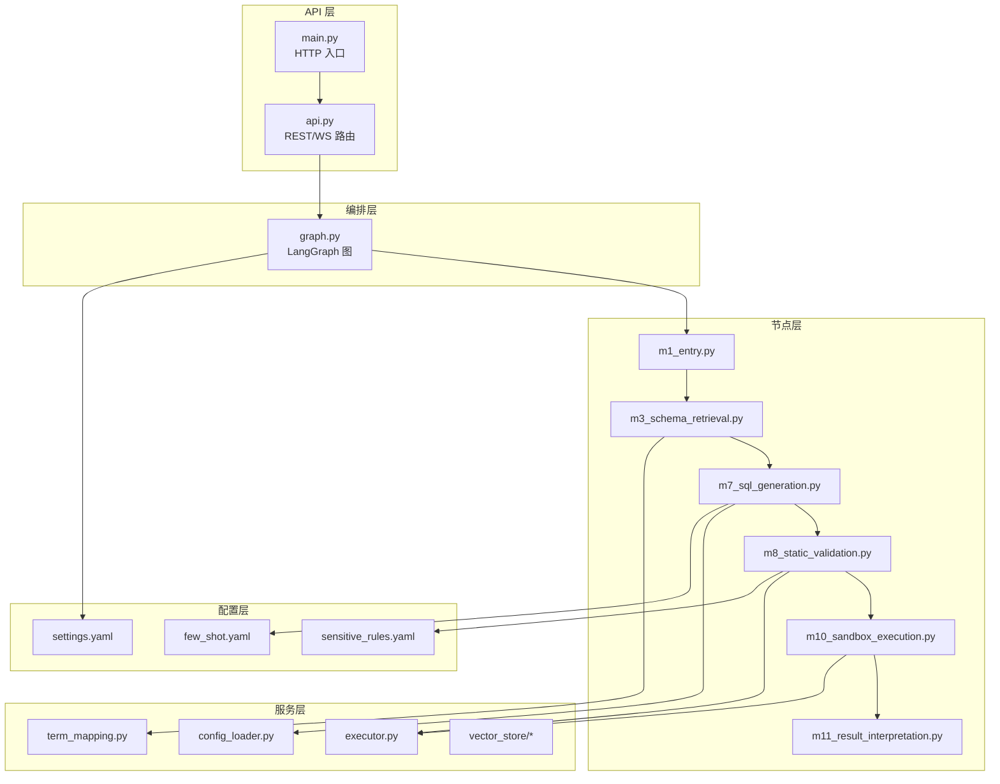
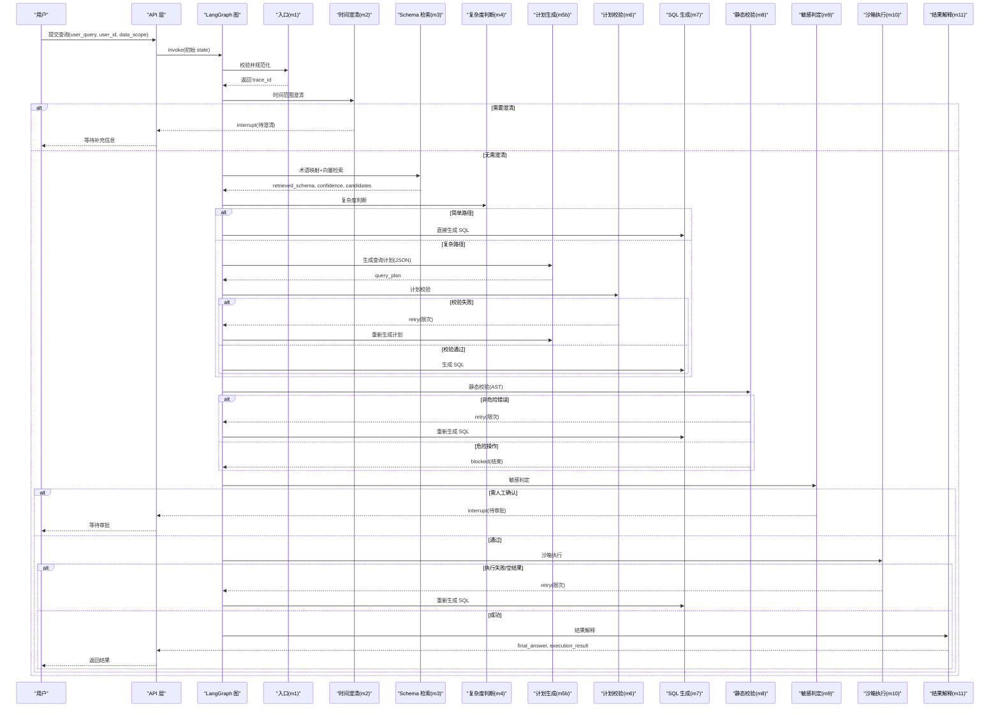
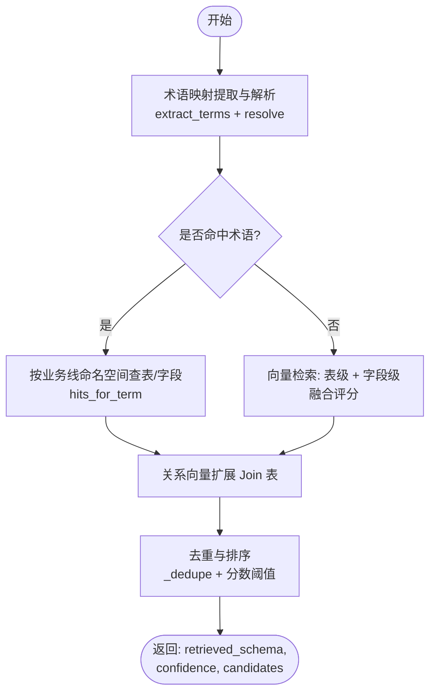
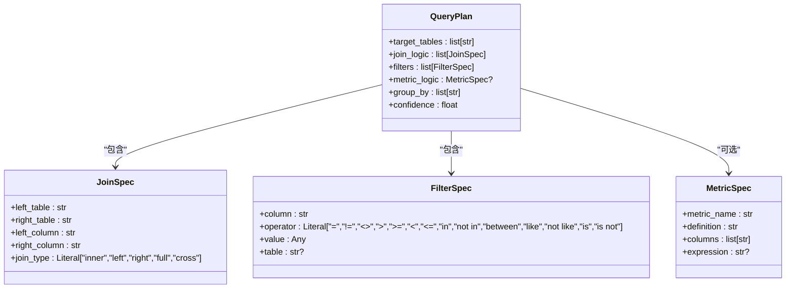
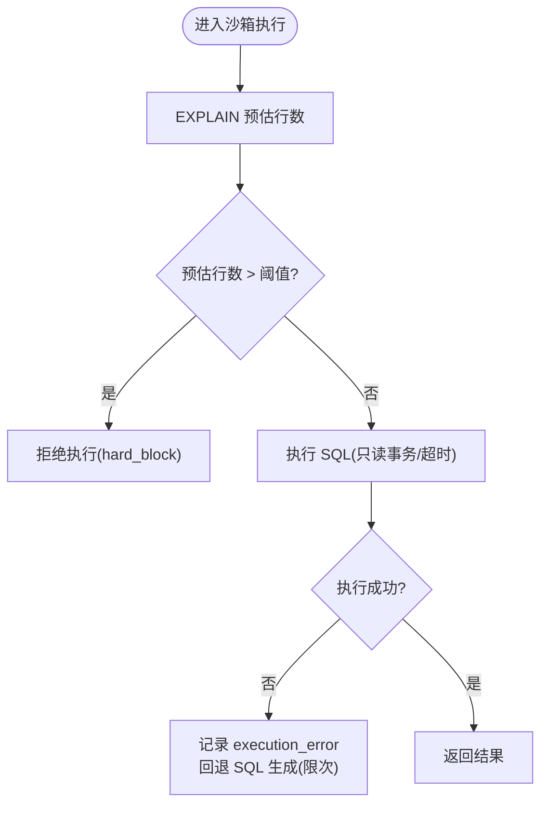
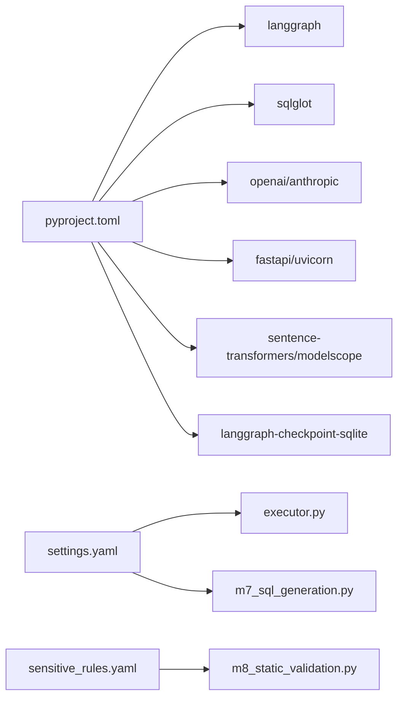

# 项目介绍与价值

<cite>
**本文引用的文件**   
- [NL2SQL.md](file://NL2SQL.md)
- [pyproject.toml](file://pyproject.toml)
- [nl2sql_agent/main.py](file://nl2sql_agent/main.py)
- [nl2sql_agent/api.py](file://nl2sql_agent/api.py)
- [nl2sql_agent/graph.py](file://nl2sql_agent/graph.py)
- [nl2sql_agent/state.py](file://nl2sql_agent/state.py)
- [nl2sql_agent/nodes/m1_entry.py](file://nl2sql_agent/nodes/m1_entry.py)
- [nl2sql_agent/nodes/m3_schema_retrieval.py](file://nl2sql_agent/nodes/m3_schema_retrieval.py)
- [nl2sql_agent/nodes/m7_sql_generation.py](file://nl2sql_agent/nodes/m7_sql_generation.py)
- [nl2sql_agent/nodes/m8_static_validation.py](file://nl2sql_agent/nodes/m8_static_validation.py)
- [nl2sql_agent/services/term_mapping.py](file://nl2sql_agent/services/term_mapping.py)
- [nl2sql_agent/services/executor.py](file://nl2sql_agent/services/executor.py)
- [nl2sql_agent/config/settings.yaml](file://nl2sql_agent/config/settings.yaml)
- [nl2sql_agent/config/few_shot.yaml](file://nl2sql_agent/config/few_shot.yaml)
- [nl2sql_agent/config/sensitive_rules.yaml](file://nl2sql_agent/config/sensitive_rules.yaml)
</cite>

## 目录
1. [引言](#引言)
2. [项目结构](#项目结构)
3. [核心组件](#核心组件)
4. [架构总览](#架构总览)
5. [关键组件详解](#关键组件详解)
6. [依赖关系分析](#依赖关系分析)
7. [性能与准确率保障](#性能与准确率保障)
8. [故障排查指南](#故障排查指南)
9. [结论](#结论)

## 引言
本项目的核心价值在于：让不懂 SQL 的业务用户通过自然语言即可获取数据洞察，同时确保生成 SQL 的高准确率与强安全控制。围绕“数据库 schema 处理方案、系统提示词优化、问数智能体的应用范围、准确率保证”等核心问题，项目采用基于 LangGraph 的 11 节点工作流编排，结合“术语映射表 + 向量相似度检索 + 计划校验 + 静态校验 + 沙箱执行”的多层机制，构建从意图澄清到结果解释的端到端链路。

- 目标受众：业务分析师、运营人员、产品与风控等非技术用户
- 适用场景：跨业务线的数据查询、指标口径统一、敏感数据审批、复杂多表关联分析
- 关键理念：以“可解释、可校验、可回退”的工作流替代“黑盒生成”，在每一步引入确定性规则与人工确认点，确保最终 SQL 准确且安全

**章节来源**
- [NL2SQL.md:1-76](file://NL2SQL.md#L1-L76)

## 项目结构
项目采用分层模块化设计：
- API 层：FastAPI 提供 REST 与 WebSocket 接口，支持流式事件推送、断线重连、历史与审计
- 图编排层：LangGraph StateGraph 定义 11 个节点与路由策略，形成两条重试回路（计划校验失败仅回退计划；执行报错仅回退 SQL 生成）
- 节点层：每个模块职责单一，如入口校验、时间范围澄清、Schema 检索、复杂度判断、计划生成与校验、SQL 生成、静态校验、敏感判定、沙箱执行、结果解释
- 服务层：术语映射、向量检索、执行器、配置加载、Few-shot 存储、SQL 方言适配等
- 配置层：运行参数、敏感规则、复杂度规则、少样本示例等全部外置 YAML

**图表来源**
- [nl2sql_agent/main.py:1-152](file://nl2sql_agent/main.py#L1-L152)
- [nl2sql_agent/api.py:1-573](file://nl2sql_agent/api.py#L1-L573)
- [nl2sql_agent/graph.py:1-313](file://nl2sql_agent/graph.py#L1-L313)
- [nl2sql_agent/nodes/m1_entry.py:1-28](file://nl2sql_agent/nodes/m1_entry.py#L1-L28)
- [nl2sql_agent/nodes/m3_schema_retrieval.py:1-249](file://nl2sql_agent/nodes/m3_schema_retrieval.py#L1-L249)
- [nl2sql_agent/nodes/m7_sql_generation.py:1-113](file://nl2sql_agent/nodes/m7_sql_generation.py#L1-L113)
- [nl2sql_agent/nodes/m8_static_validation.py:1-153](file://nl2sql_agent/nodes/m8_static_validation.py#L1-L153)
- [nl2sql_agent/services/executor.py:1-205](file://nl2sql_agent/services/executor.py#L1-L205)
- [nl2sql_agent/config/settings.yaml:1-30](file://nl2sql_agent/config/settings.yaml#L1-L30)
- [nl2sql_agent/config/few_shot.yaml:1-32](file://nl2sql_agent/config/few_shot.yaml#L1-L32)
- [nl2sql_agent/config/sensitive_rules.yaml:1-24](file://nl2sql_agent/config/sensitive_rules.yaml#L1-L24)

**章节来源**
- [pyproject.toml:1-44](file://pyproject.toml#L1-L44)

## 核心组件
- 状态模型 NL2SQLState：集中承载各节点输入输出，包括用户提问、澄清信息、检索结果、计划、SQL、校验错误、敏感判定、执行结果、权限信息等
- 图编排 graph.py：定义 11 个节点与路由函数，严格限定两条重试回路边界，避免错误扩散
- 术语映射 term_mapping.py：按业务线命名空间加载映射，支持热更新与别名匹配，解决“业务词→字段”的歧义与冲突
- 向量检索与 Schema 检索：混合检索（术语精确命中 + 表级/字段级向量召回 + 关系扩展），产出置信度与候选集
- SQL 生成与静态校验：机械翻译 + AST 校验，防字段幻觉、危险操作拦截、行级权限注入
- 沙箱执行：只读事务、超时熔断、EXPLAIN 预估行数拒绝、执行报错回退
- 结果解释：结构化结果转自然语言摘要或表格展示

**章节来源**
- [nl2sql_agent/state.py:1-146](file://nl2sql_agent/state.py#L1-L146)
- [nl2sql_agent/graph.py:1-313](file://nl2sql_agent/graph.py#L1-L313)
- [nl2sql_agent/services/term_mapping.py:1-144](file://nl2sql_agent/services/term_mapping.py#L1-L144)
- [nl2sql_agent/nodes/m3_schema_retrieval.py:1-249](file://nl2sql_agent/nodes/m3_schema_retrieval.py#L1-L249)
- [nl2sql_agent/nodes/m7_sql_generation.py:1-113](file://nl2sql_agent/nodes/m7_sql_generation.py#L1-L113)
- [nl2sql_agent/nodes/m8_static_validation.py:1-153](file://nl2sql_agent/nodes/m8_static_validation.py#L1-L153)
- [nl2sql_agent/services/executor.py:1-205](file://nl2sql_agent/services/executor.py#L1-L205)

## 架构总览
下图展示了从用户提问到结果解释的完整流程，以及两条关键的回退路径：计划校验失败仅在计划阶段内部重试；执行报错仅退回 SQL 生成阶段。

**图表来源**
- [nl2sql_agent/graph.py:1-313](file://nl2sql_agent/graph.py#L1-L313)
- [nl2sql_agent/api.py:1-573](file://nl2sql_agent/api.py#L1-L573)
- [nl2sql_agent/nodes/m1_entry.py:1-28](file://nl2sql_agent/nodes/m1_entry.py#L1-L28)
- [nl2sql_agent/nodes/m3_schema_retrieval.py:1-249](file://nl2sql_agent/nodes/m3_schema_retrieval.py#L1-L249)
- [nl2sql_agent/nodes/m7_sql_generation.py:1-113](file://nl2sql_agent/nodes/m7_sql_generation.py#L1-L113)
- [nl2sql_agent/nodes/m8_static_validation.py:1-153](file://nl2sql_agent/nodes/m8_static_validation.py#L1-L153)
- [nl2sql_agent/services/executor.py:1-205](file://nl2sql_agent/services/executor.py#L1-L205)

## 关键组件详解

### 术语映射与 Schema 检索
- 术语映射服务按业务线命名空间加载映射，支持别名匹配与热更新，解决同名指标在不同业务线的歧义
- Schema 检索采用三层策略：术语精确命中 → 表级/字段级向量召回融合评分 → 关系向量扩展 Join 表
- 产出包含 retrieved_schema、retrieval_confidence、retrieval_candidates，供后续复杂度判断与澄清路由使用

**图表来源**
- [nl2sql_agent/services/term_mapping.py:1-144](file://nl2sql_agent/services/term_mapping.py#L1-L144)
- [nl2sql_agent/nodes/m3_schema_retrieval.py:1-249](file://nl2sql_agent/nodes/m3_schema_retrieval.py#L1-L249)

**章节来源**
- [nl2sql_agent/services/term_mapping.py:1-144](file://nl2sql_agent/services/term_mapping.py#L1-L144)
- [nl2sql_agent/nodes/m3_schema_retrieval.py:1-249](file://nl2sql_agent/nodes/m3_schema_retrieval.py#L1-L249)

### SQL 生成与静态校验
- SQL 生成节点根据是否有查询计划分别构建 prompt，要求模型输出 used_tables 以便后续交叉比对
- 静态校验基于 sqlglot AST 检查语法与方言合法性、危险操作拦截、表/字段一致性、字段幻觉检测
- 行级权限由代码逻辑注入，禁止将 data_scope 误用为表字段值

**图表来源**
- [nl2sql_agent/state.py:1-146](file://nl2sql_agent/state.py#L1-L146)

**章节来源**
- [nl2sql_agent/nodes/m7_sql_generation.py:1-113](file://nl2sql_agent/nodes/m7_sql_generation.py#L1-L113)
- [nl2sql_agent/nodes/m8_static_validation.py:1-153](file://nl2sql_agent/nodes/m8_static_validation.py#L1-L153)
- [nl2sql_agent/state.py:1-146](file://nl2sql_agent/state.py#L1-L146)

### 沙箱执行与安全控制
- 执行器支持 Postgres/MySQL/内存三种模式，均保证只读事务与超时熔断
- EXPLAIN 预估行数超过阈值则拒绝执行，防止大扫描风险
- 执行报错或结果为空时回退至 SQL 生成节点，最多重试指定次数

**图表来源**
- [nl2sql_agent/services/executor.py:1-205](file://nl2sql_agent/services/executor.py#L1-L205)

**章节来源**
- [nl2sql_agent/services/executor.py:1-205](file://nl2sql_agent/services/executor.py#L1-L205)

## 依赖关系分析
- 外部依赖：langgraph、sqlglot、anthropic/openai、fastapi、uvicorn、sentence-transformers、modelscope、sqlite 检查点等
- 运行时依赖：数据库连接（PostgreSQL/MySQL）、向量存储（pgvector/内存）、LLM 服务
- 配置驱动：dialect、schema_search_top_k、execution 限制、row_level_filter、敏感规则、少样本示例等

**图表来源**
- [pyproject.toml:1-44](file://pyproject.toml#L1-L44)
- [nl2sql_agent/config/settings.yaml:1-30](file://nl2sql_agent/config/settings.yaml#L1-L30)
- [nl2sql_agent/config/sensitive_rules.yaml:1-24](file://nl2sql_agent/config/sensitive_rules.yaml#L1-L24)

**章节来源**
- [pyproject.toml:1-44](file://pyproject.toml#L1-L44)

## 性能与准确率保障
- 性能优化
  - 简单查询跳过计划阶段，减少延迟与 token 消耗
  - 向量检索按业务线过滤，降低召回噪声
  - 事件流式推送与断线重连，提升前端体验
- 准确率保障
  - 术语映射表维护优先于 prompt 调优，确保“业务词→字段”唯一映射
  - 计划校验强制强类型 JSON，避免自由文本导致的语义漂移
  - 静态校验基于 AST，拦截字段幻觉与危险操作
  - 执行前 EXPLAIN 预估行数拒绝，避免大扫描
  - Few-shot 示例库辅助简单路径生成，提高稳定性

**章节来源**
- [nl2sql_agent/graph.py:1-313](file://nl2sql_agent/graph.py#L1-L313)
- [nl2sql_agent/nodes/m3_schema_retrieval.py:1-249](file://nl2sql_agent/nodes/m3_schema_retrieval.py#L1-L249)
- [nl2sql_agent/nodes/m7_sql_generation.py:1-113](file://nl2sql_agent/nodes/m7_sql_generation.py#L1-L113)
- [nl2sql_agent/nodes/m8_static_validation.py:1-153](file://nl2sql_agent/nodes/m8_static_validation.py#L1-L153)
- [nl2sql_agent/services/executor.py:1-205](file://nl2sql_agent/services/executor.py#L1-L205)
- [nl2sql_agent/config/few_shot.yaml:1-32](file://nl2sql_agent/config/few_shot.yaml#L1-L32)

## 故障排查指南
- 常见问题定位
  - 澄清阶段：need_clarification 为真时，检查 time_range、指标口径、术语映射是否存在
  - 检索阶段：retrieval_confidence 低时，检查术语映射与向量索引是否覆盖相关表/字段
  - 计划阶段：plan_validation_errors 非空时，检查 QueryPlan 的 join/filters/metric_logic 是否符合 Schema
  - SQL 阶段：validation_errors 非空时，检查 used_tables 与 AST 引用是否一致，是否存在字段幻觉
  - 执行阶段：execution_error 非空时，查看 EXPLAIN 预估行数与超时设置
- 恢复与审批
  - 中断节点（human_review、clarify_candidates、clarify_low_confidence）可通过 /approve 或 /resume 恢复
  - 历史与审计接口支持按 trace_id 回溯状态与反馈

**章节来源**
- [nl2sql_agent/api.py:1-573](file://nl2sql_agent/api.py#L1-L573)
- [nl2sql_agent/graph.py:1-313](file://nl2sql_agent/graph.py#L1-L313)
- [nl2sql_agent/state.py:1-146](file://nl2sql_agent/state.py#L1-L146)

## 结论
本项目以“可解释、可校验、可回退”为核心设计理念，通过术语映射、向量检索、计划校验、静态校验与沙箱执行等多层机制，确保 NL2SQL 在高准确率与强安全控制下稳定运行。面向不懂 SQL 的用户，提供从自然语言到数据洞察的一体化能力，同时为运维与风控提供完善的审计与审批通道。建议持续完善术语映射与少样本示例库，结合反馈闭环进一步提升准确率与用户体验。