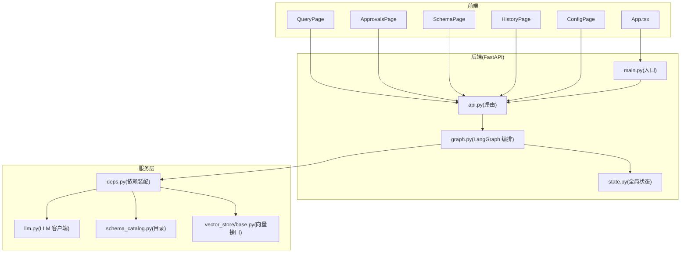
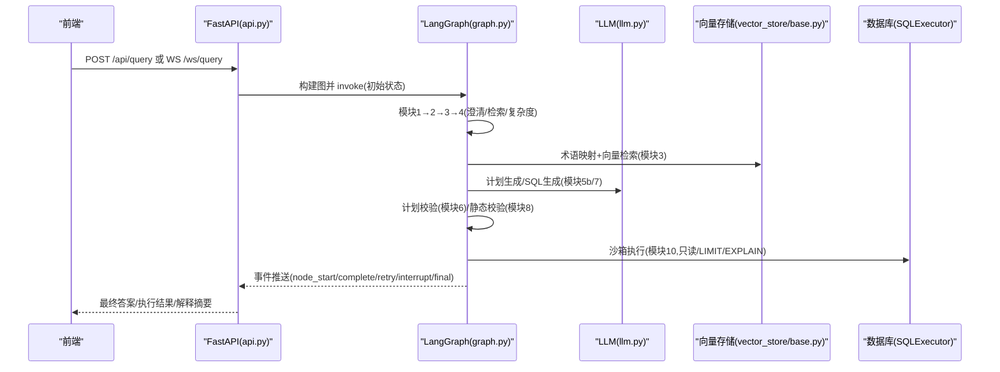
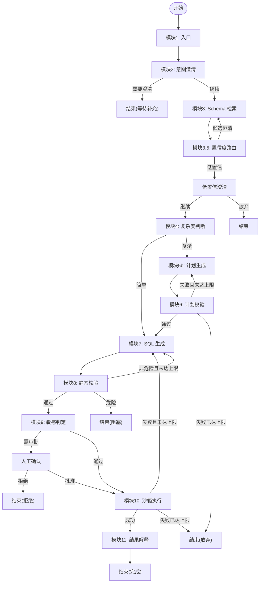
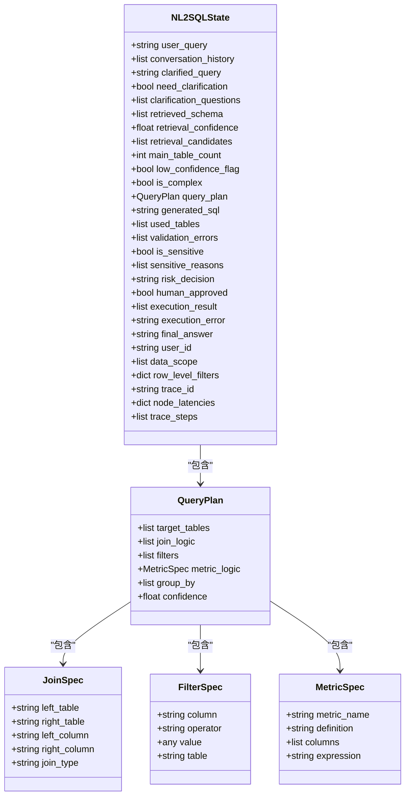
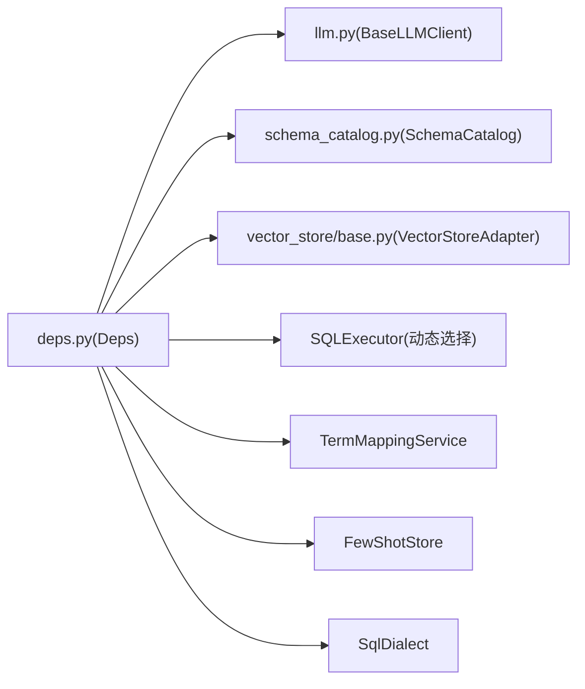
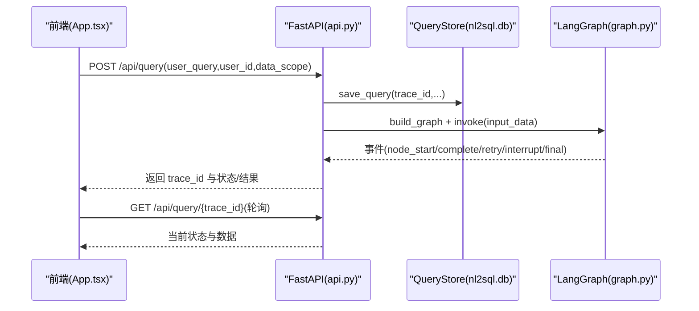
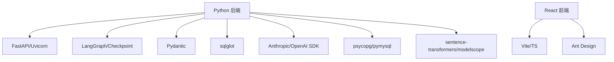

# 项目概述

<cite>
**本文引用的文件**   
- [NL2SQL.md](file://NL2SQL.md)
- [main.py](file://main.py)
- [nl2sql_agent/main.py](file://nl2sql_agent/main.py)
- [nl2sql_agent/graph.py](file://nl2sql_agent/graph.py)
- [nl2sql_agent/state.py](file://nl2sql_agent/state.py)
- [nl2sql_agent/api.py](file://nl2sql_agent/api.py)
- [nl2sql_agent/services/deps.py](file://nl2sql_agent/services/deps.py)
- [nl2sql_agent/services/llm.py](file://nl2sql_agent/services/llm.py)
- [nl2sql_agent/services/schema_catalog.py](file://nl2sql_agent/services/schema_catalog.py)
- [nl2sql_agent/services/vector_store/base.py](file://nl2sql_agent/services/vector_store/base.py)
- [nl2sql_agent/nodes/m1_entry.py](file://nl2sql_agent/nodes/m1_entry.py)
- [web/src/App.tsx](file://web/src/App.tsx)
- [web/package.json](file://web/package.json)
- [pyproject.toml](file://pyproject.toml)
</cite>

## 目录
1. [简介](#简介)
2. [项目结构](#项目结构)
3. [核心组件](#核心组件)
4. [架构总览](#架构总览)
5. [详细组件分析](#详细组件分析)
6. [依赖关系分析](#依赖关系分析)
7. [性能考量](#性能考量)
8. [故障排查指南](#故障排查指南)
9. [结论](#结论)
10. [附录：快速开始](#附录快速开始)

## 简介
本项目是一个基于自然语言到 SQL（NL2SQL）的智能体系统，目标是让非技术用户通过自然语言查询数据库，获得准确、安全、可解释的结果。系统以 LangGraph 编排的 11 节点工作流为核心，结合智能 Schema 检索、术语映射、复杂度路由、计划生成与校验、静态校验、敏感判定、沙箱执行与结果解释等关键能力，形成“理解—规划—生成—校验—执行—解释”的闭环流程。

核心价值与目标
- 降低数据获取门槛：无需掌握 SQL，用自然语言完成复杂查询与分析。
- 提升准确率与可控性：通过“计划+校验+重试”机制与严格的权限/敏感控制，减少幻觉与误操作风险。
- 多业务线与安全隔离：按 data_scope 过滤表范围，行级权限注入，敏感规则配置化。
- 可扩展与可观测：事件驱动、线程状态持久化、历史审计与反馈闭环预留。

## 项目结构
后端采用 Python FastAPI，前端为 React + TypeScript（Vite），核心工作流由 LangGraph 驱动，向量存储与数据库连接通过服务层抽象。

图表来源
- [web/src/App.tsx:1-58](file://web/src/App.tsx#L1-L58)
- [nl2sql_agent/main.py:1-152](file://nl2sql_agent/main.py#L1-L152)
- [nl2sql_agent/api.py:1-573](file://nl2sql_agent/api.py#L1-L573)
- [nl2sql_agent/graph.py:1-313](file://nl2sql_agent/graph.py#L1-L313)
- [nl2sql_agent/state.py:1-146](file://nl2sql_agent/state.py#L1-L146)
- [nl2sql_agent/services/deps.py:1-178](file://nl2sql_agent/services/deps.py#L1-L178)
- [nl2sql_agent/services/llm.py:1-328](file://nl2sql_agent/services/llm.py#L1-L328)
- [nl2sql_agent/services/schema_catalog.py:1-95](file://nl2sql_agent/services/schema_catalog.py#L1-L95)
- [nl2sql_agent/services/vector_store/base.py:1-21](file://nl2sql_agent/services/vector_store/base.py#L1-L21)

章节来源
- [NL2SQL.md:1-76](file://NL2SQL.md#L1-L76)
- [pyproject.toml:1-44](file://pyproject.toml#L1-L44)
- [web/package.json:1-26](file://web/package.json#L1-L26)

## 核心组件
- 工作流编排（LangGraph）：定义 11 个节点与路由策略，包含两条重试回路（计划校验失败回退至计划；执行失败回退至 SQL 生成）。
- 全局状态（Pydantic）：统一承载用户输入、检索结果、计划、SQL、校验信息、敏感判定、执行结果、追踪信息等。
- 依赖装配（Deps）：集中加载配置、LLM、术语映射、Schema 目录、向量存储、SQL 执行器、方言适配等。
- LLM 客户端：支持 Anthropic 与 DeepSeek（OpenAI 兼容），提供结构化输出、SQL 生成封装与模型选择策略。
- Schema 目录与向量检索：按业务线过滤表结构，术语映射优先命中，向量相似度兜底。
- 前端界面：问答、审批队列、表结构与注释管理、历史与审计、配置管理等页面。

章节来源
- [nl2sql_agent/graph.py:1-313](file://nl2sql_agent/graph.py#L1-L313)
- [nl2sql_agent/state.py:1-146](file://nl2sql_agent/state.py#L1-L146)
- [nl2sql_agent/services/deps.py:1-178](file://nl2sql_agent/services/deps.py#L1-L178)
- [nl2sql_agent/services/llm.py:1-328](file://nl2sql_agent/services/llm.py#L1-L328)
- [nl2sql_agent/services/schema_catalog.py:1-95](file://nl2sql_agent/services/schema_catalog.py#L1-L95)
- [nl2sql_agent/services/vector_store/base.py:1-21](file://nl2sql_agent/services/vector_store/base.py#L1-L21)
- [web/src/App.tsx:1-58](file://web/src/App.tsx#L1-L58)

## 架构总览
整体架构围绕“请求进入 → 工作流编排 → 服务层调用 → 外部集成（LLM/向量/数据库）→ 结果返回”展开。FastAPI 暴露 REST 与 WebSocket 接口，LangGraph 负责状态机式执行，服务层解耦具体实现。

图表来源
- [nl2sql_agent/api.py:1-573](file://nl2sql_agent/api.py#L1-L573)
- [nl2sql_agent/graph.py:1-313](file://nl2sql_agent/graph.py#L1-L313)
- [nl2sql_agent/services/llm.py:1-328](file://nl2sql_agent/services/llm.py#L1-L328)
- [nl2sql_agent/services/vector_store/base.py:1-21](file://nl2sql_agent/services/vector_store/base.py#L1-L21)

## 详细组件分析

### 工作流与状态机（LangGraph 11 节点）
- 节点职责
  - 模块1 入口：校验 user_id/data_scope，规范化 query，生成 trace_id。
  - 模块2 意图澄清：时间范围缺失、指标歧义、术语无唯一映射时触发澄清。
  - 模块3 Schema 检索：术语映射优先，向量相似度兜底，产出 SchemaHit。
  - 模块3.5 置信度路由：候选澄清/低置信澄清分支。
  - 模块4 复杂度判断：简单路径直出 SQL，复杂路径走计划。
  - 模块5b 计划生成：输出强类型 QueryPlan（表、Join、Filter、Metric、GroupBy、Confidence）。
  - 模块6 计划校验：与 Schema/术语交叉核对，失败回退至 5b（上限 max_plan_retries）。
  - 模块7 SQL 生成：从计划或直接检索结果生成 SQL，要求附带 used_tables。
  - 模块8 静态校验：语法/方言检查、字段存在性、危险关键字拦截、行级权限注入。
  - 模块9 敏感判定：敏感字段/行数阈值/金额导出等触发人工确认或硬阻断。
  - 模块10 沙箱执行：只读账号、强制 LIMIT、EXPLAIN 预估、超时熔断、错误回退至 7。
  - 模块11 结果解释：结构化结果转自然语言摘要，保留原始数据供核验。
- 路由与重试边界
  - 计划校验失败仅在 5b 内部打转，不退回 3。
  - 执行报错仅退回 7，不退回 5b。
  - 每条错误在离它最近的节点被消化，避免整条链路推倒重来。

图表来源
- [nl2sql_agent/graph.py:1-313](file://nl2sql_agent/graph.py#L1-L313)
- [nl2sql_agent/nodes/m1_entry.py:1-28](file://nl2sql_agent/nodes/m1_entry.py#L1-L28)

章节来源
- [NL2SQL.md:28-66](file://NL2SQL.md#L28-L66)
- [nl2sql_agent/graph.py:1-313](file://nl2sql_agent/graph.py#L1-L313)
- [nl2sql_agent/nodes/m1_entry.py:1-28](file://nl2sql_agent/nodes/m1_entry.py#L1-L28)

### 全局状态（Pydantic 模型）
- 关键字段
  - 用户与权限：user_id、data_scope、row_level_filters（服务端可信注入）。
  - 澄清与检索：clarification_questions、retrieved_schema、retrieval_confidence、retrieval_candidates。
  - 计划与 SQL：query_plan、generated_sql、used_tables、validation_errors。
  - 敏感与执行：is_sensitive、sensitive_reasons、risk_decision、execution_result、execution_error。
  - 追踪：trace_id、trace_steps、node_latencies。
- 设计要点
  - 严格类型约束（如 JoinSpec/FilterSpec/MetricSpec/QueryPlan），防止自由文本导致的语义漂移。
  - 运行时字段用于调试与可观测性，便于前端展示与问题定位。

图表来源
- [nl2sql_agent/state.py:1-146](file://nl2sql_agent/state.py#L1-L146)

章节来源
- [nl2sql_agent/state.py:1-146](file://nl2sql_agent/state.py#L1-L146)

### 依赖装配与服务层
- Deps 装配
  - 配置加载：settings.yaml、rules、model_config、vector_store.yaml。
  - LLM：主模型与可选 SQL 专用模型，支持 Anthropic/DeepSeek。
  - 向量存储：内存或 pgvector，显式配置选择。
  - 执行器：MySQL/Postgres 根据 URL scheme 自动选择。
  - 其他：术语映射、Schema 目录、Few-shot 存储、SQL 方言。
- LLM 客户端
  - 结构化输出：function calling 优先，纯文本解析兜底，带重试与回显检测。
  - SQL 生成：同时返回 SQL 与 used_tables，便于后续交叉校验。
- Schema 目录
  - 按 data_scope 过滤表，支持共享表（行级权限控制）。
  - 术语解析后反查表，返回完整列定义。

图表来源
- [nl2sql_agent/services/deps.py:1-178](file://nl2sql_agent/services/deps.py#L1-L178)
- [nl2sql_agent/services/llm.py:1-328](file://nl2sql_agent/services/llm.py#L1-L328)
- [nl2sql_agent/services/schema_catalog.py:1-95](file://nl2sql_agent/services/schema_catalog.py#L1-L95)
- [nl2sql_agent/services/vector_store/base.py:1-21](file://nl2sql_agent/services/vector_store/base.py#L1-L21)

章节来源
- [nl2sql_agent/services/deps.py:1-178](file://nl2sql_agent/services/deps.py#L1-L178)
- [nl2sql_agent/services/llm.py:1-328](file://nl2sql_agent/services/llm.py#L1-L328)
- [nl2sql_agent/services/schema_catalog.py:1-95](file://nl2sql_agent/services/schema_catalog.py#L1-L95)

### API 与前端交互
- REST 接口
  - /api/query：非流式提交，返回 trace_id 与状态（running/done/blocked/rejected）。
  - /api/query/{trace_id}：查询状态。
  - /api/query/{trace_id}/approve：人工审批恢复。
  - /api/query/{trace_id}/resume：通用恢复（候选澄清/低置信澄清等）。
  - /api/history、/api/approvals、/api/audit/{trace_id}：历史与审计。
  - /api/config/*：术语映射与规则读取/更新。
  - /api/schema*：表结构与注释审核、重入库。
- WebSocket
  - /ws/query：流式推送 node_start/complete/retry/interrupt/final/error，支持断线重连恢复。
- 前端
  - App.tsx 提供导航与页面切换（数据问答、审批队列、表与注释、历史与审计、配置管理）。
  - package.json 定义依赖与脚本（Vite、React、Ant Design）。

图表来源
- [nl2sql_agent/api.py:1-573](file://nl2sql_agent/api.py#L1-L573)
- [web/src/App.tsx:1-58](file://web/src/App.tsx#L1-L58)
- [web/package.json:1-26](file://web/package.json#L1-L26)

章节来源
- [nl2sql_agent/api.py:1-573](file://nl2sql_agent/api.py#L1-L573)
- [web/src/App.tsx:1-58](file://web/src/App.tsx#L1-L58)
- [web/package.json:1-26](file://web/package.json#L1-L26)

## 依赖关系分析
- 后端依赖
  - FastAPI、Uvicorn：HTTP/WebSocket 服务。
  - LangGraph、Checkpoint：工作流编排与状态持久化。
  - Pydantic：状态与请求/响应模型校验。
  - sqlglot：SQL AST 解析与方言适配。
  - Anthropic/OpenAI SDK：LLM 调用。
  - psycopg/pymysql：数据库连接。
  - sentence-transformers/modelscope：嵌入模型（可选）。
  - langgraph-checkpoint-sqlite：SQLite 持久化。
- 前端依赖
  - React、Vite、TypeScript、Ant Design。

图表来源
- [pyproject.toml:1-44](file://pyproject.toml#L1-L44)
- [web/package.json:1-26](file://web/package.json#L1-L26)

章节来源
- [pyproject.toml:1-44](file://pyproject.toml#L1-L44)
- [web/package.json:1-26](file://web/package.json#L1-L26)

## 性能考量
- 向量检索优化：术语映射优先命中，向量相似度兜底，top_k 可调。
- 计划与 SQL 分离：复杂查询走计划路径，减少直接生成 SQL 的不确定性。
- 静态校验与沙箱执行：提前拦截非法 SQL，限制扫描行数与超时，避免资源耗尽。
- 事件流与断线重连：WebSocket 推送节点事件，前端可恢复中断流程，降低重复开销。
- Checkpoint 持久化：SQLite 保存中间状态，支持跨进程恢复与审计。

[本节为通用指导，不直接分析具体文件]

## 故障排查指南
- 常见问题
  - 未配置数据库连接：build_deps 会抛出异常，需设置 DATABASE_URL 或 settings.yaml 的 database_url。
  - LLM 环境变量缺失：ANTHROPIC_API_KEY/ANTHROPIC_MODEL 或 DEEPSEEK_API_KEY/DEEPSEEK_MODEL 未设置。
  - 向量存储后端未配置：vector_store.yaml 中 backend=pgvector 但未提供 url。
  - 计划校验失败多次：检查术语映射与 Schema 是否覆盖所需字段，必要时补充注释或调整检索策略。
  - 执行报错或结果为空：查看 execution_error，必要时修正 SQL 或放宽条件。
- 定位手段
  - 使用 /api/audit/{trace_id} 查看完整状态与节点耗时。
  - 通过 /api/history 筛选用户与业务线，定位问题查询。
  - 关注节点事件（node_start/complete/retry/interrupt/final）与 trace_steps。

章节来源
- [nl2sql_agent/services/deps.py:1-178](file://nl2sql_agent/services/deps.py#L1-L178)
- [nl2sql_agent/api.py:1-573](file://nl2sql_agent/api.py#L1-L573)

## 结论
本方案以 LangGraph 为核心的 11 节点工作流，将“理解—规划—生成—校验—执行—解释”全链路标准化，结合术语映射、向量检索、静态校验与敏感控制，显著提升 NL2SQL 的准确率与安全性。前后端分离、事件驱动与状态持久化使系统具备良好的可观测性与可维护性，适合在多业务线场景下落地。

[本节为总结性内容，不直接分析具体文件]

## 附录：快速开始
- 环境准备
  - Python >= 3.11，安装依赖（参考 pyproject.toml）。
  - 配置 .env：ANTHROPIC_API_KEY、ANTHROPIC_MODEL（或 DEEPSEEK_* 系列）、DATABASE_URL。
  - 可选：PGVECTOR_URL（若使用 pgvector 作为向量存储）。
- 启动后端
  - 运行 uvicorn nl2sql_agent.main:app（端口 8000）。
  - 或使用 scripts/dev.ps1（Windows 开发脚本）。
- 启动前端
  - 进入 web 目录，npm install，npm run dev（默认 5173 端口）。
- 首次使用
  - 访问前端“数据问答”，输入自然语言问题，观察事件流与结果。
  - 如需人工确认，前往“审批队列”处理 pending_review 任务。
  - 通过“表与注释”维护 Schema 注释，必要时触发“重入库”。

章节来源
- [nl2sql_agent/main.py:1-152](file://nl2sql_agent/main.py#L1-L152)
- [pyproject.toml:1-44](file://pyproject.toml#L1-L44)
- [web/package.json:1-26](file://web/package.json#L1-L26)