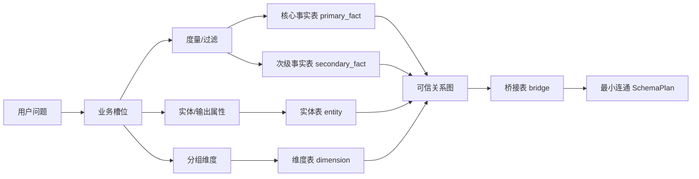
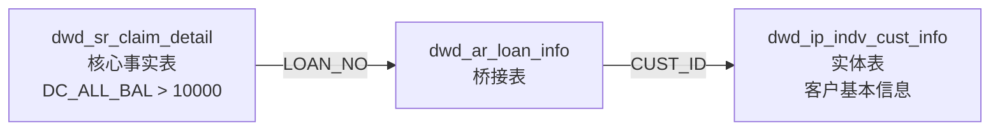

# NL2SQL 系统业务执行流程

本文描述系统从接收自然语言问题到返回查询结果的完整业务流程，重点体现字段驱动的 Schema 规划、业务澄清、安全校验和人工审批机制。

## 总体业务流程图

```mermaid
flowchart TD
    A[用户输入自然语言问题] --> B[模块1：请求接入]
    B --> B1[注入用户身份、数据权限、会话上下文]
    B1 --> C[模块2：问题理解、改写与业务消歧]

    C --> C0[生成 ResolvedQuery 和决策摘要]
    C0 --> C3{是否缺少会改变结果的业务信息}
    C3 -- 是 --> C1[使用业务语言提示用户补充]
    C1 --> C2[结束本次执行，等待用户重新提问]
    C3 -- 否 --> D[模块3：Schema 检索与规划]

    subgraph R[Schema 检索与规划]
        D --> D1[解析 QueryIntent]
        D1 --> D2[识别实体、度量、属性、过滤、维度和查询类型]
        D2 --> D3{是否命中已审核的复合业务指标}

        D3 -- 是 --> D4[使用术语库定义和 resolved_fields]
        D3 -- 否 --> D5[字段级混合召回]
        D5 --> D6[字段短语、向量、类型、角色和实体亲和度评分]
        D6 --> D7[确定核心事实表或锚点表集合]

        D4 --> D8[识别实体表和维度表]
        D7 --> D8
        D8 --> D9[从 M-Schema 关系图寻找最短可信 Join 路径]
        D9 --> D10[自动补充桥接表]
        D10 --> D11[生成 SchemaPlan]
    end

    D11 --> E{模块3.5：SchemaPlan 是否存在问题}

    E -- 同一业务槽位存在多个高分字段 --> E1[展示业务字段口径选项]
    E1 --> E2[用户选择业务含义，不接触物理表和字段]
    E2 --> D

    E -- 字段证据或关系证据不足 --> E3[低置信提示]
    E3 --> E4{用户是否继续尝试}
    E4 -- 否 --> E5[结束并提示补充业务口径或关联字段]
    E4 -- 是 --> F[标记低置信，继续统一计划路径并要求人工审批]

    E -- 规划完整且置信度足够 --> I[模块5b：生成结构化 QueryPlan]
    F --> I

    I --> I1[按 SchemaPlan 规划目标表、Join、过滤、指标和分组]
    I1 --> J[模块6：QueryPlan 确定性校验]
    J --> J1{计划是否通过}
    J1 -- 否且未达到重试上限 --> I
    J1 -- 否且达到重试上限 --> J2[结束并提示人工介入]
    J1 -- 是 --> H[模块7：生成只读 SQL]

    H --> H1[严格翻译 QueryPlan]
    H1 --> K[模块8：SQL 静态校验]

    K --> K1{是否为危险 SQL}
    K1 -- 是 --> K2[硬拦截：禁止写操作、DDL、多语句和外部调用]
    K1 -- 否 --> K3{表、字段、Join 和权限条件是否正确}

    K3 -- 否且未达到重试上限 --> H
    K3 -- 否且达到重试上限 --> K4[结束并提示 SQL 生成失败]
    K3 -- 是 --> L[注入可信行级权限过滤]

    L --> M[模块9：风险与敏感数据判定]
    M --> M1{风险决策}
    M1 -- hard_block --> M2[直接拦截]
    M1 -- approval_required --> M3[人工审批]
    M1 -- pass --> N[模块10：沙箱执行]

    M3 --> M4{审批结果}
    M4 -- 驳回 --> M5[结束并记录反馈]
    M4 -- 通过 --> N

    N --> N1{数据库执行是否成功}
    N1 -- 否且未达到重试上限 --> H
    N1 -- 否且达到重试上限 --> N2[降级返回执行错误]
    N1 -- 是 --> O[模块11：结果解释]

    O --> O1[结果脱敏、截断和字段语义整理]
    O1 --> O2[生成自然语言摘要]
    O2 --> O3[展示问题理解、计算步骤、关键假设和置信度]
    O3 --> P[向用户返回 SQL、结果和解释]

    P --> Q[保存历史、Trace、耗时、审批和反馈数据]
```



## SchemaPlan 的表角色



各角色含义：

| 角色 | 作用 | 是否作为用户候选 |
|---|---|---|
| `primary_fact` | 承载核心指标或主要过滤条件 | 仅同一业务槽位存在真实歧义时澄清 |
| `secondary_fact` | 承载第二个事实指标 | 不与核心事实表互斥 |
| `entity` | 提供客户、产品、机构等实体属性 | 不与事实表互斥 |
| `dimension` | 提供地区、时间、产品等分组维度 | 不与事实表互斥 |
| `bridge` | 连接事实表和实体/维度表 | 不展示为用户候选 |

## 示例：代偿客户基本信息

用户问题：

```text
统计代偿金额超过10000的客户的基本信息
```

意图解析结果：

```json
{
  "query_type": "fact_filter",
  "measure": "代偿金额",
  "filter": "代偿金额 > 10000",
  "entity": "客户",
  "output": "基本信息"
}
```

Schema 规划结果：



对应业务规则：

1. `dwd_sr_claim_detail.DC_ALL_BAL` 承载代偿金额过滤条件。
2. `dwd_ar_loan_info` 只负责从借据编号映射到客户编号。
3. `dwd_ip_indv_cust_info` 提供客户基本信息。
4. 三张表属于互补角色，不要求用户三选一。
5. `metric_logic` 为 `null`，因为该问题是筛选客户信息，不是计算代偿金额合计。

## 业务澄清原则

系统只在澄清会改变查询业务语义时询问用户：

- “代偿金额”可能是代偿总额或代偿本金；
- “地区”可能是居住地区、户籍地区或机构地区；
- 找不到可信的表关联字段；
- 复杂业务指标缺少审核口径。

系统不应要求用户选择：

- 核心事实表与客户实体表；
- 实体表与桥接表；
- 最短 Join 路径中自动补充的技术表。

## 安全与准确性边界

- Schema 检索严格受 `data_scope` 限制。
- `data_scope` 是系统命名空间，不能转换成 `PLATFORM_CODE` 等业务过滤值。
- Join 只能来自 M-Schema 中的物理外键或审核通过的逻辑关系。
- QueryPlan 和 SQL 必须经过表、字段、Join、类型及术语口径校验。
- 行级权限只能由服务端可信上下文注入。
- 非 SELECT、DDL、写操作和多语句直接拦截。
- 敏感字段、金额聚合和低置信查询可以进入人工审批。
- SQL 执行只在受限沙箱中进行，并受到行数和超时限制。
