# NL2SQL 分层测试集

本测试集不以“生成了 SQL”作为唯一成功标准。每个案例应依次检查：

1. `SemanticGraph` 是否完整保留用户要求的输出、条件、分组、排序和数量限制；
2. `Query M-Schema` 是否只包含必要表、字段和已验证关系，没有完整 Schema 泄露；
3. `QueryPlan` 是否覆盖全部 required outputs 和高影响 predicate atoms；
4. SQL 的 `WHERE / HAVING / JOIN / GROUP BY` 与计划一致；
5. 多事实查询是否先按共同粒度分别预聚合，避免金额和笔数被明细 Join 放大；
6. SQL 可执行且结果列、粒度和业务说明符合预期。

建议每个案例记录以下指标：`是否首次成功`、`计划重试次数`、`SQL 重试次数`、
`总耗时`、`检索表 Recall`、`字段 Recall`、`Join 路径正确性` 和 `执行结果正确性`。

## 覆盖矩阵

| 等级 | 重点能力 | 对应案例 |
|---|---|---|
| L1 | 单表投影、过滤、分组聚合 | 1～3 |
| L2 | 多条件、多指标、输出完整性 | 4～6 |
| L3 | 两表 Join、实体粒度、存在性 | 7～9 |
| L4 | 三表路径、多事实预聚合 | 10～12 |
| L5 | 时间、条件聚合、复合键、HAVING、排序 | 13～15 |
| Guard | 缺字段、缺关系、错误 Few-shot 隔离 | 16～20 |

## 正向案例

### 一级：单表基础查询

1. 查询所有客户的姓名、年龄和手机号码  
   预期主表：`dwd_ip_indv_cust_info`

2. 查询贷款金额超过 1000 元的借据编号、客户姓名、贷款金额和贷款状态  
   预期主表：`dwd_ar_loan_info`

3. 统计不同贷款状态下的贷款笔数和贷款总金额  
   预期能力：单表分组、`COUNT`、`SUM`

### 二级：单表复合条件

4. 查询贷款金额超过 1000 元且逾期本金余额大于 0 的客户姓名、借据编号、贷款金额和逾期本金余额  
   预期条件：`LOAN_AMT > 1000 AND OVD_BAL > 0`

5. 查询年龄大于 30 岁且有手机号码的客户姓名、年龄、学历、职业和居住地址  
   预期主表：客户信息表

6. 统计每个产品的贷款笔数、贷款总金额、平均贷款金额和剩余本金  
   预期分组字段：`PRD_CODE`；贷款笔数使用 `COUNT`，贷款金额分别生成 `SUM` 和 `AVG`，
   剩余本金使用 `SUM(PRIN_BAL)`，四个输出不得相互覆盖。

### 三级：两表关联

7. 查询有逾期贷款的客户基本信息，包括姓名、证件号码、手机号码、户籍地址和居住地址  
   预期关联：

```text
dwd_ar_loan_info.CUST_ID
→ dwd_ip_indv_cust_info.CUST_ID
```

8. 查询每个客户的贷款笔数、贷款总金额和逾期本金总额，并返回客户姓名和手机号码  
   预期能力：客户与贷款表关联、客户级聚合

9. 查询还款状态为逾期的借据，返回借据编号、客户姓名、当前期数、实还本金和实还罚息  
   预期关联：还款明细通过 `LOAN_NO` 关联贷款借据表  
   逾期状态可能使用 `REPAY_STATUS IN ('03','04')`

### 四级：三表关联

10. 查询代偿总额超过 1000 元的客户姓名、手机号码、居住地址、借据编号和代偿总额  
    预期路径：

```text
代偿记录 → 贷款借据 → 客户信息
LOAN_NO       CUST_ID
```

11. 统计每个客户累计贷款金额、累计代偿本金、累计代偿利息和累计代偿总额  
    预期能力：贷款事实和代偿事实分别按客户预聚合，再关联客户实体；禁止直接连接两张明细事实表后求和。

12. 查询既有逾期又有代偿记录的客户，返回客户姓名、证件号码、贷款金额、逾期本金余额和代偿总额  
    预期能力：客户、贷款、代偿三表关联和复合业务条件

### 五级：复杂分析

13. 按贷款开始月份统计贷款客户数、贷款笔数、贷款总金额、逾期客户数和逾期本金余额  
    预期能力：

- 按月处理 `START_DATE`
- `COUNT(DISTINCT CUST_ID)`
- 条件聚合
- 避免客户数重复

14. 对比每笔借据每一期的应还金额和实际还款金额，返回借据编号、客户姓名、期次、应还本金、应还利息、实还本金、实还利息和差额  
    预期路径：

```text
还款计划
  → 按 LOAN_NO + TERM_NO 关联还款明细
  → 按 LOAN_NO 关联贷款借据
```

15. 查询累计代偿总额超过 1000 元且逾期本金余额大于 0 的客户，返回客户基本信息、贷款笔数、贷款总金额、逾期本金余额和累计代偿总额，并按累计代偿总额降序排列  
    预期能力：

- 多表预聚合
- `HAVING`
- 多条件过滤
- 排序
- 防止贷款金额和代偿金额因明细表关联而重复计算

## 防护与失败语义案例

16. `查询客户的星座和姓名`
    预期：如果 Schema 没有“星座”，明确报告该输出无法绑定；不得用客户编号、学历等字段替代。

17. `查询客户姓名及其代偿金额`，但当前数据库没有客户表到代偿表的已验证关系
    预期：不得猜测同名字段 JOIN；返回缺少关系事实的可解释错误。

18. `统计每个产品累计贷款金额超过 10000 元的产品`
    预期：`SUM(LOAN_AMT) > 10000` 必须进入 `HAVING`，不能写入 `WHERE`。

19. `查询没有贷款记录的客户姓名`
    预期：使用 `NOT EXISTS` 或等价反连接语义；不得错误生成普通 `INNER JOIN`。

20. 切换到不包含 `dwd_ar_loan_info` 的数据库后询问 `查询贷款总金额`
    预期：旧 MySQL SQL Few-shot 不得进入提示词；只能依据当前数据库的 Query M-Schema 规划，
    无法绑定时明确失败。

## 每条案例的通过标准

- 必需输出字段召回率为 100%；不存在的输出字段必须进入 `missing_outputs`。
- 高影响条件覆盖率为 100%，不能静默删除“逾期”“超过阈值”等条件。
- JOIN 只能来自 Query M-Schema 已验证关系，路径方向可以转换但关联键必须一致。
- 聚合结果的输出粒度与 `output_grain` 一致。
- 正向案例执行成功；防护案例应以预期方式阻断或降级，而不是生成语义错误但可执行的 SQL。
- 首次失败、重试成功必须分别记录，不能只统计最终成功率。

### 连续追问测试

在同一个对话中依次询问：

1. `查询有逾期的客户姓名和居住地址`
2. `再增加手机号码、贷款金额和逾期本金余额`
3. `只保留贷款金额超过1000元的客户`
4. `再统计这些客户的累计代偿总额`
5. `按累计代偿总额从高到低排列`

重点检查后续问题是否沿用前文条件，而不是重新开启无关查询。

```mermaid
flowchart TD
    U["用户在前端输入问题"] --> UI["选择数据库连接<br/>携带当前会话上下文"]
    UI --> API["REST / WebSocket 提交查询"]
    API --> AUTH{"访问凭证有效？"}

    AUTH -- 否 --> AUTH_FAIL["拒绝访问"]
    AUTH -- 是 --> SAVE["创建 trace_id<br/>保存查询记录<br/>注册停止执行信号"]
    SAVE --> ENTRY["模块1：请求入口"]

    subgraph S1["阶段一：问题理解与语义覆盖"]
        ENTRY --> NORMALIZE["规范化问题编码与会话上下文"]
        NORMALIZE --> RULE_PARSE["确定性语义解析<br/>识别实体、指标、维度、筛选、返回要求"]
        RULE_PARSE --> NEED_LLM{"是否需要模型增强理解？"}

        NEED_LLM -- 否 --> SEMANTIC
        NEED_LLM -- 是 --> UNDERSTAND_LLM["调用统一模型生成 ResolvedQuery"]
        UNDERSTAND_LLM --> STRUCT_CHECK{"结构化结果有效？"}
        STRUCT_CHECK -- 否且可重试 --> UNDERSTAND_LLM
        STRUCT_CHECK -- 否且重试耗尽 --> FALLBACK["退回确定性解析结果"]
        STRUCT_CHECK -- 是 --> MERGE["与确定性结果合并<br/>模型不能删除用户明确要求"]
        FALLBACK --> SEMANTIC
        MERGE --> SEMANTIC["生成 SemanticGraph"]

        SEMANTIC --> COVERAGE["原问题语义覆盖检查<br/>检查筛选条件、返回要求、统计动作"]
        COVERAGE --> REPAIR["保守修复遗漏语义<br/>保留“基本信息、逾期情况”等宽泛主题"]
        REPAIR --> CLARIFY_CHECK{"仍有必须由用户补充的信息？"}

        CLARIFY_CHECK -- 是 --> CLARIFY_END["返回补充说明<br/>本次流程结束"]
        CLARIFY_CHECK -- 否 --> RETRIEVAL
        CLARIFY_CHECK -- "属于字段/指标口径<br/>可由 Schema 解决" --> RETRIEVAL
    end

    subgraph S2["阶段二：Schema 检索与字段绑定"]
        RETRIEVAL["模块3：读取所选数据库的 M-Schema"] --> TERM["通道一：术语与业务概念检索"]
        RETRIEVAL --> TABLE_VECTOR["通道二：表级向量检索"]
        RETRIEVAL --> COLUMN_VECTOR["通道三：字段级向量检索"]
        RETRIEVAL --> RELATION_VECTOR["通道四：关系与 Join 路径检索"]

        TERM --> FUSION
        TABLE_VECTOR --> FUSION
        COLUMN_VECTOR --> FUSION
        RELATION_VECTOR --> FUSION["融合候选表、字段及关系证据"]

        FUSION --> FIELD_RANK["字段候选排序<br/>词法、向量、字段角色、值画像"]
        FIELD_RANK --> SCHEMA_PLAN["生成最小 SchemaPlan<br/>主事实表、实体表、维度表、桥接表"]

        SCHEMA_PLAN --> BROAD{"是否存在宽泛返回主题？"}
        BROAD -- 否 --> GROUND
        BROAD -- 是 --> PROJECTION["Schema 驱动具体化<br/>例如：逾期情况 → 逾期本金余额"]
        PROJECTION --> PROJECTION_MODEL{"字段选择模型结果有效？"}
        PROJECTION_MODEL -- 是 --> MATERIALIZE["生成明确的语义输出字段"]
        PROJECTION_MODEL -- 否 --> RULE_FALLBACK["规则式字段选择兜底"]
        RULE_FALLBACK --> MATERIALIZE
        MATERIALIZE --> GROUND

        GROUND["绑定语义条件和返回要求<br/>Semantic Bindings / Output Bindings"] --> GROUP_KEY["确定查询粒度<br/>实体分组优先使用非空主键或唯一键"]
        GROUP_KEY --> EXTEND["根据输出字段补全关系子图<br/>自动加入必要关联表和桥接表"]
        EXTEND --> QUERY_MSCHEMA["生成查询级 Query M-Schema<br/>只保留本问题需要的表、字段和关系"]

        QUERY_MSCHEMA --> OUTPUT_CHECK{"用户要求的字段都能绑定？"}
        OUTPUT_CHECK -- 否 --> UNSUPPORTED["说明无法绑定的业务字段<br/>禁止虚构字段"]
        OUTPUT_CHECK -- 是 --> CONFIDENCE{"Schema 证据是否足够？"}

        CONFIDENCE -- "字段业务含义存在歧义" --> BUSINESS_CLARIFY["仅澄清业务口径<br/>不让用户选择物理表"]
        BUSINESS_CLARIFY --> RETRIEVAL

        CONFIDENCE -- 低置信度 --> LOW_CONFIDENCE{"是否继续尝试？"}
        LOW_CONFIDENCE -- 否 --> LOW_END["返回证据不足说明"]
        LOW_CONFIDENCE -- 是 --> PLAN_GENERATION
        CONFIDENCE -- 足够 --> PLAN_GENERATION
    end

    subgraph S3["阶段三：统一查询计划生成"]
        PLAN_GENERATION["模块5：调用模型生成 QueryPlan"] --> PLAN_CONTENT["计划包含<br/>目标表、Join、输出字段、WHERE、HAVING<br/>分组、排序、Limit、统计粒度"]
        PLAN_CONTENT --> NORMALIZER["确定性计划规范化"]

        NORMALIZER --> CONTRACT["使用 Output Bindings 重建输出字段<br/>使用 Semantic Bindings 修正筛选字段和值"]
        CONTRACT --> SCOPE["区分条件作用域<br/>行级条件 → WHERE<br/>聚合条件 → HAVING"]
        SCOPE --> MULTIFACT["识别多事实表场景<br/>规划按统一粒度预聚合"]
        MULTIFACT --> LOGICAL["生成 LogicalPlan"]
    end

    subgraph S4["阶段四：计划完整性校验"]
        LOGICAL --> PLAN_VALIDATE["模块6：QueryPlan 校验"]
        PLAN_VALIDATE --> V1["原始问题 ↔ SemanticGraph 覆盖检查"]
        V1 --> V2["SemanticGraph ↔ QueryPlan 原子覆盖检查"]
        V2 --> V3["QueryPlan ↔ Query M-Schema 物理字段检查"]
        V3 --> V4["检查粒度、Join、WHERE/HAVING<br/>输出字段和多事实聚合安全"]
        V4 --> PLAN_PASS{"计划通过？"}

        PLAN_PASS -- "否，未达重试上限" --> PLAN_RETRY["携带错误反馈重新生成计划"]
        PLAN_RETRY --> PLAN_GENERATION
        PLAN_PASS -- "否，重试耗尽" --> PLAN_FAIL["返回计划生成失败及具体原因"]
        PLAN_PASS -- 是 --> SQL_GENERATION
    end

    subgraph S5["阶段五：SQL 生成与静态校验"]
        SQL_GENERATION["模块7：SQL 生成"] --> COMPILER{"QueryPlan 能否确定性编译？"}
        COMPILER -- 是 --> DET_SQL["SQL 编译器生成 SQL<br/>正常路径不再次调用模型"]
        COMPILER -- 否 --> SQL_LLM["兼容兜底：模型翻译 QueryPlan 为 SQL"]

        DET_SQL --> STATIC
        SQL_LLM --> STATIC["模块8：SQL AST 静态校验"]

        STATIC --> SQL_SYNTAX["检查 SQL 语法和数据库方言"]
        SQL_SYNTAX --> TABLE_FIELD["检查表、字段是否属于 Query M-Schema"]
        TABLE_FIELD --> SAFETY["禁止危险操作和虚构字段<br/>禁止把 data_scope 当业务字段值"]
        SAFETY --> SQL_PASS{"SQL 校验通过？"}

        SQL_PASS -- "否，普通错误且可重试" --> SQL_RETRY["携带校验错误重新生成 SQL"]
        SQL_RETRY --> SQL_GENERATION
        SQL_PASS -- "否，危险操作" --> HARD_BLOCK["直接拦截"]
        SQL_PASS -- "否，重试耗尽" --> SQL_FAIL["返回 SQL 生成失败"]
        SQL_PASS -- 是 --> SQL_RESULT["得到最终可执行 SQL"]
    end

    SQL_RESULT --> NEXT["后续流程<br/>敏感检查 → EXPLAIN → 只读执行 → 结果总结"]

    AUTH_FAIL --> END["结束"]
    CLARIFY_END --> END
    UNSUPPORTED --> END
    LOW_END --> END
    PLAN_FAIL --> END
    HARD_BLOCK --> END
    SQL_FAIL --> END
```



